```python
pip install pandas
```

    Requirement already satisfied: pandas in /usr/local/lib/python3.11/dist-packages (2.2.3)
    Requirement already satisfied: numpy>=1.23.2 in /usr/local/lib/python3.11/dist-packages (from pandas) (1.26.4)
    Requirement already satisfied: python-dateutil>=2.8.2 in /usr/local/lib/python3.11/dist-packages (from pandas) (2.9.0.post0)
    Requirement already satisfied: pytz>=2020.1 in /usr/local/lib/python3.11/dist-packages (from pandas) (2025.2)
    Requirement already satisfied: tzdata>=2022.7 in /usr/local/lib/python3.11/dist-packages (from pandas) (2025.2)
    Requirement already satisfied: mkl_fft in /usr/local/lib/python3.11/dist-packages (from numpy>=1.23.2->pandas) (1.3.8)
    Requirement already satisfied: mkl_random in /usr/local/lib/python3.11/dist-packages (from numpy>=1.23.2->pandas) (1.2.4)
    Requirement already satisfied: mkl_umath in /usr/local/lib/python3.11/dist-packages (from numpy>=1.23.2->pandas) (0.1.1)
    Requirement already satisfied: mkl in /usr/local/lib/python3.11/dist-packages (from numpy>=1.23.2->pandas) (2025.1.0)
    Requirement already satisfied: tbb4py in /usr/local/lib/python3.11/dist-packages (from numpy>=1.23.2->pandas) (2022.1.0)
    Requirement already satisfied: mkl-service in /usr/local/lib/python3.11/dist-packages (from numpy>=1.23.2->pandas) (2.4.1)
    Requirement already satisfied: six>=1.5 in /usr/local/lib/python3.11/dist-packages (from python-dateutil>=2.8.2->pandas) (1.17.0)
    Requirement already satisfied: intel-openmp<2026,>=2024 in /usr/local/lib/python3.11/dist-packages (from mkl->numpy>=1.23.2->pandas) (2024.2.0)
    Requirement already satisfied: tbb==2022.* in /usr/local/lib/python3.11/dist-packages (from mkl->numpy>=1.23.2->pandas) (2022.1.0)
    Requirement already satisfied: tcmlib==1.* in /usr/local/lib/python3.11/dist-packages (from tbb==2022.*->mkl->numpy>=1.23.2->pandas) (1.3.0)
    Requirement already satisfied: intel-cmplr-lib-rt in /usr/local/lib/python3.11/dist-packages (from mkl_umath->numpy>=1.23.2->pandas) (2024.2.0)
    Requirement already satisfied: intel-cmplr-lib-ur==2024.2.0 in /usr/local/lib/python3.11/dist-packages (from intel-openmp<2026,>=2024->mkl->numpy>=1.23.2->pandas) (2024.2.0)
    Note: you may need to restart the kernel to use updated packages.
    


```python
import pandas as pd
from datasets import load_dataset
import matplotlib.pyplot as plt
import re
import nltk
from nltk.corpus import stopwords
from sklearn.feature_extraction.text import TfidfVectorizer
nltk.download('punkt')
from nltk.tokenize import word_tokenize
nltk.download('stopwords')
stop_words = set(stopwords.words('english'))
```

    [nltk_data] Downloading package punkt to /usr/share/nltk_data...
    [nltk_data]   Package punkt is already up-to-date!
    [nltk_data] Downloading package stopwords to /usr/share/nltk_data...
    [nltk_data]   Package stopwords is already up-to-date!
    


```python
ds = load_dataset("webis/tldr-17", split="train")
```


    README.md: 0.00B [00:00, ?B/s]


    tldr-17.py: 0.00B [00:00, ?B/s]


    dataset_infos.json: 0.00B [00:00, ?B/s]


    The repository for webis/tldr-17 contains custom code which must be executed to correctly load the dataset. You can inspect the repository content at https://hf.co/datasets/webis/tldr-17.
    You can avoid this prompt in future by passing the argument `trust_remote_code=True`.
    
    Do you wish to run the custom code? [y/N]  y
    


    corpus-webis-tldr-17.zip:   0%|          | 0.00/3.14G [00:00<?, ?B/s]


    Generating train split:   0%|          | 0/3848330 [00:00<?, ? examples/s]


    Loading dataset shards:   0%|          | 0/38 [00:00<?, ?it/s]


```python
df = ds.to_pandas()
df = df[['subreddit', 'body', 'content']].dropna()
df
```


<div>
<style scoped>
    .dataframe tbody tr th:only-of-type {
        vertical-align: middle;
    }

    .dataframe tbody tr th {
        vertical-align: top;
    }

    .dataframe thead th {
        text-align: right;
    }
</style>
<table border="1" class="dataframe">
  <thead>
    <tr style="text-align: right;">
      <th></th>
      <th>subreddit</th>
      <th>body</th>
      <th>content</th>
    </tr>
  </thead>
  <tbody>
    <tr>
      <th>0</th>
      <td>math</td>
      <td>I think it should be fixed on either UTC stand...</td>
      <td>I think it should be fixed on either UTC stand...</td>
    </tr>
    <tr>
      <th>1</th>
      <td>funny</td>
      <td>Art is about the hardest thing to categorize i...</td>
      <td>Art is about the hardest thing to categorize i...</td>
    </tr>
    <tr>
      <th>2</th>
      <td>Borderlands</td>
      <td>Ask me what I think about the Wall Street Jour...</td>
      <td>Ask me what I think about the Wall Street Jour...</td>
    </tr>
    <tr>
      <th>3</th>
      <td>gamingpc</td>
      <td>In Mechwarrior Online, I have begun to use a m...</td>
      <td>In Mechwarrior Online, I have begun to use a m...</td>
    </tr>
    <tr>
      <th>4</th>
      <td>Diablo</td>
      <td>You are talking about the Charsi imbue, right?...</td>
      <td>You are talking about the Charsi imbue, right?...</td>
    </tr>
    <tr>
      <th>...</th>
      <td>...</td>
      <td>...</td>
      <td>...</td>
    </tr>
    <tr>
      <th>3848325</th>
      <td>sex</td>
      <td>I've finally gotten around to initiating plans...</td>
      <td>I've finally gotten around to initiating plans...</td>
    </tr>
    <tr>
      <th>3848326</th>
      <td>AskReddit</td>
      <td>Long time lurker, first time poster here. I'm ...</td>
      <td>Long time lurker, first time poster here. I'm ...</td>
    </tr>
    <tr>
      <th>3848327</th>
      <td>AskReddit</td>
      <td>Long time lurker, first time poster here. I'm ...</td>
      <td>Long time lurker, first time poster here. I'm ...</td>
    </tr>
    <tr>
      <th>3848328</th>
      <td>battlefield3</td>
      <td>My xbox hasn't been in the best of health rece...</td>
      <td>My xbox hasn't been in the best of health rece...</td>
    </tr>
    <tr>
      <th>3848329</th>
      <td>IASIP</td>
      <td>I found this sub-reddit by clicking 'random' a...</td>
      <td>I found this sub-reddit by clicking 'random' a...</td>
    </tr>
  </tbody>
</table>
<p>3848330 rows × 3 columns</p>
</div>


```python
# Define target game subreddits
game_subreddits = ['leagueoflegends', 'pokemon', 'zelda', 'Overwatch', 'smashbros', 'hearthstone']

# Filter the DataFrame
df_games = df[df['subreddit'].isin(game_subreddits)].copy()

print(df_games['subreddit'].value_counts())
```

    subreddit
    leagueoflegends    109307
    hearthstone          9500
    pokemon              6464
    smashbros            4464
    Overwatch            3633
    zelda                1182
    Name: count, dtype: int64
    

## Preprocessing

Firstly, we used the content text that doesn't include TL;DR part because it could bias the phrase extraction towards words that are common in summaries. Summaries often repeat key points in a condensed way rather than reflecting the natural flow of the document. 

We aimed to extract distinct phrases for each subreddit using a TF-IDF model. To improve the quality of the results, we first removed elements that are not useful for our task, such as links and stop words. In addition to stop words, we noticed that some phrases still appeared as important — for example, phrases like “quick play”, “ranked games”, or “playing overwatch”. To address this, we also removed certain domain-related words like “play”, “playing”, “game”, as well as the names of the games themselves, like "pokemon", "zelda", and "smash" etc., so that phrases containing these words would not dominate the results. Finally, we applied stemming to normalize word forms and avoid treating different surface forms of the same concept as distinct phrases.

Note: I did not apply stemming for TF-IDF because the Word2Vec model was trained on original (unstemmed) words. Stemming TF-IDF phrases created tokens that don’t match Word2Vec’s vocabulary, making it hard to retrieve embeddings or find similar words. Keeping original word forms ensures consistency between TF-IDF phrases and Word2Vec embeddings. That’s why our TF-IDF phrases may look a bit messy, but they work well for matching with the Word2Vec embeddings.


```python
common_words = {"game", "games", "gaming", "player", "play", "playing", "plays", "pokemon", "zelda", "smash", "smashbros" "overwatch", "hearthstone", "legends"}
    
def preprocess(text):
    text = text.lower()
    text = re.sub(r"http\S+|www\S+|https\S+", '', text) #removes links if any
    text = re.sub(r'[^a-z\s]', ' ', text) #replaces anything that is not a letter or space with a space
    text = re.sub(r'\s+', ' ', text).strip() #replace multiple whitespace characters with a single space
    tokens = text.split()
    tokens = [word for word in tokens if word not in stop_words and word not in common_words]
    return " ".join(tokens)

# Apply to the filtered gaming dataset
df_games['cleaned_body'] = df_games['content'].apply(preprocess)
```


```python
df_games[['subreddit', 'body', 'cleaned_body']].head()
```


<div>
<style scoped>
    .dataframe tbody tr th:only-of-type {
        vertical-align: middle;
    }

    .dataframe tbody tr th {
        vertical-align: top;
    }

    .dataframe thead th {
        text-align: right;
    }
</style>
<table border="1" class="dataframe">
  <thead>
    <tr style="text-align: right;">
      <th></th>
      <th>subreddit</th>
      <th>body</th>
      <th>cleaned_body</th>
    </tr>
  </thead>
  <tbody>
    <tr>
      <th>15</th>
      <td>leagueoflegends</td>
      <td>Didn't they lose 6 games in a row? Just becaus...</td>
      <td>lose row close mean lot weaker team love arkan...</td>
    </tr>
    <tr>
      <th>64</th>
      <td>leagueoflegends</td>
      <td>Because spinning axe is a massive damage buff(...</td>
      <td>spinning axe massive damage buff percent based...</td>
    </tr>
    <tr>
      <th>106</th>
      <td>zelda</td>
      <td>My thoughts from nine months ago and its corre...</td>
      <td>thoughts nine months ago corresponding discuss...</td>
    </tr>
    <tr>
      <th>123</th>
      <td>leagueoflegends</td>
      <td>I agree, and feel like TRM...may or may not ge...</td>
      <td>agree feel like trm may may get lot unnecessar...</td>
    </tr>
    <tr>
      <th>124</th>
      <td>leagueoflegends</td>
      <td>I kinda of have issue with putting blame on ju...</td>
      <td>kinda issue putting blame one party yes agree ...</td>
    </tr>
  </tbody>
</table>
</div>


```python
# quickly identify the word's frequencies
from wordcloud import WordCloud

# Join all cleaned text
all_text = " ".join(df_games['cleaned_body'])

# Generate word cloud
wordcloud = WordCloud(width=800, height=400, background_color='white').generate(all_text)

wordcloud.to_image()
```


    
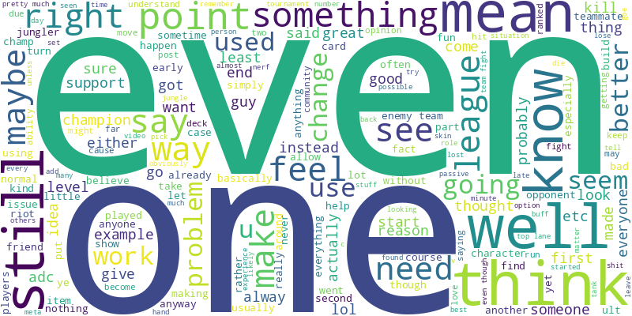
    


```python
# Group posts by subreddit and concatenate all texts
grouped = df_games.groupby('subreddit')['cleaned_body'].apply(lambda texts: ' '.join(texts)).reset_index()
```

We want to identify which bigrams are most characteristic of each subreddit. To do this, we compute the importance of specific bigrams (2-word phrases) for each subreddit using TF-IDF. We also experimented with extracting both unigrams and bigrams, but the results were mostly dominated by character names and failed to capture game-specific concepts or meaningful semantic clusters.


```python
# Create the vectorizer
vectorizer = TfidfVectorizer(ngram_range=(2,2), max_df=0.6, use_idf=True)  #max_df: ignores bigrams that appear in more than 60% of documents

# Fit and transform
tfidf_matrix = vectorizer.fit_transform(grouped['cleaned_body'])

# Convert to DataFrame
tfidf_df = pd.DataFrame(tfidf_matrix.toarray(), index=grouped['subreddit'], columns=vectorizer.get_feature_names_out())
```


```python
tfidf_df
```


<div>
<style scoped>
    .dataframe tbody tr th:only-of-type {
        vertical-align: middle;
    }

    .dataframe tbody tr th {
        vertical-align: top;
    }

    .dataframe thead th {
        text-align: right;
    }
</style>
<table border="1" class="dataframe">
  <thead>
    <tr style="text-align: right;">
      <th></th>
      <th>aa aa</th>
      <th>aa ab</th>
      <th>aa abilities</th>
      <th>aa ability</th>
      <th>aa able</th>
      <th>aa abuse</th>
      <th>aa activated</th>
      <th>aa activating</th>
      <th>aa active</th>
      <th>aa actually</th>
      <th>...</th>
      <th>zzzzzzz fuck</th>
      <th>zzzzzzz lock</th>
      <th>zzzzzzz shit</th>
      <th>zzzzzzzz deven</th>
      <th>zzzzzzzz seen</th>
      <th>zzzzzzzzzzz annoying</th>
      <th>zzzzzzzzzzz guys</th>
      <th>zzzzzzzzzzz jarvan</th>
      <th>zzzzzzzzzzzzzz friends</th>
      <th>zzzzzzzzzzzzzzzzzzzzzzzzzzzzzzzzzzz amourious</th>
    </tr>
    <tr>
      <th>subreddit</th>
      <th></th>
      <th></th>
      <th></th>
      <th></th>
      <th></th>
      <th></th>
      <th></th>
      <th></th>
      <th></th>
      <th></th>
      <th></th>
      <th></th>
      <th></th>
      <th></th>
      <th></th>
      <th></th>
      <th></th>
      <th></th>
      <th></th>
      <th></th>
      <th></th>
    </tr>
  </thead>
  <tbody>
    <tr>
      <th>Overwatch</th>
      <td>0.000000</td>
      <td>0.000000</td>
      <td>0.000000</td>
      <td>0.00000</td>
      <td>0.000000</td>
      <td>0.000000</td>
      <td>0.000000</td>
      <td>0.000000</td>
      <td>0.000000</td>
      <td>0.000000</td>
      <td>...</td>
      <td>0.000000</td>
      <td>0.000000</td>
      <td>0.000000</td>
      <td>0.000000</td>
      <td>0.000000</td>
      <td>0.000000</td>
      <td>0.000000</td>
      <td>0.000000</td>
      <td>0.000000</td>
      <td>0.000000</td>
    </tr>
    <tr>
      <th>hearthstone</th>
      <td>0.000000</td>
      <td>0.000000</td>
      <td>0.000000</td>
      <td>0.00000</td>
      <td>0.000000</td>
      <td>0.000000</td>
      <td>0.000000</td>
      <td>0.000000</td>
      <td>0.000000</td>
      <td>0.000000</td>
      <td>...</td>
      <td>0.000000</td>
      <td>0.000000</td>
      <td>0.000000</td>
      <td>0.000000</td>
      <td>0.000000</td>
      <td>0.000000</td>
      <td>0.000000</td>
      <td>0.000000</td>
      <td>0.000000</td>
      <td>0.000000</td>
    </tr>
    <tr>
      <th>leagueoflegends</th>
      <td>0.012194</td>
      <td>0.000061</td>
      <td>0.000368</td>
      <td>0.00049</td>
      <td>0.000123</td>
      <td>0.000061</td>
      <td>0.000061</td>
      <td>0.000061</td>
      <td>0.000245</td>
      <td>0.000245</td>
      <td>...</td>
      <td>0.000061</td>
      <td>0.000061</td>
      <td>0.000061</td>
      <td>0.000061</td>
      <td>0.000061</td>
      <td>0.000061</td>
      <td>0.000061</td>
      <td>0.000061</td>
      <td>0.000061</td>
      <td>0.000061</td>
    </tr>
    <tr>
      <th>pokemon</th>
      <td>0.000000</td>
      <td>0.000000</td>
      <td>0.000000</td>
      <td>0.00000</td>
      <td>0.000000</td>
      <td>0.000000</td>
      <td>0.000000</td>
      <td>0.000000</td>
      <td>0.000000</td>
      <td>0.000000</td>
      <td>...</td>
      <td>0.000000</td>
      <td>0.000000</td>
      <td>0.000000</td>
      <td>0.000000</td>
      <td>0.000000</td>
      <td>0.000000</td>
      <td>0.000000</td>
      <td>0.000000</td>
      <td>0.000000</td>
      <td>0.000000</td>
    </tr>
    <tr>
      <th>smashbros</th>
      <td>0.000000</td>
      <td>0.000000</td>
      <td>0.000000</td>
      <td>0.00000</td>
      <td>0.000000</td>
      <td>0.000000</td>
      <td>0.000000</td>
      <td>0.000000</td>
      <td>0.000000</td>
      <td>0.000000</td>
      <td>...</td>
      <td>0.000000</td>
      <td>0.000000</td>
      <td>0.000000</td>
      <td>0.000000</td>
      <td>0.000000</td>
      <td>0.000000</td>
      <td>0.000000</td>
      <td>0.000000</td>
      <td>0.000000</td>
      <td>0.000000</td>
    </tr>
    <tr>
      <th>zelda</th>
      <td>0.000000</td>
      <td>0.000000</td>
      <td>0.000000</td>
      <td>0.00000</td>
      <td>0.000000</td>
      <td>0.000000</td>
      <td>0.000000</td>
      <td>0.000000</td>
      <td>0.000000</td>
      <td>0.000000</td>
      <td>...</td>
      <td>0.000000</td>
      <td>0.000000</td>
      <td>0.000000</td>
      <td>0.000000</td>
      <td>0.000000</td>
      <td>0.000000</td>
      <td>0.000000</td>
      <td>0.000000</td>
      <td>0.000000</td>
      <td>0.000000</td>
    </tr>
  </tbody>
</table>
<p>6 rows × 4842295 columns</p>
</div>


There are some unusual bigrams that probably appear only in the League of Legends data, so their TF-IDF scores are non-zero there. All other subreddits lack these bigrams, resulting in TF-IDF scores of zero for those phrases. However, we assume these rare bigrams won’t significantly affect the results. We set max_df = 0.6 to ignore terms that appear in more than 60% of the documents. Such terms are considered too common and are excluded from the vocabulary.

 The higher the score, the more unique and important that bigram is for that subreddit.


```python
# Get top N unique terms
top_n = 20
for subreddit in tfidf_df.index:
    print(f"\n -Top {top_n} terms for r/{subreddit}:")
    top_terms = tfidf_df.loc[subreddit].sort_values(ascending=False).head(top_n)
    print(top_terms)
```

    
     -Top 20 terms for r/Overwatch:
    loot boxes          0.141670
    skill rating        0.098433
    torbj rn            0.086382
    mercy lucio         0.086382
    gold medals         0.082794
    reinhardt shield    0.080773
    capture point       0.079114
    tracer genji        0.078529
    attacking team      0.078194
    team comp           0.077667
    defense matrix      0.076286
    discord orb         0.070676
    loot box            0.069555
    overwatch team      0.067311
    fan hammer          0.067311
    team composition    0.065240
    lucio mercy         0.065067
    like tracer         0.062824
    left click          0.059804
    tracer reaper       0.056092
    Name: Overwatch, dtype: float64
    
     -Top 20 terms for r/hearthstone:
    hero power         0.218500
    control warrior    0.187971
    dr boom            0.171297
    card draw          0.170534
    next turn          0.155244
    board control      0.145845
    face hunter        0.142634
    control decks      0.129731
    aggro decks        0.124398
    cards like         0.120718
    freeze mage        0.112294
    miracle rogue      0.110202
    mana cost          0.098023
    class cards        0.090672
    knife juggler      0.082651
    mech mage          0.082303
    card advantage     0.079861
    arena run          0.077071
    board clear        0.071840
    patron warrior     0.068061
    Name: hearthstone, dtype: float64
    
     -Top 20 terms for r/leagueoflegends:
    bot lane           0.227563
    lee sin            0.226809
    ad carry           0.156063
    magic damage       0.131141
    champ select       0.130940
    team fight         0.127825
    team fights        0.127373
    top laner          0.116298
    kha zix            0.115808
    mid lane           0.113815
    elo hell           0.112902
    enemy jungler      0.105024
    low elo            0.092703
    auto attack        0.088829
    blue buff          0.086090
    win lane           0.078333
    champion select    0.077673
    mid laner          0.076926
    top mid            0.075980
    first blood        0.075117
    Name: leagueoflegends, dtype: float64
    
     -Top 20 terms for r/pokemon:
    elite four        0.160650
    rydel rydel       0.143845
    team rocket       0.122191
    gym leaders       0.121573
    wonder trade      0.116488
    ev training       0.112889
    gym leader        0.109428
    soul silver       0.104133
    fire red          0.101486
    th gen            0.095308
    ruby sapphire     0.094074
    perfect ivs       0.090896
    perfect iv        0.090896
    hg ss             0.088248
    mega evolution    0.085534
    egg moves         0.082953
    gen iv            0.081772
    gen iii           0.078878
    type moves        0.077659
    gen ii            0.076707
    Name: pokemon, dtype: float64
    
     -Top 20 terms for r/smashbros:
    sm sh                  0.431869
    little mac             0.236360
    dash attack            0.130365
    melee brawl            0.122242
    custom moves           0.114747
    dark pit               0.112786
    mega man               0.105354
    dr mario               0.101998
    tech skill             0.097311
    landing lag            0.095132
    meta knight            0.093700
    ice climbers           0.087589
    mew king               0.086306
    short hop              0.086052
    toon link              0.077404
    fox falco              0.074537
    duck hunt              0.073989
    gamecube controller    0.071293
    wii version            0.070772
    melee players          0.069935
    Name: smashbros, dtype: float64
    
     -Top 20 terms for r/zelda:
    majora mask          0.439466
    skyward sword        0.406535
    wind waker           0.350892
    motion controls      0.137194
    skull kid            0.123777
    mask salesman        0.123019
    happy mask           0.104977
    link awakening       0.104977
    sacred realm         0.096775
    water temple         0.078012
    phantom hourglass    0.075322
    deku tree            0.072171
    oot mm               0.072171
    majoras mask         0.061872
    spirit tracks        0.061321
    forest temple        0.059049
    temple time          0.056492
    minish cap           0.056492
    lost woods           0.054507
    dark link            0.053801
    Name: zelda, dtype: float64
    


```python
# !Run this if you want to see the top 50 phrases for each subreddit
top_phrases = []

for subreddit, row in tfidf_df.iterrows():
    top = row.sort_values(ascending=False).head(50)
    for phrase, score in top.items():
        top_phrases.append({'subreddit': subreddit, 'phrase': phrase, 'tfidf_score': score})

top_50_df = pd.DataFrame(top_phrases)
top_50_df.to_csv('top_50_phrases_per_subreddit.csv', index=False)
```

## -Collect Gensim's Phrases-

We used Gensim’s Phrases model to identify phrases:

- It automatically detects collocations based on their co-occurrence frequencies and statistical association

- Learns phrases that appear together significantly more than chance


```python
#FOR WORD2VEC
#Tokenize the cleaned body
tokenized_docs = df_games['cleaned_body'].apply(str.split).tolist()
print(tokenized_docs[0][:20])
```

    ['lose', 'row', 'close', 'mean', 'lot', 'weaker', 'team', 'love', 'arkansas', 'razorbacks', 'football', 'years', 'think', 'lost', 'alabama', 'lsu', 'field', 'goal', 'missed', 'less']
    


```python
from gensim.models import Phrases
from gensim.models.phrases import Phraser

#Train a Phrases model on tokenized_docs

# Detect frequent bigrams
phrases = Phrases(tokenized_docs, min_count=5, threshold=10)
bigram_model = Phraser(phrases) #bigrams are joined (wind_waker)

# Apply the model to tokenized text
corpus_phrased = [bigram_model[doc] for doc in tokenized_docs]

print(corpus_phrased[0][:50])  # it doesn’t have phrases that meet the criteria
print(corpus_phrased[1][:50])  # see the detected bigrams merged with underscores
```

    ['lose', 'row', 'close', 'mean', 'lot', 'weaker', 'team', 'love', 'arkansas', 'razorbacks', 'football', 'years', 'think', 'lost', 'alabama', 'lsu', 'field', 'goal', 'missed', 'less', 'yards', 'year', 'lost', 'alabam', 'team', 'isnt', 'young', 'ranked', 'quarterback', 'get', 'injured', 'ul', 'monroe', 'make', 'points']
    ['spinning_axe', 'massive', 'damage', 'buff', 'percent', 'based', 'damage', 'buff', 'applies', 'passive', 'dot', 'even', 'rank', 'one', 'use', 'spell', 'keep', 'buff', 'extended', 'amount', 'time', 'even', 'apply', 'asking', 'massive', 'damage', 'increase', 'countered', 'expire', 'set', 'time', 'like', 'asking', 'corki_rockets', 'home', 'nearest', 'low', 'heath', 'champion', 'deal', 'true_damage']
    

We used Gensim’s Phrases model to multi-word expressions like "wind waker" or "spinning axe" and treat them as single tokens like wind_waker or spinning_axe.

## Training Word2Vec

- The Word2Vec model was trained on this phrased corpus (corpus_phrased), where common multi-word expressions were merged with underscores.

- We used the skip-gram architecture to learn embeddings that predict surrounding context words.

- The model had an embedding size of 100 dimensions, a window size of 5, ignored tokens that appeared fewer than 5 times, and was trained for 10 epochs.


```python
from gensim.models import Word2Vec
from gensim.models.callbacks import CallbackAny2Vec
from tqdm import tqdm

class EpochLogger(CallbackAny2Vec):
    def __init__(self, epochs):
        self.epochs = epochs
        self.pbar = tqdm(total=epochs, desc='Training Epochs')
    
    def on_epoch_end(self, model):
        self.pbar.update(1)
    
    def on_train_end(self, model):
        self.pbar.close()

# Then train the model with the callback

epoch_logger = EpochLogger(epochs=10)

w2v_model = Word2Vec(
    sentences=corpus_phrased,
    vector_size=100,   # Embedding dimensions
    window=5,    # Context window
    min_count=5,  # Ignore rare words
    sg=1,    # Use skip-gram (1) or CBOW (0)
    workers=4,
    epochs=10, # increase this for better training (epochs = 10)
    callbacks=[epoch_logger]
)
```

    Training Epochs: 100%|██████████| 10/10 [07:15<00:00, 43.51s/it]
    


```python
# Save the whole model
w2v_model.save("subreddit_bigrams_word2vec.model")

# Optionally:save just the vectors
#w2v_model.wv.save_word2vec_format("subreddit_bigrams_vectors.txt")
```

For each subreddit, we identified the top 20 most distinctive phrases (those with the highest TF-IDF scores).
These phrases were collected into a set, merged with underscores, and converted to the same format (e.g., wind waker - wind_waker), since the Word2Vec model was trained on text where frequent phrases were joined with underscores.


```python
# Initialize an empty set to avoid duplicates
unique_phrases = set()

# Collect top 20 TF-IDF phrases for each subreddit
top_n = 20
for subreddit in tfidf_df.index:
    top_terms = tfidf_df.loc[subreddit].sort_values(ascending=False).head(top_n)
    unique_phrases.update(top_terms.index)

# Convert set to list
unique_phrases = list(unique_phrases)

# Convert phrases to gensim format (with underscores)
unique_phrases = [phrase.replace(" ", "_") for phrase in unique_phrases]
```


```python
#See the most 20 similar words/phrases
for phrase in unique_phrases:
    try:
        similar = w2v_model.wv.most_similar(phrase, topn=20)
        print(f"\n Phrase: {phrase}")
        for word, score in similar:
            print(f"    {word} (score: {score:.3f})")
    except KeyError:
        print(f"\nPhrase '{phrase}' not in Word2Vec vocabulary.")
```

    
     Phrase: torbj_rn
        tjorborn (score: 0.755)
        widowmaker_hanzo (score: 0.754)
        bastion (score: 0.754)
        mccree_pharah (score: 0.746)
        symmetra (score: 0.736)
        torbjorn_symmetra (score: 0.718)
        zenyatta (score: 0.718)
        hanzo_widowmaker (score: 0.716)
        defense_heroes (score: 0.712)
        reinhardt_shield (score: 0.712)
        pharah_junkrat (score: 0.709)
        torb (score: 0.708)
        symettra (score: 0.705)
        torbjorn (score: 0.703)
        torby (score: 0.702)
        pharah_widow (score: 0.701)
        bastion_mei (score: 0.701)
        bastion_bastion (score: 0.700)
        reinhardt_winston (score: 0.700)
        toblerone (score: 0.700)
    
     Phrase: mercy_lucio
        lucio_mercy (score: 0.832)
        healers (score: 0.815)
        reinhardt_zarya (score: 0.802)
        lucio_zenyatta (score: 0.797)
        symmetra_defense (score: 0.789)
        l_cio (score: 0.786)
        offense_heroes (score: 0.785)
        zenyatta (score: 0.784)
        defense_heroes (score: 0.777)
        mercy (score: 0.769)
        lucio (score: 0.766)
        reinhart (score: 0.753)
        healer (score: 0.750)
        lucio_zen (score: 0.746)
        reinhardt_roadhog (score: 0.745)
        reaper_genji (score: 0.743)
        pharah_mccree (score: 0.740)
        offense_hero (score: 0.738)
        switch_heros (score: 0.734)
        mercys (score: 0.732)
    
     Phrase: next_turn
        lethal_next (score: 0.805)
        rhonin (score: 0.797)
        board_empty (score: 0.793)
        gurubashi (score: 0.791)
        turns_later (score: 0.790)
        coldlight_oracle (score: 0.786)
        rag_hits (score: 0.785)
        cleared_board (score: 0.783)
        noble_sacrifice (score: 0.782)
        clear_board (score: 0.780)
        kranich (score: 0.779)
        creatures_board (score: 0.777)
        eviscerate (score: 0.777)
        wipe_board (score: 0.774)
        taunter (score: 0.773)
        noble_sac (score: 0.773)
        dust_devil (score: 0.772)
        turn_coin (score: 0.772)
        frostmourne (score: 0.771)
        clears_board (score: 0.771)
    
     Phrase: control_decks
        aggro_decks (score: 0.901)
        zoo (score: 0.875)
        control_warrior (score: 0.865)
        handlock (score: 0.846)
        rush_decks (score: 0.844)
        midrange_decks (score: 0.842)
        aggro_deck (score: 0.835)
        ramp_druid (score: 0.825)
        control_priest (score: 0.824)
        decks (score: 0.820)
        midrange (score: 0.816)
        zoolock (score: 0.809)
        zoo_decks (score: 0.808)
        shaman (score: 0.807)
        aggro (score: 0.801)
        priest (score: 0.800)
        deck (score: 0.799)
        face_hunter (score: 0.798)
        zoo_hunter (score: 0.797)
        freeze_mage (score: 0.797)
    
     Phrase: gym_leaders
        trainers (score: 0.807)
        gym_leader (score: 0.805)
        gyms (score: 0.801)
        elite_four (score: 0.777)
        victory_road (score: 0.757)
        johto (score: 0.747)
        kanto (score: 0.738)
        th_gym (score: 0.735)
        gym_battles (score: 0.732)
        trial_captains (score: 0.732)
        gym_badges (score: 0.728)
        defeat_elite (score: 0.721)
        duchess (score: 0.720)
        kalos (score: 0.717)
        hoenn (score: 0.708)
        diantha (score: 0.705)
        unova (score: 0.702)
        beat_elite (score: 0.699)
        johto_hoenn (score: 0.698)
        mt_silver (score: 0.694)
    
     Phrase: mega_man
        mario (score: 0.836)
        samus (score: 0.834)
        dr_mario (score: 0.819)
        megaman (score: 0.812)
        wario (score: 0.794)
        zero_suit (score: 0.791)
        kirby (score: 0.790)
        luigi (score: 0.787)
        toon_link (score: 0.783)
        olimar (score: 0.782)
        bowser_jr (score: 0.781)
        sheik (score: 0.776)
        little_mac (score: 0.774)
        captain_falcon (score: 0.773)
        bowser (score: 0.772)
        meta_knight (score: 0.771)
        king_dedede (score: 0.770)
        pacman (score: 0.769)
        dark_pit (score: 0.765)
        lucario (score: 0.764)
    
     Phrase: defense_matrix
        scatter_arrow (score: 0.789)
        cryo_freeze (score: 0.786)
        alt_fire (score: 0.783)
        sleep_dart (score: 0.780)
        pulse_bomb (score: 0.780)
        whole_hog (score: 0.778)
        primary_fire (score: 0.772)
        rein_shield (score: 0.772)
        venom_mine (score: 0.770)
        zarya_shields (score: 0.770)
        dva (score: 0.769)
        concussion_mine (score: 0.768)
        reinhardt_shield (score: 0.768)
        lshift (score: 0.767)
        dragonblade (score: 0.767)
        graviton_surge (score: 0.766)
        pharah_junkrat (score: 0.764)
        roadhog_mccree (score: 0.764)
        particle_beam (score: 0.764)
        biotic_field (score: 0.764)
    
     Phrase: champion_select
        champ_select (score: 0.932)
        lobby (score: 0.836)
        champion_selection (score: 0.820)
        pre_lobby (score: 0.794)
        selecting_champion (score: 0.772)
        instalockers (score: 0.742)
        queue (score: 0.737)
        champ_selects (score: 0.735)
        pregame_lobby (score: 0.734)
        insta_lockers (score: 0.734)
        queue_dodges (score: 0.732)
        queue_pops (score: 0.730)
        banning_phase (score: 0.728)
        champselect (score: 0.725)
        clicked_accept (score: 0.720)
        someone_dodges (score: 0.717)
        kick_feature (score: 0.709)
        insta_lock (score: 0.709)
        dodge_timer (score: 0.705)
        champ_selection (score: 0.700)
    
     Phrase: arena_run
        arena (score: 0.788)
        card_pack (score: 0.773)
        arena_runs (score: 0.751)
        opening_packs (score: 0.745)
        opened_pack (score: 0.741)
        arena_draft (score: 0.738)
        classic_pack (score: 0.728)
        dailies (score: 0.728)
        naxx_wing (score: 0.728)
        constructed (score: 0.727)
        arena_entry (score: 0.726)
        buy_packs (score: 0.720)
        daily_quests (score: 0.720)
        tavern_brawl (score: 0.720)
        gvg_pack (score: 0.718)
        open_pack (score: 0.718)
        nax (score: 0.714)
        golden_legendary (score: 0.712)
        first_wing (score: 0.712)
        dust_pack (score: 0.709)
    
     Phrase: fire_red
        leaf_green (score: 0.917)
        firered_leafgreen (score: 0.863)
        soul_silver (score: 0.862)
        firered (score: 0.847)
        emerald (score: 0.846)
        heartgold (score: 0.846)
        alpha_sapphire (score: 0.843)
        white_white (score: 0.839)
        soulsilver (score: 0.839)
        ss_hg (score: 0.834)
        red_version (score: 0.828)
        ruby_sapphire (score: 0.827)
        white_version (score: 0.819)
        yellow_version (score: 0.818)
        emerald_version (score: 0.811)
        black_black (score: 0.808)
        emerald_ruby (score: 0.807)
        omega_ruby (score: 0.806)
        leafgreen (score: 0.805)
        sapphire_emerald (score: 0.802)
    
     Phrase: rydel_rydel
        rydelrydel_rydel (score: 0.975)
        rydel_rydelrydel (score: 0.975)
        pikachu_pika (score: 0.937)
        pika_pika (score: 0.937)
        pika_chu (score: 0.936)
        chu_pika (score: 0.936)
        blablabla_rantrantrant (score: 0.933)
        pika_pikachu (score: 0.931)
        ramblerambleramble (score: 0.929)
        warnung_warnung (score: 0.920)
        must_outplay (score: 0.907)
        yoplay (score: 0.884)
        une (score: 0.883)
        la_gb (score: 0.882)
        ende (score: 0.882)
        topjorri (score: 0.881)
        fran (score: 0.880)
        doch (score: 0.880)
        lks_enemy (score: 0.879)
        avec (score: 0.875)
    
     Phrase: link_awakening
        oracle_ages (score: 0.857)
        oracle_seasons (score: 0.848)
        minish_cap (score: 0.828)
        link_past (score: 0.823)
        phantom_hourglass (score: 0.821)
        alttp (score: 0.808)
        spirit_tracks (score: 0.807)
        prequels (score: 0.797)
        direct_sequel (score: 0.792)
        alttp_oot (score: 0.790)
        oot_mm (score: 0.788)
        albw (score: 0.777)
        wind_waker (score: 0.775)
        four_swords (score: 0.775)
        majoras_mask (score: 0.774)
        links_awakening (score: 0.774)
        ww_tp (score: 0.766)
        windwaker (score: 0.761)
        adventure_link (score: 0.759)
        ds_remake (score: 0.759)
    
     Phrase: forest_temple
        fire_temple (score: 0.862)
        shadow_temple (score: 0.792)
        water_temple (score: 0.790)
        lanayru (score: 0.778)
        goron (score: 0.774)
        koroks (score: 0.774)
        sealed_temple (score: 0.768)
        eldin (score: 0.767)
        kakariko (score: 0.762)
        majoras_mask (score: 0.759)
        hyrule_market (score: 0.758)
        arbiter_grounds (score: 0.755)
        hyrule_castle (score: 0.753)
        skyview (score: 0.748)
        tael (score: 0.748)
        saria (score: 0.747)
        hyrule_field (score: 0.746)
        zant (score: 0.745)
        deku (score: 0.745)
        ocean_king (score: 0.744)
    
     Phrase: dr_boom
        bgh (score: 0.839)
        loatheb (score: 0.837)
        big_hunter (score: 0.835)
        ragnaros (score: 0.826)
        rag (score: 0.818)
        black_knight (score: 0.816)
        leeroy (score: 0.816)
        tirion (score: 0.811)
        highmane (score: 0.802)
        undertaker (score: 0.801)
        sludge_belcher (score: 0.799)
        shredder (score: 0.797)
        ysera (score: 0.793)
        deathwing (score: 0.793)
        piloted_shredder (score: 0.792)
        dark_cultist (score: 0.791)
        leeroy_jenkins (score: 0.789)
        rag_sylvanas (score: 0.787)
        bolvar (score: 0.783)
        boom_bots (score: 0.781)
    
     Phrase: ice_climbers
        duck_hunt (score: 0.776)
        sheik (score: 0.770)
        dr_mario (score: 0.765)
        mega_man (score: 0.761)
        ics (score: 0.758)
        wft (score: 0.758)
        olimar (score: 0.754)
        samus (score: 0.754)
        lucas (score: 0.751)
        mario (score: 0.751)
        wario (score: 0.750)
        lucas_wolf (score: 0.748)
        captain_falcon (score: 0.747)
        toon_link (score: 0.747)
        pacman (score: 0.747)
        roy (score: 0.743)
        luigi (score: 0.738)
        peach (score: 0.736)
        zero_suit (score: 0.736)
        palutena (score: 0.733)
    
     Phrase: perfect_ivs
        perfect_iv (score: 0.906)
        eevees (score: 0.841)
        ivs (score: 0.829)
        friend_safari (score: 0.816)
        hidden_ability (score: 0.815)
        breed_iv (score: 0.804)
        gible (score: 0.801)
        egg_moves (score: 0.801)
        iv_ditto (score: 0.798)
        female_ha (score: 0.796)
        hidden_abilities (score: 0.796)
        egg_group (score: 0.792)
        breeding_iv (score: 0.790)
        iv_spread (score: 0.789)
        holding_everstone (score: 0.789)
        breeders (score: 0.787)
        iv_parents (score: 0.786)
        masuda_method (score: 0.783)
        ev_trained (score: 0.780)
        desired_nature (score: 0.772)
    
     Phrase: soul_silver
        heartgold (score: 0.881)
        leaf_green (score: 0.878)
        soulsilver (score: 0.866)
        fire_red (score: 0.862)
        white_white (score: 0.862)
        ss_hg (score: 0.861)
        emerald (score: 0.857)
        firered_leafgreen (score: 0.855)
        alpha_sapphire (score: 0.855)
        diamond_pearl (score: 0.853)
        heartgold_soulsilver (score: 0.845)
        leafgreen (score: 0.840)
        remakes_gen (score: 0.839)
        omegaruby_alphasapphire (score: 0.839)
        leafgreen_firered (score: 0.835)
        red_version (score: 0.835)
        omega_ruby (score: 0.832)
        transfer_gen (score: 0.831)
        ds_lite (score: 0.827)
        emerald_ruby (score: 0.825)
    
     Phrase: spirit_tracks
        phantom_hourglass (score: 0.930)
        minish_cap (score: 0.861)
        windwaker (score: 0.860)
        wind_waker (score: 0.835)
        ww_tp (score: 0.832)
        albw (score: 0.832)
        skyward_sword (score: 0.824)
        loz (score: 0.815)
        link_past (score: 0.813)
        majoras_mask (score: 0.811)
        twilight_princess (score: 0.808)
        link_awakening (score: 0.807)
        oracle_ages (score: 0.800)
        tp_ss (score: 0.800)
        oot_mm (score: 0.798)
        alttp (score: 0.795)
        alttp_oot (score: 0.790)
        lttp (score: 0.787)
        direct_sequel (score: 0.786)
        four_swords (score: 0.784)
    
    Phrase 'cards_like' not in Word2Vec vocabulary.
    
     Phrase: gym_leader
        gym_leaders (score: 0.805)
        gym_trainer (score: 0.781)
        elite_four (score: 0.767)
        johto (score: 0.763)
        gyms (score: 0.761)
        cerulean (score: 0.757)
        victory_road (score: 0.755)
        brock_misty (score: 0.754)
        diantha (score: 0.749)
        trainers (score: 0.745)
        gym (score: 0.745)
        electric_type (score: 0.738)
        th_gym (score: 0.736)
        defeat_elite (score: 0.734)
        monotype (score: 0.733)
        trainer_battle (score: 0.730)
        tepig (score: 0.730)
        striaton (score: 0.730)
        trainer (score: 0.725)
        volkner (score: 0.725)
    
     Phrase: toon_link
        sheik (score: 0.845)
        meta_knight (score: 0.825)
        yoshi (score: 0.817)
        samus (score: 0.817)
        kirby (score: 0.814)
        mario (score: 0.812)
        zero_suit (score: 0.809)
        olimar (score: 0.808)
        captain_falcon (score: 0.806)
        dr_mario (score: 0.806)
        wft (score: 0.803)
        ike (score: 0.801)
        luigi (score: 0.800)
        falco (score: 0.799)
        wario (score: 0.799)
        megaman (score: 0.795)
        duck_hunt (score: 0.793)
        rosalina (score: 0.784)
        shiek (score: 0.784)
        villager (score: 0.784)
    
     Phrase: type_moves
        dual_type (score: 0.863)
        poison_type (score: 0.854)
        electric_types (score: 0.850)
        psychic_ghost (score: 0.847)
        flying_types (score: 0.846)
        water_electric (score: 0.841)
        water_types (score: 0.835)
        rock_ground (score: 0.832)
        water_type (score: 0.829)
        gets_stab (score: 0.827)
        water_flying (score: 0.825)
        scolipede (score: 0.824)
        water_ice (score: 0.824)
        water_grass (score: 0.822)
        weaknesses_resistances (score: 0.822)
        fighting_type (score: 0.818)
        dark_type (score: 0.818)
        grass_fighting (score: 0.818)
        flying_type (score: 0.817)
        ice_types (score: 0.816)
    
     Phrase: left_click
        right_click (score: 0.847)
        left_mouse (score: 0.772)
        left_clicking (score: 0.754)
        leftclick (score: 0.747)
        press_shift (score: 0.732)
        hold_shift (score: 0.730)
        secondary_fire (score: 0.727)
        mouse_button (score: 0.724)
        rebind (score: 0.721)
        press_bound (score: 0.715)
        shift_key (score: 0.712)
        reticle (score: 0.712)
        mouseclick (score: 0.711)
        right_clicks (score: 0.706)
        move_mouse (score: 0.699)
        recon_rifle (score: 0.697)
        alt_click (score: 0.694)
        tilde (score: 0.693)
        lmb (score: 0.683)
        key_keyboard (score: 0.683)
    
     Phrase: perfect_iv
        perfect_ivs (score: 0.906)
        hidden_abilities (score: 0.865)
        ivs (score: 0.865)
        breed_iv (score: 0.845)
        egg_moves (score: 0.841)
        hidden_ability (score: 0.837)
        iv_spread (score: 0.830)
        eevees (score: 0.828)
        iv_breeding (score: 0.822)
        breeding_iv (score: 0.819)
        breed_perfect (score: 0.818)
        nature_ivs (score: 0.807)
        gible (score: 0.807)
        egg_group (score: 0.804)
        breeding (score: 0.801)
        female_ha (score: 0.799)
        holding_everstone (score: 0.799)
        check_ivs (score: 0.793)
        iv_ditto (score: 0.792)
        iv_parents (score: 0.790)
    
     Phrase: mid_laner
        midlaner (score: 0.885)
        top_laner (score: 0.822)
        mid_laners (score: 0.788)
        jungler (score: 0.765)
        midlane (score: 0.756)
        toplaner (score: 0.722)
        laner (score: 0.712)
        midlaners (score: 0.703)
        adc (score: 0.699)
        solo_laner (score: 0.697)
        mids (score: 0.679)
        bot_lane (score: 0.673)
        ad_carry (score: 0.663)
        botlane (score: 0.659)
        mid (score: 0.659)
        ap_carry (score: 0.659)
        top_lane (score: 0.658)
        laners (score: 0.656)
        sneaky_lemon (score: 0.647)
        tsm_theoddone (score: 0.642)
    
     Phrase: team_rocket
        giovanni (score: 0.797)
        team_plasma (score: 0.754)
        johto (score: 0.753)
        team_galactic (score: 0.752)
        gym_leader (score: 0.718)
        silph_co (score: 0.711)
        cerulean (score: 0.711)
        magma_aqua (score: 0.700)
        ghetsis (score: 0.699)
        regis (score: 0.699)
        lysandre (score: 0.698)
        silph (score: 0.692)
        jessie_james (score: 0.692)
        dialga_palkia (score: 0.686)
        unova (score: 0.686)
        gangsters (score: 0.686)
        brock_misty (score: 0.686)
        kanto (score: 0.684)
        rocket_grunt (score: 0.681)
        lake_rage (score: 0.678)
    
     Phrase: fox_falco
        falco (score: 0.835)
        marth (score: 0.818)
        jiggs (score: 0.813)
        waveshines (score: 0.812)
        peach (score: 0.808)
        downsmash (score: 0.807)
        marth_fox (score: 0.803)
        ike (score: 0.802)
        luigi (score: 0.801)
        sheik_fox (score: 0.800)
        ness_lucas (score: 0.800)
        sheik (score: 0.799)
        shiek (score: 0.799)
        hoo_hah (score: 0.795)
        spacies (score: 0.794)
        aerials (score: 0.788)
        fast_fallers (score: 0.788)
        side_b (score: 0.787)
        falcon (score: 0.787)
        puff (score: 0.785)
    
     Phrase: loot_box
        loot_boxes (score: 0.785)
        currency_purchase (score: 0.775)
        duplicates (score: 0.772)
        lootbox (score: 0.768)
        cosmetic_item (score: 0.757)
        seasonal_event (score: 0.746)
        lootboxes (score: 0.741)
        crates (score: 0.739)
        event_currency (score: 0.738)
        hextech_chest (score: 0.734)
        summer_loot (score: 0.727)
        unusual_hats (score: 0.722)
        loot_crates (score: 0.716)
        currency_earned (score: 0.702)
        hextech_chests (score: 0.696)
        currency (score: 0.693)
        quests_arena (score: 0.692)
        loot (score: 0.691)
        dupes (score: 0.685)
        crate (score: 0.683)
    
     Phrase: gen_iii
        gen_ii (score: 0.857)
        gen_v (score: 0.842)
        hg_ss (score: 0.839)
        gsc (score: 0.837)
        gen_gen (score: 0.833)
        rd_gen (score: 0.828)
        gen (score: 0.824)
        gen_iv (score: 0.820)
        rse (score: 0.818)
        gen_vi (score: 0.813)
        rby (score: 0.810)
        oras (score: 0.808)
        hgss (score: 0.803)
        sinnoh_region (score: 0.802)
        pok_mon (score: 0.796)
        previous_generations (score: 0.792)
        frlg (score: 0.790)
        th_gen (score: 0.789)
        diamond_pearl (score: 0.787)
        mega_evolutions (score: 0.786)
    
     Phrase: dark_pit
        lucina (score: 0.808)
        palutena (score: 0.806)
        dr_mario (score: 0.798)
        captain_falcon (score: 0.776)
        kirby (score: 0.774)
        duck_hunt (score: 0.771)
        olimar (score: 0.769)
        samus (score: 0.768)
        shulk (score: 0.768)
        roy (score: 0.766)
        mega_man (score: 0.765)
        wario (score: 0.759)
        yoshi (score: 0.756)
        pacman (score: 0.756)
        chrom (score: 0.754)
        zero_suit (score: 0.752)
        lucas (score: 0.752)
        robin (score: 0.749)
        bowser_jr (score: 0.747)
        toon_link (score: 0.745)
    
     Phrase: gamecube_controller
        gc_controller (score: 0.861)
        nunchuk (score: 0.811)
        controllers (score: 0.801)
        gamecube_controllers (score: 0.788)
        pro_controller (score: 0.782)
        pdp (score: 0.782)
        controller (score: 0.778)
        classic_controller (score: 0.775)
        wii (score: 0.769)
        adapter (score: 0.767)
        motion_plus (score: 0.763)
        gamepad (score: 0.762)
        gcn_controller (score: 0.759)
        wii_u (score: 0.750)
        button_layout (score: 0.749)
        pro_controllers (score: 0.748)
        xbox_controller (score: 0.741)
        fightpad (score: 0.741)
        gc_controllers (score: 0.737)
        c_stick (score: 0.730)
    
     Phrase: sm_sh
        melee_pm (score: 0.850)
        melee_brawl (score: 0.823)
        brawl_melee (score: 0.817)
        brawl (score: 0.770)
        melee_project (score: 0.763)
        bros (score: 0.763)
        captain_falcon (score: 0.755)
        super_bros (score: 0.750)
        wii_u (score: 0.749)
        sheik (score: 0.745)
        lucas (score: 0.737)
        falco (score: 0.735)
        toon_link (score: 0.735)
        samus (score: 0.734)
        brawl_sm (score: 0.733)
        olimar (score: 0.733)
        nintendo (score: 0.729)
        ice_climbers (score: 0.727)
        sakurai (score: 0.723)
        gimr (score: 0.723)
    
     Phrase: low_elo
        lower_elo (score: 0.862)
        high_elo (score: 0.823)
        lower_elos (score: 0.814)
        higher_elo (score: 0.792)
        bronze (score: 0.761)
        bronze_silver (score: 0.753)
        low_elos (score: 0.744)
        gold_plat (score: 0.729)
        plat_diamond (score: 0.725)
        soloq (score: 0.720)
        solo_queue (score: 0.718)
        higher_elos (score: 0.717)
        bronze_silvers (score: 0.716)
        silver_bronze (score: 0.715)
        lower_leagues (score: 0.714)
        soloqueue (score: 0.709)
        elo_hell (score: 0.704)
        solo_q (score: 0.703)
        plat (score: 0.699)
        high_elos (score: 0.684)
    
     Phrase: top_laner
        toplaner (score: 0.874)
        top_lane (score: 0.838)
        mid_laner (score: 0.822)
        jungler (score: 0.798)
        toplane (score: 0.773)
        top_laners (score: 0.758)
        solo_laner (score: 0.737)
        laner (score: 0.734)
        bot_lane (score: 0.734)
        toplaners (score: 0.721)
        midlaner (score: 0.718)
        adc (score: 0.702)
        botlane (score: 0.694)
        ad_carry (score: 0.694)
        bottom_lane (score: 0.686)
        attrox (score: 0.681)
        piglet_xpecial (score: 0.681)
        midlane (score: 0.675)
        jungle (score: 0.674)
        laners (score: 0.668)
    
     Phrase: knife_juggler
        juggler (score: 0.853)
        snake_trap (score: 0.845)
        noble_sacrifice (score: 0.828)
        unbound_elemental (score: 0.827)
        haunted_creeper (score: 0.823)
        savannah_highmane (score: 0.822)
        paletress (score: 0.821)
        faerie_dragon (score: 0.818)
        gahz_rilla (score: 0.816)
        frothing_berserker (score: 0.814)
        mana_wyrm (score: 0.813)
        highmane (score: 0.813)
        timber_wolf (score: 0.809)
        flametongue_totem (score: 0.808)
        harvest_golem (score: 0.806)
        leokk (score: 0.805)
        doomsayer (score: 0.805)
        void_terror (score: 0.802)
        abusive_sergeant (score: 0.801)
        armorsmith (score: 0.801)
    
     Phrase: first_blood
        firstblood (score: 0.856)
        double_kill (score: 0.817)
        fb (score: 0.770)
        doublebuffs (score: 0.758)
        got_fb (score: 0.741)
        doublekill (score: 0.735)
        double_buffs (score: 0.732)
        first_blooded (score: 0.731)
        failed_gank (score: 0.731)
        st_blood (score: 0.716)
        towerdived (score: 0.710)
        shutdown_gold (score: 0.707)
        triple_kill (score: 0.701)
        towerdove (score: 0.694)
        stealing_blue (score: 0.694)
        kass_kass (score: 0.687)
        eze (score: 0.686)
        killed_twice (score: 0.684)
        counterganked (score: 0.684)
        ganked_twice (score: 0.680)
    
    Phrase 'wii_version' not in Word2Vec vocabulary.
    
     Phrase: tracer_reaper
        winston_reinhardt (score: 0.832)
        hanzo_widowmaker (score: 0.830)
        mccree_pharah (score: 0.828)
        widowmaker_hanzo (score: 0.826)
        reaper_pharah (score: 0.826)
        tracer_genji (score: 0.817)
        widowmakers (score: 0.815)
        widows (score: 0.814)
        reinhardt_winston (score: 0.809)
        torbjorn_symmetra (score: 0.804)
        winston_genji (score: 0.803)
        va_winston (score: 0.799)
        reaper_tracer (score: 0.798)
        mercy_zen (score: 0.798)
        flankers (score: 0.797)
        tracer_pharah (score: 0.797)
        roadhog_winston (score: 0.796)
        soldier_tracer (score: 0.796)
        winstons (score: 0.794)
        pharah_junkrat (score: 0.793)
    
     Phrase: enemy_jungler
        opposing_jungler (score: 0.857)
        gank (score: 0.834)
        countergank (score: 0.828)
        ganking (score: 0.817)
        counter_gank (score: 0.813)
        jungler (score: 0.806)
        warded (score: 0.791)
        getting_invaded (score: 0.777)
        counterjungle (score: 0.775)
        getting_ganked (score: 0.768)
        ward_river (score: 0.764)
        ganks (score: 0.762)
        counterganks (score: 0.761)
        river_warded (score: 0.758)
        laner (score: 0.753)
        ganked (score: 0.751)
        laners (score: 0.749)
        topside (score: 0.749)
        buffs_stolen (score: 0.749)
        steal_blue (score: 0.746)
    
    Phrase 'overwatch_team' not in Word2Vec vocabulary.
    
     Phrase: wind_waker
        twilight_princess (score: 0.904)
        skyward_sword (score: 0.890)
        oot (score: 0.883)
        majora_mask (score: 0.862)
        ocarina_time (score: 0.854)
        link_past (score: 0.850)
        spirit_tracks (score: 0.835)
        phantom_hourglass (score: 0.832)
        loz (score: 0.825)
        majoras_mask (score: 0.816)
        windwaker (score: 0.803)
        lttp (score: 0.792)
        ocarina (score: 0.791)
        alttp (score: 0.783)
        ww_tp (score: 0.780)
        oot_mm (score: 0.777)
        link_awakening (score: 0.775)
        albw (score: 0.765)
        zeldas (score: 0.761)
        minish_cap (score: 0.752)
    
     Phrase: ev_training
        iv_breeding (score: 0.830)
        super_training (score: 0.820)
        breeding (score: 0.808)
        ev_iv (score: 0.803)
        iv_ev (score: 0.796)
        breeding_perfect (score: 0.792)
        competitive_battling (score: 0.759)
        exp_share (score: 0.756)
        ivs_evs (score: 0.742)
        ev_trained (score: 0.741)
        battle_maison (score: 0.741)
        egg_moves (score: 0.740)
        perfect_iv (score: 0.738)
        ivs_nature (score: 0.738)
        breeding_ivs (score: 0.737)
        breed_perfect (score: 0.735)
        ev_train (score: 0.727)
        iv_breed (score: 0.727)
        ivs (score: 0.723)
        evs (score: 0.717)
    
     Phrase: dash_attack
        bair (score: 0.864)
        aerials (score: 0.858)
        aerial (score: 0.854)
        f_tilt (score: 0.850)
        n_air (score: 0.848)
        dair (score: 0.846)
        side_b (score: 0.841)
        fsmash (score: 0.839)
        dtilt (score: 0.834)
        nair (score: 0.831)
        f_air (score: 0.830)
        usmash (score: 0.828)
        short_hop (score: 0.827)
        ftilt (score: 0.827)
        dsmash (score: 0.826)
        neutral_b (score: 0.823)
        spotdodge (score: 0.818)
        u_tilt (score: 0.817)
        pk_thunder (score: 0.817)
        dash_grab (score: 0.816)
    
     Phrase: bot_lane
        botlane (score: 0.914)
        bottom_lane (score: 0.910)
        lane (score: 0.811)
        lanes (score: 0.808)
        top_lane (score: 0.792)
        bot (score: 0.788)
        adc (score: 0.758)
        ad_carry (score: 0.754)
        solo_lanes (score: 0.753)
        starts_roaming (score: 0.743)
        top_laner (score: 0.734)
        jungler (score: 0.730)
        adc_supp (score: 0.726)
        botlaners (score: 0.721)
        duo_bot (score: 0.719)
        cait_janna (score: 0.718)
        cait_nunu (score: 0.716)
        lane_partner (score: 0.715)
        bott (score: 0.714)
        successfully_ganked (score: 0.711)
    
     Phrase: loot_boxes
        loot_box (score: 0.785)
        duplicates (score: 0.780)
        lootbox (score: 0.768)
        event_currency (score: 0.766)
        lootboxes (score: 0.762)
        summer_loot (score: 0.753)
        currency (score: 0.750)
        cosmetic_item (score: 0.748)
        loot_crates (score: 0.746)
        pre_ordering (score: 0.735)
        currency_purchase (score: 0.730)
        real_money (score: 0.725)
        currency_earned (score: 0.720)
        arena_entries (score: 0.719)
        crates (score: 0.716)
        seasonal_event (score: 0.715)
        gvg_packs (score: 0.714)
        card_packs (score: 0.709)
        purchasing_packs (score: 0.705)
        packs_arena (score: 0.699)
    
     Phrase: hg_ss
        hgss (score: 0.875)
        gen_v (score: 0.842)
        gen_iii (score: 0.839)
        heartgold_soulsilver (score: 0.831)
        oras (score: 0.822)
        rse (score: 0.821)
        gen (score: 0.818)
        frlg (score: 0.818)
        gen_gen (score: 0.817)
        gen_ii (score: 0.816)
        gsc (score: 0.811)
        fr_lg (score: 0.809)
        firered_leafgreen (score: 0.807)
        gen_remake (score: 0.806)
        ruby_sapphire (score: 0.803)
        diamond_pearl (score: 0.801)
        remakes_gen (score: 0.801)
        rby (score: 0.801)
        johto_kanto (score: 0.793)
        th_gen (score: 0.791)
    
     Phrase: tracer_genji
        flankers (score: 0.859)
        tracer_reaper (score: 0.817)
        zarya_mei (score: 0.802)
        flanker (score: 0.801)
        snipers (score: 0.800)
        reaper_mccree (score: 0.799)
        lucios (score: 0.797)
        junkrat_pharah (score: 0.797)
        widows (score: 0.796)
        lucio_zenyatta (score: 0.793)
        offense_heroes (score: 0.793)
        reinhardt_shield (score: 0.792)
        lucio_genji (score: 0.792)
        winston_reinhardt (score: 0.792)
        widowmaker_hanzo (score: 0.790)
        soldier_mccree (score: 0.789)
        reinhardt_winston (score: 0.788)
        widowmakers (score: 0.786)
        tracers (score: 0.786)
        mccree_pharah (score: 0.785)
    
    Phrase 'mid_lane' not in Word2Vec vocabulary.
    
     Phrase: lost_woods
        oot_link (score: 0.838)
        skull_kid (score: 0.821)
        tael (score: 0.820)
        mask_salesman (score: 0.817)
        kafei (score: 0.815)
        child_timeline (score: 0.811)
        gorons (score: 0.795)
        defeats_ganon (score: 0.795)
        adult_link (score: 0.793)
        great_deku (score: 0.792)
        koroks (score: 0.791)
        defeated_ganon (score: 0.790)
        kokiri (score: 0.789)
        sealed_away (score: 0.787)
        hero_shade (score: 0.786)
        zora_domain (score: 0.786)
        guru_guru (score: 0.786)
        sealed_temple (score: 0.785)
        groose_descendant (score: 0.785)
        child_link (score: 0.783)
    
     Phrase: fan_hammer
        body_shot (score: 0.817)
        flashbang (score: 0.808)
        mccree_flashbang (score: 0.790)
        fth (score: 0.785)
        bodyshot (score: 0.779)
        bodyshots (score: 0.769)
        alt_fire (score: 0.749)
        fth_combo (score: 0.748)
        head_shots (score: 0.746)
        alternate_fire (score: 0.746)
        roadhog_hook (score: 0.745)
        quickscope (score: 0.743)
        scatter_arrow (score: 0.740)
        ana_shots (score: 0.737)
        damage_falloff (score: 0.732)
        junkrat_pharah (score: 0.730)
        projectile_weapon (score: 0.725)
        land_headshots (score: 0.724)
        hitscan_weapons (score: 0.723)
        body_shots (score: 0.720)
    
     Phrase: aggro_decks
        control_decks (score: 0.901)
        midrange_decks (score: 0.847)
        rush_decks (score: 0.843)
        zoo (score: 0.841)
        aggro_deck (score: 0.828)
        zoo_decks (score: 0.822)
        zoolock (score: 0.820)
        ramp_druid (score: 0.818)
        decks (score: 0.812)
        secret_paladin (score: 0.810)
        aggro_midrange (score: 0.809)
        handlock (score: 0.806)
        freeze_mage (score: 0.803)
        shaman (score: 0.801)
        midrange_control (score: 0.798)
        priest (score: 0.798)
        control_warrior (score: 0.797)
        face_hunter (score: 0.794)
        slower_decks (score: 0.793)
        midrange (score: 0.793)
    
     Phrase: freeze_mage
        handlock (score: 0.878)
        mech_mage (score: 0.854)
        oil_rogue (score: 0.852)
        control_priest (score: 0.849)
        ramp_druid (score: 0.847)
        midrange_hunter (score: 0.846)
        deck (score: 0.843)
        combo_druid (score: 0.843)
        zoo (score: 0.841)
        shaman (score: 0.840)
        control_warrior (score: 0.839)
        rogue (score: 0.838)
        miracle_rogues (score: 0.832)
        miracle_rogue (score: 0.829)
        warlock (score: 0.828)
        druid (score: 0.826)
        zoolock (score: 0.820)
        face_hunter (score: 0.820)
        decks (score: 0.817)
        priest (score: 0.816)
    
     Phrase: deku_tree
        tael (score: 0.819)
        kafei (score: 0.796)
        groose_descendant (score: 0.787)
        saria (score: 0.786)
        child_link (score: 0.786)
        mask_salesman (score: 0.781)
        deku_butler (score: 0.772)
        kokiri (score: 0.771)
        link_tatl (score: 0.770)
        kokiri_forest (score: 0.767)
        tatl (score: 0.764)
        great_deku (score: 0.764)
        saria_song (score: 0.761)
        hilda (score: 0.761)
        anju (score: 0.756)
        departs (score: 0.754)
        guru_guru (score: 0.753)
        darmani (score: 0.752)
        deed_done (score: 0.751)
        song_healing (score: 0.750)
    
     Phrase: miracle_rogue
        handlock (score: 0.840)
        patron_warrior (score: 0.836)
        zoolock (score: 0.830)
        freeze_mage (score: 0.829)
        zoo (score: 0.827)
        face_hunter (score: 0.825)
        control_warrior (score: 0.824)
        combo_druid (score: 0.824)
        oil_rogue (score: 0.823)
        mech_mage (score: 0.813)
        patron (score: 0.808)
        hunter_deck (score: 0.800)
        shaman (score: 0.794)
        ramp_druid (score: 0.793)
        handlock_deck (score: 0.790)
        deck (score: 0.790)
        midrange_hunter (score: 0.789)
        aggro_shaman (score: 0.787)
        warrior_deck (score: 0.785)
        midrange_shaman (score: 0.784)
    
     Phrase: oot_mm
        ww_tp (score: 0.864)
        minish_cap (score: 0.841)
        four_swords (score: 0.829)
        link_past (score: 0.820)
        direct_sequel (score: 0.819)
        majora_mask (score: 0.812)
        phantom_hourglass (score: 0.809)
        majoras_mask (score: 0.800)
        alttp (score: 0.799)
        spirit_tracks (score: 0.798)
        oot (score: 0.798)
        albw (score: 0.797)
        windwaker (score: 0.796)
        tp_ww (score: 0.796)
        skyward_sword (score: 0.792)
        alttp_oot (score: 0.791)
        twilight_princess (score: 0.790)
        link_awakening (score: 0.788)
        ocarina_time (score: 0.780)
        wind_waker (score: 0.777)
    
     Phrase: gen_ii
        gen (score: 0.879)
        gen_iii (score: 0.857)
        gen_v (score: 0.848)
        gsc (score: 0.822)
        hg_ss (score: 0.816)
        gen_gen (score: 0.809)
        diamond_pearl (score: 0.803)
        hgss (score: 0.802)
        th_gen (score: 0.796)
        gen_iv (score: 0.793)
        ruby_sapphire (score: 0.793)
        fr_lg (score: 0.781)
        fifth_generation (score: 0.779)
        pok_mon (score: 0.779)
        rby (score: 0.778)
        firered_leafgreen (score: 0.777)
        previous_generations (score: 0.772)
        black_white (score: 0.771)
        alpha_sapphire (score: 0.770)
        heartgold_soulsilver (score: 0.769)
    
     Phrase: th_gen
        gen (score: 0.841)
        gen_v (score: 0.839)
        gen_ii (score: 0.796)
        hg_ss (score: 0.791)
        gen_vi (score: 0.790)
        gen_iv (score: 0.790)
        gen_iii (score: 0.789)
        gens (score: 0.788)
        gen_gen (score: 0.782)
        oras (score: 0.767)
        gen_remake (score: 0.766)
        battle_frontier (score: 0.760)
        th_generation (score: 0.755)
        ruby_sapphire (score: 0.751)
        megas (score: 0.749)
        b_w (score: 0.748)
        rd_gen (score: 0.746)
        gsc (score: 0.745)
        previous_generations (score: 0.743)
        remakes_gen (score: 0.743)
    
     Phrase: ad_carry
        adc (score: 0.912)
        ap_carry (score: 0.807)
        ranged_ad (score: 0.787)
        ad_carries (score: 0.773)
        adc_marksman (score: 0.760)
        bot_lane (score: 0.754)
        marksman (score: 0.753)
        vayne (score: 0.734)
        adcarry (score: 0.732)
        ranged_carry (score: 0.727)
        ap_carrys (score: 0.726)
        kogma (score: 0.726)
        suppport (score: 0.718)
        babysits (score: 0.709)
        baby_sit (score: 0.708)
        marksmen (score: 0.706)
        carries (score: 0.705)
        apc (score: 0.704)
        adcs (score: 0.698)
        fulfilling_role (score: 0.698)
    
     Phrase: team_comp
        team_composition (score: 0.860)
        teamcomp (score: 0.857)
        comp (score: 0.843)
        team_comps (score: 0.829)
        composition (score: 0.818)
        comps (score: 0.743)
        compositions (score: 0.714)
        team_compositions (score: 0.713)
        teamcomps (score: 0.704)
        picks (score: 0.697)
        adjust_playstyle (score: 0.672)
        certain_comps (score: 0.667)
        banning_picking (score: 0.651)
        proper_itemization (score: 0.651)
        stands_deficiency (score: 0.647)
        team (score: 0.645)
        galio_amumu (score: 0.645)
        dive_comp (score: 0.639)
        smaller_skirmishes (score: 0.638)
        poke_comp (score: 0.636)
    
     Phrase: mew_king
        hbox (score: 0.821)
        armada (score: 0.808)
        leffen (score: 0.805)
        westballz (score: 0.804)
        mango (score: 0.790)
        armada_peach (score: 0.782)
        hungrybox (score: 0.779)
        plup (score: 0.766)
        sfat (score: 0.763)
        wizzrobe (score: 0.752)
        ppmd (score: 0.746)
        ppmd_armada (score: 0.741)
        sets_armada (score: 0.734)
        fc_return (score: 0.728)
        amsa (score: 0.727)
        nakat (score: 0.726)
        esam (score: 0.726)
        peach (score: 0.726)
        loser_finals (score: 0.723)
        k_armada (score: 0.722)
    
     Phrase: short_hop
        shffl (score: 0.888)
        short_hops (score: 0.854)
        shl (score: 0.851)
        dair (score: 0.849)
        shorthop (score: 0.848)
        dash_grab (score: 0.848)
        shield_grab (score: 0.847)
        aerial (score: 0.846)
        wavedash (score: 0.845)
        aerials (score: 0.843)
        bair (score: 0.842)
        shff (score: 0.841)
        downsmash (score: 0.840)
        uptilt (score: 0.837)
        f_tilt (score: 0.836)
        tech_chases (score: 0.836)
        uair (score: 0.835)
        nairs (score: 0.834)
        tech_chasing (score: 0.833)
        short_hopping (score: 0.833)
    
     Phrase: water_temple
        fire_temple (score: 0.827)
        forest_temple (score: 0.790)
        puzzles (score: 0.775)
        hyrule_field (score: 0.770)
        majoras_mask (score: 0.769)
        ocarina (score: 0.762)
        temple (score: 0.762)
        ocean_king (score: 0.759)
        ww_tp (score: 0.754)
        epona (score: 0.748)
        skyward_sword (score: 0.748)
        shadow_temple (score: 0.748)
        majora_mask (score: 0.746)
        phantom_hourglass (score: 0.746)
        lttp (score: 0.744)
        boss_battle (score: 0.739)
        backtracking (score: 0.736)
        girahim (score: 0.736)
        skyview (score: 0.734)
        temples (score: 0.732)
    
    Phrase 'temple_time' not in Word2Vec vocabulary.
    
     Phrase: mech_mage
        face_hunter (score: 0.881)
        oil_rogue (score: 0.875)
        combo_druid (score: 0.860)
        tempo_mage (score: 0.857)
        freeze_mage (score: 0.854)
        zoo (score: 0.848)
        ramp_druid (score: 0.843)
        control_warrior (score: 0.841)
        zoolock (score: 0.839)
        control_priest (score: 0.839)
        midrange_hunter (score: 0.838)
        hunter_deck (score: 0.837)
        midrange_shaman (score: 0.831)
        decks (score: 0.829)
        handlock (score: 0.828)
        zoo_hunter (score: 0.826)
        dragon_priest (score: 0.825)
        shaman (score: 0.818)
        hunter_zoo (score: 0.816)
        miracle_rogue (score: 0.813)
    
    Phrase 'like_tracer' not in Word2Vec vocabulary.
    
     Phrase: board_clear
        card_draw (score: 0.835)
        board_control (score: 0.832)
        board_presence (score: 0.824)
        board_state (score: 0.821)
        mc_tech (score: 0.821)
        ancient_lore (score: 0.812)
        consecration (score: 0.808)
        big_taunts (score: 0.808)
        doomhammer (score: 0.808)
        twilight_drakes (score: 0.808)
        outvalue (score: 0.807)
        clear_board (score: 0.807)
        board_wipe (score: 0.806)
        card_draws (score: 0.802)
        creatures_board (score: 0.801)
        auchenai_circle (score: 0.801)
        northshire (score: 0.800)
        leeroy_combo (score: 0.799)
        doomsayer (score: 0.799)
        board_wipes (score: 0.798)
    
     Phrase: wonder_trade
        wondertrade (score: 0.832)
        gts (score: 0.786)
        wonder_trading (score: 0.762)
        eevees (score: 0.762)
        breeding (score: 0.761)
        iv_ditto (score: 0.758)
        bunnelby (score: 0.757)
        r_friendsafari (score: 0.752)
        r_pokemontrades (score: 0.747)
        shiny_hunting (score: 0.745)
        wondertraded (score: 0.744)
        wondertrading (score: 0.743)
        friend_safari (score: 0.740)
        iv_dittos (score: 0.740)
        gible (score: 0.736)
        beldums (score: 0.735)
        breed (score: 0.735)
        daycare (score: 0.734)
        breeding_perfect (score: 0.729)
        iv_breed (score: 0.729)
    
     Phrase: ruby_sapphire
        firered_leafgreen (score: 0.858)
        diamond_pearl (score: 0.837)
        leaf_green (score: 0.829)
        fire_red (score: 0.827)
        soul_silver (score: 0.824)
        rse (score: 0.818)
        heartgold_soulsilver (score: 0.816)
        emerald (score: 0.813)
        hgss (score: 0.812)
        gen_gen (score: 0.809)
        omega_ruby (score: 0.805)
        hg_ss (score: 0.803)
        rby (score: 0.802)
        alpha_sapphire (score: 0.802)
        gens (score: 0.801)
        gen_remakes (score: 0.796)
        gen_ii (score: 0.793)
        black_white (score: 0.786)
        remakes_gen (score: 0.785)
        rd_gen (score: 0.782)
    
     Phrase: reinhardt_shield
        bastions (score: 0.818)
        reinhardt (score: 0.814)
        genji_tracer (score: 0.811)
        rein_shield (score: 0.810)
        soldier_tracer (score: 0.798)
        pharah_reaper (score: 0.798)
        flankers (score: 0.795)
        reinhardt_winston (score: 0.794)
        lucios (score: 0.793)
        junkrats (score: 0.793)
        tracer_genji (score: 0.792)
        roadhog_zarya (score: 0.788)
        tracers (score: 0.787)
        tracer_reaper (score: 0.786)
        va_winston (score: 0.786)
        reinhardt_shields (score: 0.786)
        mercys (score: 0.784)
        hanzo_junkrat (score: 0.784)
        pharah_junkrat (score: 0.784)
        widows (score: 0.784)
    
     Phrase: team_fight
        teamfight (score: 0.939)
        teamfights (score: 0.866)
        team_fights (score: 0.862)
        fights (score: 0.792)
        fight (score: 0.747)
        skirmish (score: 0.737)
        engages (score: 0.716)
        teamfighting (score: 0.710)
        small_skirmish (score: 0.709)
        engage (score: 0.694)
        initiate (score: 0.692)
        squishy_carries (score: 0.686)
        engagements (score: 0.682)
        initiations (score: 0.680)
        fight_breaks (score: 0.675)
        get_instagibbed (score: 0.673)
        positionning (score: 0.673)
        turn_tides (score: 0.670)
        smaller_skirmishes (score: 0.670)
        managed_ace (score: 0.669)
    
     Phrase: blue_buff
        blue_buffs (score: 0.808)
        wraiths (score: 0.752)
        red_buff (score: 0.732)
        bluebuff (score: 0.701)
        farm_wraiths (score: 0.699)
        golems_red (score: 0.694)
        smiteless (score: 0.689)
        leash (score: 0.683)
        steal_blue (score: 0.677)
        wraiths_wolves (score: 0.674)
        wolves_wraiths (score: 0.671)
        small_camps (score: 0.667)
        smiteless_blue (score: 0.663)
        camp_spawns (score: 0.663)
        steal_red (score: 0.662)
        scuttle (score: 0.660)
        small_camp (score: 0.658)
        blue (score: 0.655)
        tribush (score: 0.655)
        krugs (score: 0.654)
    
     Phrase: majora_mask
        oot (score: 0.879)
        ocarina_time (score: 0.873)
        twilight_princess (score: 0.864)
        wind_waker (score: 0.862)
        skyward_sword (score: 0.856)
        ocarina (score: 0.837)
        majoras_mask (score: 0.827)
        link_past (score: 0.817)
        oot_mm (score: 0.812)
        loz (score: 0.798)
        albw (score: 0.795)
        phantom_hourglass (score: 0.793)
        spirit_tracks (score: 0.782)
        botw (score: 0.780)
        majora (score: 0.779)
        lttp (score: 0.776)
        adult_link (score: 0.773)
        termina (score: 0.772)
        epona (score: 0.771)
        minish_cap (score: 0.771)
    
     Phrase: hero_power
        hero_powers (score: 0.813)
        water_elemental (score: 0.810)
        life_tap (score: 0.804)
        druid (score: 0.803)
        abusive_sergeant (score: 0.801)
        warlock (score: 0.793)
        doomhammer (score: 0.792)
        blood_imp (score: 0.788)
        druid_claw (score: 0.787)
        board_wipe (score: 0.786)
        elemental_destruction (score: 0.786)
        rogue (score: 0.786)
        coldlight_oracles (score: 0.784)
        heropower (score: 0.783)
        deadly_poison (score: 0.782)
        ancient_lore (score: 0.781)
        card_draw (score: 0.780)
        divine_favor (score: 0.780)
        senjin (score: 0.779)
        naturalize (score: 0.779)
    
     Phrase: gold_medals
        eliminations (score: 0.808)
        elims (score: 0.799)
        gold_medal (score: 0.767)
        eliminations_objective (score: 0.759)
        gold_elims (score: 0.742)
        gold_eliminations (score: 0.728)
        medals (score: 0.699)
        zero_deaths (score: 0.679)
        healer_healer (score: 0.678)
        obj (score: 0.677)
        killstreak (score: 0.667)
        eli (score: 0.643)
        widow_hanzo (score: 0.642)
        potg (score: 0.629)
        zarya_mercy (score: 0.628)
        killstreaks (score: 0.622)
        wall_riding (score: 0.620)
        junkrats (score: 0.619)
        vas (score: 0.613)
        assault_maps (score: 0.612)
    
     Phrase: elo_hell
        elohell (score: 0.829)
        stuck_elo (score: 0.808)
        elo (score: 0.740)
        doesnt_exist (score: 0.706)
        low_elo (score: 0.704)
        bronze (score: 0.696)
        current_rating (score: 0.696)
        elo_bracket (score: 0.686)
        belong_higher (score: 0.683)
        belong (score: 0.682)
        trolls_afkers (score: 0.681)
        elohell_exist (score: 0.679)
        belong_elo (score: 0.679)
        stuck_bronze (score: 0.671)
        higher_elo (score: 0.671)
        stuck_silver (score: 0.669)
        belong_bronze (score: 0.655)
        trolls_feeders (score: 0.653)
        feeders (score: 0.652)
        trolls_leavers (score: 0.649)
    
     Phrase: skull_kid
        skullkid (score: 0.838)
        happy_mask (score: 0.824)
        termina (score: 0.823)
        lost_woods (score: 0.821)
        mask_salesman (score: 0.821)
        oot_link (score: 0.816)
        kafei (score: 0.815)
        salesman (score: 0.813)
        majora (score: 0.810)
        darmani (score: 0.800)
        hyrule_castle (score: 0.800)
        sealed_away (score: 0.799)
        adult_link (score: 0.798)
        saria (score: 0.798)
        hylia (score: 0.795)
        kokiri (score: 0.794)
        groose (score: 0.791)
        stalfos (score: 0.789)
        ilia (score: 0.789)
        tael (score: 0.788)
    
     Phrase: dark_link
        gannondorf (score: 0.797)
        ghiraham (score: 0.784)
        gannon (score: 0.784)
        oot_link (score: 0.771)
        midna (score: 0.770)
        save_hyrule (score: 0.761)
        tael (score: 0.760)
        six_sages (score: 0.758)
        spiritual_stones (score: 0.752)
        wind_fish (score: 0.750)
        groose_descendant (score: 0.749)
        kafei (score: 0.746)
        tetra (score: 0.744)
        defeated_ganon (score: 0.742)
        saria (score: 0.740)
        mask_majora (score: 0.738)
        tatl (score: 0.735)
        metra (score: 0.735)
        groose (score: 0.735)
        mask_salesman (score: 0.733)
    
     Phrase: motion_controls
        motion_control (score: 0.815)
        skyward_sword (score: 0.772)
        backtracking (score: 0.725)
        wii (score: 0.723)
        water_temple (score: 0.721)
        ocarina (score: 0.713)
        ww_tp (score: 0.713)
        twilight_princess (score: 0.711)
        sense_adventure (score: 0.707)
        phantom_hourglass (score: 0.704)
        silent_realm (score: 0.696)
        spirit_tracks (score: 0.695)
        repetitiveness (score: 0.692)
        wii_motion (score: 0.686)
        cutscenes (score: 0.684)
        oot_mm (score: 0.682)
        overworld (score: 0.682)
        wind_waker (score: 0.681)
        control_scheme (score: 0.680)
        nunchuk (score: 0.680)
    
     Phrase: patron_warrior
        secret_paladin (score: 0.865)
        patron (score: 0.864)
        miracle_rogue (score: 0.836)
        face_hunter (score: 0.833)
        midrange_hunter (score: 0.802)
        zoolock (score: 0.801)
        otk (score: 0.794)
        grim_patron (score: 0.787)
        uth (score: 0.786)
        warsong_nerf (score: 0.784)
        zoo (score: 0.782)
        control_warrior (score: 0.781)
        combo_druid (score: 0.780)
        freeze_mage (score: 0.774)
        freezemage (score: 0.770)
        undertaker (score: 0.767)
        secret_pally (score: 0.767)
        undertaker_hunter (score: 0.767)
        mech_mage (score: 0.767)
        midrange_decks (score: 0.766)
    
     Phrase: custom_moves
        miis (score: 0.804)
        palutena (score: 0.784)
        mii (score: 0.758)
        mii_fighters (score: 0.728)
        customs (score: 0.726)
        legal_stages (score: 0.718)
        dlc_characters (score: 0.714)
        mii_specials (score: 0.708)
        amiibos (score: 0.699)
        sm_sh (score: 0.691)
        mii_fighter (score: 0.690)
        alternate_costumes (score: 0.688)
        brawl_ssb (score: 0.687)
        omega_stages (score: 0.685)
        melee_pm (score: 0.683)
        ds_version (score: 0.680)
        infinites (score: 0.677)
        yoshi (score: 0.675)
        advanced_techniques (score: 0.674)
        sheik_marth (score: 0.673)
    
     Phrase: team_composition
        team_comp (score: 0.860)
        composition (score: 0.803)
        team_comps (score: 0.778)
        teamcomp (score: 0.761)
        team_compositions (score: 0.746)
        comp (score: 0.734)
        banning_picking (score: 0.714)
        compositions (score: 0.708)
        picks (score: 0.683)
        picks_bans (score: 0.681)
        stands_deficiency (score: 0.676)
        shore_weaknesses (score: 0.675)
        adjust_playstyle (score: 0.673)
        teamcomps (score: 0.669)
        banphase (score: 0.661)
        proper_itemization (score: 0.661)
        coordination_communication (score: 0.647)
        drafting_phase (score: 0.647)
        counter_picks (score: 0.645)
        team (score: 0.642)
    
     Phrase: auto_attack
        autoattack (score: 0.894)
        aa (score: 0.871)
        auto_attacks (score: 0.866)
        autoattacks (score: 0.821)
        autos (score: 0.802)
        aas (score: 0.797)
        auto_attacking (score: 0.796)
        proc_passive (score: 0.791)
        guaranteed_crit (score: 0.779)
        basic_attack (score: 0.778)
        proc_sheen (score: 0.776)
        autohit (score: 0.766)
        autoattacking (score: 0.763)
        caitlyn_headshot (score: 0.761)
        cancel_auto (score: 0.754)
        catch_axe (score: 0.748)
        jinx_rocket (score: 0.745)
        iron_ambassador (score: 0.744)
        lightslinger (score: 0.741)
        piercing_arrow (score: 0.739)
    
     Phrase: lucio_mercy
        mercy_lucio (score: 0.832)
        reinhardt_zarya (score: 0.828)
        healer (score: 0.818)
        winston_zarya (score: 0.805)
        healers (score: 0.802)
        reinhardt_roadhog (score: 0.802)
        mccree_genji (score: 0.800)
        reinhart (score: 0.795)
        reaper_genji (score: 0.795)
        pharah_mccree (score: 0.795)
        switch_heros (score: 0.791)
        tracer_reaper (score: 0.788)
        mercy (score: 0.788)
        genji_hanzo (score: 0.786)
        lucio (score: 0.785)
        widow_hanzo (score: 0.782)
        lucio_zen (score: 0.781)
        mccree_pharah (score: 0.780)
        ana_ana (score: 0.779)
        tracer_pharah (score: 0.778)
    
     Phrase: champ_select
        champion_select (score: 0.932)
        lobby (score: 0.866)
        pre_lobby (score: 0.804)
        champselect (score: 0.796)
        champion_selection (score: 0.785)
        champ_selects (score: 0.763)
        insta_lockers (score: 0.753)
        instalockers (score: 0.746)
        last_pick (score: 0.741)
        insta_lock (score: 0.737)
        championselect (score: 0.735)
        client_bugged (score: 0.734)
        queue_pops (score: 0.729)
        someone_dodges (score: 0.727)
        calling_roles (score: 0.727)
        queue (score: 0.725)
        pregame_lobby (score: 0.723)
        banning_picking (score: 0.714)
        instalocking (score: 0.714)
        entering_lobby (score: 0.713)
    
     Phrase: happy_mask
        salesman (score: 0.916)
        tael (score: 0.827)
        skull_kid (score: 0.824)
        oot_link (score: 0.820)
        darmani (score: 0.812)
        zant (score: 0.811)
        tatl (score: 0.810)
        kafei (score: 0.805)
        saria (score: 0.797)
        mask_salesman (score: 0.795)
        skullkid (score: 0.795)
        majora (score: 0.794)
        groose (score: 0.791)
        groose_descendant (score: 0.791)
        lunar_children (score: 0.788)
        goron (score: 0.788)
        epona (score: 0.786)
        descendant (score: 0.785)
        song_healing (score: 0.785)
        hylia (score: 0.784)
    
     Phrase: phantom_hourglass
        spirit_tracks (score: 0.930)
        minish_cap (score: 0.872)
        windwaker (score: 0.863)
        ww_tp (score: 0.852)
        skyward_sword (score: 0.845)
        loz (score: 0.837)
        wind_waker (score: 0.832)
        wwhd (score: 0.826)
        tp_ss (score: 0.826)
        albw (score: 0.825)
        oracle_ages (score: 0.825)
        link_awakening (score: 0.821)
        alttp (score: 0.819)
        twilight_princess (score: 0.815)
        alttp_oot (score: 0.815)
        four_swords (score: 0.814)
        direct_sequel (score: 0.810)
        oot_mm (score: 0.809)
        majoras_mask (score: 0.806)
        ds_remake (score: 0.803)
    
     Phrase: mana_cost
        costs_mana (score: 0.799)
        cost_mana (score: 0.795)
        costing_mana (score: 0.786)
        mana_costs (score: 0.785)
        manacost (score: 0.761)
        energy_costs (score: 0.750)
        mana (score: 0.738)
        rune_prison (score: 0.733)
        cooldown (score: 0.725)
        astral_infusion (score: 0.725)
        cooldown_lowered (score: 0.724)
        exceeds_manapool (score: 0.724)
        spirit_dread (score: 0.721)
        midgame_unusable (score: 0.712)
        riftwalks (score: 0.711)
        revert_nerf (score: 0.710)
        aria_perseverance (score: 0.704)
        mana_restore (score: 0.703)
        manacosts (score: 0.701)
        base_damage (score: 0.701)
    
     Phrase: tech_skill
        advanced_techniques (score: 0.825)
        wavedashes (score: 0.806)
        wavedashing (score: 0.790)
        techskill (score: 0.788)
        dash_dancing (score: 0.786)
        wave_dashing (score: 0.779)
        shffl (score: 0.775)
        shffls (score: 0.774)
        wavedash (score: 0.771)
        l_canceling (score: 0.768)
        short_hopping (score: 0.766)
        l_cancels (score: 0.764)
        multishine (score: 0.762)
        waveshining (score: 0.758)
        movement_options (score: 0.757)
        bait_punish (score: 0.754)
        level_cpus (score: 0.751)
        waveshines (score: 0.746)
        short_hops (score: 0.745)
        advanced_techs (score: 0.745)
    
     Phrase: card_advantage
        board_control (score: 0.880)
        tempo (score: 0.828)
        board_presence (score: 0.794)
        tempo_advantage (score: 0.790)
        board_state (score: 0.780)
        card_draw (score: 0.764)
        board_clear (score: 0.761)
        establishing_board (score: 0.760)
        maintain_board (score: 0.757)
        card_draws (score: 0.753)
        tempo_gain (score: 0.751)
        drawing_cards (score: 0.748)
        value_tempo (score: 0.740)
        run_steam (score: 0.739)
        gain_tempo (score: 0.731)
        boardcontrol (score: 0.730)
        northshire (score: 0.729)
        life_tap (score: 0.728)
        topdecking (score: 0.725)
        flooding_board (score: 0.719)
    
     Phrase: magic_damage
        physical_damage (score: 0.873)
        magical_damage (score: 0.829)
        true_damage (score: 0.811)
        magic_dmg (score: 0.806)
        reduces_armor (score: 0.786)
        bonus_magic (score: 0.775)
        magic_resist (score: 0.775)
        additional_magic (score: 0.774)
        xap (score: 0.772)
        liandry_burn (score: 0.770)
        reduces_mr (score: 0.770)
        physical_magical (score: 0.770)
        bonus_physical (score: 0.767)
        target_maximum (score: 0.766)
        magic_damages (score: 0.766)
        physical_magic (score: 0.764)
        magic_resistance (score: 0.763)
        movement_impaired (score: 0.763)
        damage (score: 0.762)
        armour_reduction (score: 0.762)
    
     Phrase: duck_hunt
        ness_luigi (score: 0.822)
        zero_suit (score: 0.819)
        diddy_kong (score: 0.817)
        wft (score: 0.809)
        dr_mario (score: 0.807)
        ike (score: 0.802)
        pacman (score: 0.797)
        captain_falcon (score: 0.796)
        yoshi (score: 0.795)
        lucina (score: 0.794)
        toon_link (score: 0.793)
        rosalina (score: 0.791)
        wario (score: 0.790)
        olimar (score: 0.790)
        secondaries (score: 0.787)
        palutena (score: 0.786)
        kirby (score: 0.782)
        link_toon (score: 0.782)
        ics (score: 0.781)
        mario (score: 0.778)
    
     Phrase: sacred_realm
        twilight_realm (score: 0.839)
        termina (score: 0.823)
        timeline_split (score: 0.821)
        adult_timeline (score: 0.819)
        sages (score: 0.817)
        hyrule (score: 0.815)
        rauru (score: 0.815)
        sealed_away (score: 0.814)
        adult_link (score: 0.812)
        groose_descendant (score: 0.812)
        hylia (score: 0.810)
        lorule (score: 0.806)
        darmani (score: 0.804)
        lorulean (score: 0.801)
        hyrulean (score: 0.800)
        hyrule_castle (score: 0.799)
        goddesses (score: 0.798)
        sheikah (score: 0.796)
        defeat_ganondorf (score: 0.792)
        save_hyrule (score: 0.790)
    
     Phrase: mask_salesman
        groose_descendant (score: 0.910)
        defeated_ganon (score: 0.870)
        departs (score: 0.863)
        oot_link (score: 0.861)
        tael (score: 0.853)
        spiritual_stones (score: 0.845)
        defeats_ganon (score: 0.845)
        kokiri_forest (score: 0.844)
        link_tatl (score: 0.844)
        guru_guru (score: 0.838)
        skullkid (score: 0.837)
        kafei (score: 0.836)
        sealed_away (score: 0.835)
        sealed_temple (score: 0.834)
        save_hyrule (score: 0.834)
        koroks (score: 0.832)
        hero_shade (score: 0.832)
        child_link (score: 0.830)
        great_deku (score: 0.829)
        descendant (score: 0.829)
    
     Phrase: capture_point
        payload (score: 0.826)
        capturing_point (score: 0.815)
        push_payload (score: 0.801)
        last_checkpoint (score: 0.800)
        payload_maps (score: 0.799)
        hanamura (score: 0.791)
        volskaya (score: 0.789)
        pushing_payload (score: 0.785)
        assault_maps (score: 0.782)
        payload_hybrid (score: 0.777)
        king_row (score: 0.775)
        first_checkpoint (score: 0.768)
        overtime (score: 0.766)
        second_checkpoint (score: 0.766)
        escort (score: 0.764)
        hanamura_temple (score: 0.762)
        watchpoint_gibraltar (score: 0.758)
        temple_anubis (score: 0.756)
        volskaya_industries (score: 0.752)
        escort_payload (score: 0.750)
    
     Phrase: team_fights
        teamfights (score: 0.946)
        team_fight (score: 0.862)
        teamfight (score: 0.852)
        fights (score: 0.813)
        laning_phase (score: 0.787)
        teamfighting (score: 0.775)
        lane_phase (score: 0.762)
        mid_late (score: 0.737)
        small_skirmish (score: 0.728)
        skirmishes (score: 0.725)
        teamfights_skirmishes (score: 0.725)
        focus_peeling (score: 0.724)
        smaller_skirmishes (score: 0.715)
        positionning (score: 0.714)
        squishy_carries (score: 0.713)
        peel_carries (score: 0.710)
        initiations (score: 0.708)
        engages (score: 0.708)
        protecting_adc (score: 0.706)
        peel_adc (score: 0.703)
    
    Phrase 'top_mid' not in Word2Vec vocabulary.
    
     Phrase: skill_rating
        hidden_mmr (score: 0.760)
        mmr (score: 0.729)
        rating (score: 0.726)
        rated_players (score: 0.709)
        th_percentile (score: 0.705)
        skill_level (score: 0.700)
        placement_matches (score: 0.695)
        mmrs (score: 0.694)
        division (score: 0.690)
        current_rating (score: 0.689)
        hidden_rating (score: 0.684)
        ranking_system (score: 0.682)
        matchmaking_rating (score: 0.682)
        leagues_divisions (score: 0.680)
        system_believes (score: 0.677)
        lucky_streak (score: 0.677)
        ranking (score: 0.676)
        hidden_elo (score: 0.671)
        amounts_lp (score: 0.667)
        ratings (score: 0.666)
    
     Phrase: control_warrior
        handlock (score: 0.888)
        zoo (score: 0.886)
        control_decks (score: 0.865)
        face_hunter (score: 0.857)
        zoolock (score: 0.847)
        ramp_druid (score: 0.845)
        control_paladin (score: 0.842)
        midrange_hunter (score: 0.842)
        mech_mage (score: 0.841)
        freeze_mage (score: 0.839)
        oil_rogue (score: 0.837)
        aggro_deck (score: 0.835)
        control_priest (score: 0.834)
        deck (score: 0.829)
        decks (score: 0.825)
        miracle_rogue (score: 0.824)
        aggro_shaman (score: 0.823)
        tempo_mage (score: 0.822)
        druid (score: 0.821)
        handlock_deck (score: 0.816)
    
     Phrase: meta_knight
        sheik (score: 0.825)
        toon_link (score: 0.825)
        kirby (score: 0.818)
        samus (score: 0.812)
        diddy (score: 0.809)
        wario (score: 0.802)
        mario (score: 0.785)
        sonic (score: 0.785)
        little_mac (score: 0.784)
        yoshi (score: 0.783)
        metaknight (score: 0.780)
        megaman (score: 0.777)
        villager (score: 0.776)
        mega_man (score: 0.771)
        olimar (score: 0.770)
        bowser (score: 0.768)
        luigi (score: 0.767)
        zss (score: 0.766)
        shulk (score: 0.765)
        donkey_kong (score: 0.764)
    
     Phrase: class_cards
        neutral_cards (score: 0.838)
        cards (score: 0.821)
        druid_class (score: 0.783)
        class_specific (score: 0.782)
        wargolem (score: 0.775)
        neutrals (score: 0.773)
        firelands_portal (score: 0.771)
        rares_epics (score: 0.768)
        shaman_class (score: 0.762)
        epics (score: 0.758)
        spider_tank (score: 0.758)
        commons (score: 0.758)
        mana_curve (score: 0.754)
        hero_powers (score: 0.751)
        epics_legendaries (score: 0.750)
        card_rarity (score: 0.749)
        scarlet_purifier (score: 0.748)
        ram_wrangler (score: 0.746)
        staple_cards (score: 0.746)
        beast_synergy (score: 0.745)
    
     Phrase: elite_four
        victory_road (score: 0.807)
        th_gym (score: 0.793)
        gym_leaders (score: 0.777)
        gym_leader (score: 0.767)
        beat_elite (score: 0.759)
        diantha (score: 0.758)
        gym (score: 0.751)
        gyms (score: 0.745)
        feraligatr (score: 0.745)
        whitney (score: 0.741)
        kanto (score: 0.733)
        blastoise (score: 0.731)
        mt_silver (score: 0.731)
        battle_frontier (score: 0.727)
        bagon (score: 0.724)
        battle_maison (score: 0.724)
        defeat_elite (score: 0.718)
        swinub (score: 0.717)
        monotype (score: 0.714)
        clair (score: 0.712)
    
     Phrase: majoras_mask
        majora_mask (score: 0.827)
        wind_waker (score: 0.816)
        spirit_tracks (score: 0.811)
        skyward_sword (score: 0.809)
        ocarina_time (score: 0.809)
        windwaker (score: 0.809)
        phantom_hourglass (score: 0.806)
        oot (score: 0.805)
        oot_mm (score: 0.800)
        epona (score: 0.794)
        original_loz (score: 0.794)
        sense_adventure (score: 0.794)
        ocarina (score: 0.793)
        direct_sequel (score: 0.793)
        alttp (score: 0.792)
        ww_tp (score: 0.790)
        ocean_king (score: 0.789)
        links_awakening (score: 0.789)
        alttp_oot (score: 0.788)
        twilight_princess (score: 0.785)
    
     Phrase: discord_orb
        healing_orb (score: 0.823)
        orb_discord (score: 0.818)
        zenyatta_discord (score: 0.812)
        bodyshots (score: 0.796)
        ana_shots (score: 0.784)
        sentry_mode (score: 0.780)
        mccree_mccree (score: 0.774)
        zenyattas (score: 0.771)
        winston_roadhog (score: 0.770)
        orb_harmony (score: 0.770)
        harmony_orb (score: 0.767)
        zenyatta_orbs (score: 0.766)
        transcendence (score: 0.762)
        biotic_grenade (score: 0.762)
        zenyatta_lucio (score: 0.760)
        zarya_barrier (score: 0.760)
        photon_shield (score: 0.753)
        pharah_junkrat (score: 0.751)
        sleep_dart (score: 0.750)
        ood (score: 0.750)
    
     Phrase: dr_mario
        mario (score: 0.830)
        sheik (score: 0.827)
        wario (score: 0.822)
        mega_man (score: 0.819)
        samus (score: 0.808)
        shiek (score: 0.807)
        duck_hunt (score: 0.807)
        toon_link (score: 0.806)
        ike (score: 0.803)
        olimar (score: 0.802)
        lucina (score: 0.801)
        zss (score: 0.801)
        dark_pit (score: 0.798)
        luigi (score: 0.797)
        dedede (score: 0.795)
        link_toon (score: 0.793)
        pacman (score: 0.793)
        captain_falcon (score: 0.793)
        little_mac (score: 0.793)
        ness_lucas (score: 0.791)
    
    Phrase 'attacking_team' not in Word2Vec vocabulary.
    
     Phrase: gen_iv
        gen_v (score: 0.826)
        gen_iii (score: 0.820)
        gen (score: 0.812)
        gen_gen (score: 0.794)
        gen_ii (score: 0.793)
        th_gen (score: 0.790)
        johto_region (score: 0.785)
        hg_ss (score: 0.782)
        gen_vi (score: 0.779)
        gens (score: 0.762)
        gsc (score: 0.762)
        hgss (score: 0.759)
        previous_generations (score: 0.756)
        frlg (score: 0.754)
        rby (score: 0.753)
        x_oras (score: 0.749)
        kanto_region (score: 0.748)
        remakes_gen (score: 0.747)
        gen_remake (score: 0.744)
        th_generation (score: 0.743)
    
     Phrase: face_hunter
        mech_mage (score: 0.881)
        zoo (score: 0.876)
        control_warrior (score: 0.857)
        patron_warrior (score: 0.833)
        zoolock (score: 0.830)
        midrange_hunter (score: 0.830)
        miracle_rogue (score: 0.825)
        secret_paladin (score: 0.825)
        freeze_mage (score: 0.820)
        handlock (score: 0.815)
        face_hunters (score: 0.811)
        combo_druid (score: 0.811)
        aggro_shaman (score: 0.811)
        aggro_deck (score: 0.807)
        oil_rogue (score: 0.804)
        tempo_mage (score: 0.804)
        deck (score: 0.801)
        decks (score: 0.800)
        aggro_paladin (score: 0.800)
        control_decks (score: 0.798)
    
    Phrase 'melee_players' not in Word2Vec vocabulary.
    
    Phrase 'win_lane' not in Word2Vec vocabulary.
    
     Phrase: skyward_sword
        twilight_princess (score: 0.910)
        wind_waker (score: 0.890)
        oot (score: 0.871)
        loz (score: 0.863)
        majora_mask (score: 0.856)
        ocarina_time (score: 0.851)
        phantom_hourglass (score: 0.845)
        spirit_tracks (score: 0.824)
        link_past (score: 0.815)
        majoras_mask (score: 0.809)
        ocarina (score: 0.798)
        albw (score: 0.797)
        oot_mm (score: 0.792)
        windwaker (score: 0.790)
        ww_tp (score: 0.783)
        minish_cap (score: 0.782)
        zeldas (score: 0.777)
        lttp (score: 0.773)
        motion_controls (score: 0.772)
        alttp (score: 0.770)
    
     Phrase: card_draw
        board_clear (score: 0.835)
        arcane_intellect (score: 0.827)
        draw_cards (score: 0.824)
        ancient_lore (score: 0.821)
        life_tap (score: 0.815)
        board_presence (score: 0.806)
        tempo (score: 0.805)
        spellpower (score: 0.805)
        jeeves (score: 0.798)
        auctioneer (score: 0.797)
        spare_parts (score: 0.793)
        consecration (score: 0.793)
        activator (score: 0.791)
        mana_wyrms (score: 0.790)
        doomhammer (score: 0.790)
        naturalize (score: 0.789)
        divine_favor (score: 0.789)
        coldlight_oracle (score: 0.787)
        opening_hand (score: 0.787)
        acolyte_pain (score: 0.785)
    
     Phrase: minish_cap
        phantom_hourglass (score: 0.872)
        four_swords (score: 0.868)
        spirit_tracks (score: 0.861)
        oracle_ages (score: 0.842)
        oot_mm (score: 0.841)
        oracle_seasons (score: 0.841)
        alttp_oot (score: 0.838)
        link_awakening (score: 0.828)
        wwhd (score: 0.820)
        link_past (score: 0.820)
        albw (score: 0.819)
        direct_sequel (score: 0.812)
        windwaker (score: 0.810)
        ww_tp (score: 0.808)
        master_quest (score: 0.806)
        tp_ss (score: 0.792)
        prequels (score: 0.790)
        loz (score: 0.788)
        adventure_link (score: 0.787)
        lttp (score: 0.786)
    
     Phrase: landing_lag
        endlag (score: 0.874)
        ending_lag (score: 0.835)
        hitstun (score: 0.820)
        airdodges (score: 0.818)
        aerials (score: 0.818)
        utilt (score: 0.813)
        aerial (score: 0.809)
        dtilt (score: 0.806)
        airdodge (score: 0.801)
        spotdodge (score: 0.801)
        n_air (score: 0.798)
        air_dodging (score: 0.784)
        higher_percents (score: 0.783)
        nair (score: 0.782)
        uair (score: 0.781)
        chaingrabs (score: 0.780)
        air_dodges (score: 0.778)
        spot_dodge (score: 0.778)
        tech_chasing (score: 0.777)
        f_air (score: 0.777)
    
     Phrase: egg_moves
        hidden_abilities (score: 0.874)
        perfect_iv (score: 0.841)
        hidden_ability (score: 0.840)
        ivs (score: 0.815)
        breeding (score: 0.811)
        egg_move (score: 0.808)
        breed (score: 0.806)
        perfect_ivs (score: 0.801)
        iv_breeding (score: 0.797)
        breed_perfect (score: 0.792)
        breeders (score: 0.790)
        iv_spread (score: 0.789)
        iv_ditto (score: 0.788)
        egg_group (score: 0.779)
        mons (score: 0.778)
        breed_ditto (score: 0.775)
        iv_parent (score: 0.771)
        gallade (score: 0.766)
        egg_groups (score: 0.765)
        daycare (score: 0.765)
    
     Phrase: kha_zix
        kha (score: 0.885)
        rengar (score: 0.874)
        khazix (score: 0.844)
        diana (score: 0.748)
        evelynn (score: 0.738)
        elise (score: 0.728)
        akali (score: 0.728)
        talon (score: 0.724)
        pantheon (score: 0.719)
        fizz (score: 0.719)
        jayce (score: 0.717)
        zed (score: 0.716)
        eve (score: 0.709)
        wukong (score: 0.709)
        leblanc (score: 0.707)
        zed_kha (score: 0.704)
        talon_zed (score: 0.700)
        evelyn (score: 0.700)
        kassadin (score: 0.696)
        vi (score: 0.695)
    
     Phrase: board_control
        card_advantage (score: 0.880)
        tempo (score: 0.842)
        board_clear (score: 0.832)
        board_state (score: 0.809)
        board_presence (score: 0.805)
        maintaining_board (score: 0.793)
        aggro_deck (score: 0.789)
        hexes (score: 0.784)
        northshire (score: 0.784)
        maintain_board (score: 0.782)
        card_draw (score: 0.776)
        board (score: 0.774)
        tempo_advantage (score: 0.771)
        priest (score: 0.769)
        sticky_minions (score: 0.769)
        creatures_board (score: 0.768)
        boardcontrol (score: 0.768)
        flooding_board (score: 0.767)
        aoe_removal (score: 0.764)
        big_creatures (score: 0.764)
    
     Phrase: melee_brawl
        sm_sh (score: 0.823)
        brawl_melee (score: 0.794)
        melee_pm (score: 0.770)
        bros (score: 0.757)
        melee_project (score: 0.756)
        super_bros (score: 0.749)
        mario (score: 0.741)
        brawl (score: 0.735)
        sheik (score: 0.730)
        peach (score: 0.730)
        falco (score: 0.730)
        olimar (score: 0.730)
        captain_falcon (score: 0.720)
        ssbm (score: 0.719)
        kirby (score: 0.714)
        wii_u (score: 0.712)
        marth (score: 0.709)
        super_brothers (score: 0.707)
        toon_link (score: 0.704)
        marth_falco (score: 0.704)
    
     Phrase: mega_evolution
        megas (score: 0.749)
        mega_evolve (score: 0.748)
        fairy_type (score: 0.746)
        ash_pikachu (score: 0.743)
        ash_greninja (score: 0.733)
        mega_evolutions (score: 0.733)
        sceptile (score: 0.731)
        gamefreak (score: 0.731)
        alolan_form (score: 0.730)
        mewtwo (score: 0.728)
        marowak (score: 0.727)
        heracross (score: 0.720)
        fairy_types (score: 0.719)
        gen_vi (score: 0.719)
        rotom (score: 0.717)
        rayquaza (score: 0.716)
        pok_mon (score: 0.714)
        tyrogue (score: 0.710)
        dark_type (score: 0.709)
        mega_forms (score: 0.708)
    
     Phrase: little_mac
        ike (score: 0.852)
        shulk (score: 0.851)
        yoshi (score: 0.841)
        falcon (score: 0.827)
        wario (score: 0.822)
        samus (score: 0.818)
        mario (score: 0.816)
        captain_falcon (score: 0.813)
        palutena (score: 0.810)
        luigi (score: 0.808)
        rosalina (score: 0.806)
        sheik (score: 0.805)
        olimar (score: 0.804)
        sonic (score: 0.801)
        diddy_kong (score: 0.799)
        diddy (score: 0.798)
        zss (score: 0.797)
        jigglypuff (score: 0.793)
        dr_mario (score: 0.793)
        little_macs (score: 0.788)
    
     Phrase: lee_sin
        lee (score: 0.904)
        pantheon (score: 0.777)
        wukong (score: 0.776)
        jarvan (score: 0.773)
        shaco (score: 0.771)
        xin_zhao (score: 0.762)
        elise (score: 0.762)
        riven (score: 0.759)
        vi_elise (score: 0.759)
        jax (score: 0.755)
        panth (score: 0.755)
        panth_vi (score: 0.749)
        renekton (score: 0.743)
        shaco_rammus (score: 0.742)
        shyvana (score: 0.741)
        khazix (score: 0.741)
        maokai (score: 0.740)
        irelia (score: 0.738)
        xin (score: 0.737)
        vi (score: 0.735)
    

We extracted the 20 nearest neighbors determined by cosine similarity in vector space to chosen phrase. The results reflect how phrases are used in context across communities, offering insight into their meanings and associations in gaming discourse.

For example:

Skull Kid: A child-like character who lives in the "lost woods" and carries a sword as a weapon.

Majora's Mask: A powerful and evil mask that the Skull Kid steals from the Happy Mask Salesman.

Happy Mask Salesman: A mysterious character who travels the land selling and collecting masks. He is the original owner of Majora's Mask.

The Skull Kid, under the influence of Majora's Mask, becomes the main antagonist, causing chaos and attempting to destroy Termina. The Happy Mask Salesman's primary goal is to recover Majora's Mask, which he considers dangerous to be left in the wrong hands.
Skull Kid was originally part of the "Kokiri" world but became corrupted by Majora’s Mask, causing him to cause chaos and separate from the Kokiri.

## PCA

Since the embeddings are high-dimensional, we applied Principal Component Analysis (PCA) to reduce them to 2 dimensions (X_reduced) for visualization.


```python
import numpy as np
import plotly.express as px
from sklearn.decomposition import PCA
from sklearn.cluster import KMeans
import pandas as pd
import plotly.io as pio
```


```python
# Filter to only those in the vocab
valid_phrases = [p for p in unique_phrases if p in w2v_model.wv]

# Get their vectors
X = np.array([w2v_model.wv[p] for p in valid_phrases])

# Reduce to 2D
pca = PCA(n_components=2)
X_reduced = pca.fit_transform(X)

# Set Plotly renderer
pio.renderers.default = 'notebook'

# Check data availability
#print(X_reduced.shape)
#print(valid_phrases)

# Create a DataFrame for Plotly
pca_df = pd.DataFrame({
    'x': X_reduced[:, 0],
    'y': X_reduced[:, 1],
    'phrase': valid_phrases
})

# Create interactive scatter plot
fig = px.scatter(
    pca_df, 
    x='x', 
    y='y', 
    text='phrase', #if this commented out, no text will show unless mouseover
    #hover_name='phrase',  # Show phrase on hover
    hover_data=['phrase'],  # Shows phrase on hover
    title="Interactive 2D PCA Visualization of Subreddit Bigrams"
)

# Adjust text position and size
fig.update_traces(
    textposition='top center',
    textfont_size=10,
    marker=dict(size=8)
)

# Add axis labels
fig.update_layout(
    xaxis_title="PCA 1",
    yaxis_title="PCA 2",
    hovermode='closest'
)

# Show the figure
fig.show(renderer='iframe')
```


<iframe
    scrolling="no"
    width="100%"
    height="545px"
    src="iframe_figures/figure_21.html"
    frameborder="0"
    allowfullscreen
></iframe>


Phrases that appear close together likely have similar meanings or occur in similar contexts in subreddit data.

Phrases that are far apart are less related in terms of usage/context.

Since TfidfVectorizer was set to ngram_range=(2, 2), it only considered bigrams. As a result, all the top terms I extracted were bigrams in PCA. 

## K-Means Clustering

KMeans groups phrases with similar vector representations.

- The model tries to group together bigrams that appeared in similar contexts across the data. For example, phrases about a particular game or character might cluster together because their usage patterns are similar.

- Each cluster may represent a different topic  (e.g., one cluster's tokens could be related to Overwatch, another to Pokémon, etc.).


```python
n_clusters = 6  # adjust this
kmeans = KMeans(n_clusters=n_clusters, random_state=42)
labels = kmeans.fit_predict(X)

# Create DataFrame for plotting
pca_cluster_df = pd.DataFrame({
    'x': X_reduced[:, 0],
    'y': X_reduced[:, 1],
    'phrase': valid_phrases,
    'cluster': labels.astype(str)  # Convert to string for nicer labels
})

# Plotly scatter plot
fig = px.scatter(
    pca_cluster_df,
    x='x',
    y='y',
    color='cluster',
    text='phrase',
    hover_data=['phrase'],
    title="Interactive PCA + KMeans Clustering of Subreddit Bigrams",
    color_discrete_sequence=px.colors.qualitative.Safe  # or other color set
)

# Tweak marker and text appearance
fig.update_traces(
    textposition='top center',
    textfont_size=10,
    marker=dict(size=8, line=dict(width=0.5, color='black'))
)

# Axis labels and layout
fig.update_layout(
    xaxis_title="PCA 1",
    yaxis_title="PCA 2",
    hovermode='closest',
    legend_title="Cluster"
)

# Show the plot
fig.show(renderer='iframe')
```

    /usr/local/lib/python3.11/dist-packages/sklearn/cluster/_kmeans.py:870: FutureWarning:
    
    The default value of `n_init` will change from 10 to 'auto' in 1.4. Set the value of `n_init` explicitly to suppress the warning
    
    


<iframe
    scrolling="no"
    width="100%"
    height="545px"
    src="iframe_figures/figure_22.html"
    frameborder="0"
    allowfullscreen
></iframe>


## PCA with Similar Word2vec embeddings

We want to see the distribution of each phrase in vector space along with their similar meanings, as included below.


```python
# TF-IDF phrases
all_terms = set(unique_phrases)

# For each, add its top similar terms
for phrase in unique_phrases:
    if phrase in w2v_model.wv:
        similar_terms = w2v_model.wv.most_similar(phrase, topn=20)
        for word, _ in similar_terms:
            all_terms.add(word)

# Convert to list
all_terms = list(all_terms)

# Filter to those in vocab
valid_terms = [t for t in all_terms if t in w2v_model.wv]

# Get vectors
X = np.array([w2v_model.wv[t] for t in valid_terms])

# PCA
pca = PCA(n_components=2)
X_reduced = pca.fit_transform(X)

# Set Plotly renderer
pio.renderers.default = 'notebook'

# Create a DataFrame for Plotly
pca_df_word2vec = pd.DataFrame({
    'x': X_reduced[:, 0],
    'y': X_reduced[:, 1],
    'phrase': valid_terms
})

# Create interactive scatter plot
fig = px.scatter(
    pca_df_word2vec, 
    x='x', 
    y='y', 
    #text='phrase', #if this commented out, no text will show unless mouseover
    #hover_name='phrase',  # Show phrase on hover
    hover_data=['phrase'],  # Shows phrase on hover
    title="PCA: TF-IDF Phrases + Their Similar Terms"
)

# Adjust text position and size
fig.update_traces(
    textposition='top center',
    textfont_size=10,
    marker=dict(size=8)
)

# Add axis labels
fig.update_layout(
    xaxis_title="PCA 1",
    yaxis_title="PCA 2",
    hovermode='closest'
)

# Show the figure
fig.show(renderer='iframe')
```


<iframe
    scrolling="no"
    width="100%"
    height="545px"
    src="iframe_figures/figure_23.html"
    frameborder="0"
    allowfullscreen
></iframe>


## K-Means Clustering with Similar Word2vec embeddings


```python
# Create DataFrame for plotting
n_clusters = 6  # adjust this
kmeans = KMeans(n_clusters=n_clusters, random_state=42)
labels = kmeans.fit_predict(X)

pca_cluster_word2vec_df = pd.DataFrame({
    'x': X_reduced[:, 0],
    'y': X_reduced[:, 1],
    'phrase': valid_terms,
    'cluster': labels.astype(str)
})

# Plotly scatter plot
fig = px.scatter(
    pca_cluster_word2vec_df,
    x='x',
    y='y',
    color='cluster',
    #text='phrase',
    hover_data=['phrase'],
    title="K-Means Clustering of Phrases + Similar Terms (PCA Reduced)",
    color_discrete_sequence=px.colors.qualitative.Safe
)

fig.update_traces(
    textposition='top center',
    textfont_size=10,
    marker=dict(size=8, line=dict(width=0.5, color='black'))
)

fig.update_layout(
    xaxis_title="PCA 1",
    yaxis_title="PCA 2",
    hovermode='closest',
    legend_title="Cluster"
)

fig.show(renderer='iframe')
```

    /usr/local/lib/python3.11/dist-packages/sklearn/cluster/_kmeans.py:870: FutureWarning:
    
    The default value of `n_init` will change from 10 to 'auto' in 1.4. Set the value of `n_init` explicitly to suppress the warning
    
    


<iframe
    scrolling="no"
    width="100%"
    height="545px"
    src="iframe_figures/figure_24.html"
    frameborder="0"
    allowfullscreen
></iframe>


```python
# Load the full model
#from gensim.models import Word2Vec
#model = Word2Vec.load("subreddit_bigrams_word2vec.model")

# Load vectors only
#from gensim.models import KeyedVectors
#vectors = KeyedVectors.load_word2vec_format("subreddit_bigrams_vectors.txt")
```

## Sentiment Analysis

We conduct phrase-focused sentiment analysis that:¶

Finds subreddit-specific phrases in their respective comment sentences (e.g., "boss fight" in gaming subs)
Runs dual BERT analysis on those sentences
one for emotions (anger/disgust/fear/joy/neutral/sadness/surprise)
and one for sentiment (negative/neutral/positive)
Creates insights about how communities feel when discussing specific subreddit-specific terms, rather than analyzing all text broadly
DistilRoBERTa is a (compressed) version of RoBERTa that retains ~97% of the performance while being faster and more memory efficient. I was trained on 6 diverse emotion datasets and uses Ekman's basic emotions framework that covers the core human emotional responses. The 7 classes (6 emotions + neutral) give good granularity without being overwhelming, perfect for analyzing gaming community reactions. We especially appreciate that this model provides category 'neutral', since not necessarily all things said are laden with emotion.

Twitter-RoBERTa-base is trained on ~124M tweets (2018-2021). Thus, it is closer to Reddit language than formal text and understands internet slang, abbreviations, and casual tone. Gaming communities likely use similar informal communication styles.

DistilRoBERTa: Captures emotional nuance (anger vs sadness vs fear)

Twitter-RoBERTa: Captures overall sentiment polarity in social media context

Make sure to set up GPU (in Kaggle):¶
Settings → Accelerator → GPU T4x2
Pipeline Process
Phrase Detection: Identify subreddit-specific tf-idf phrases in sentences (s.a.)
Batch Processing: Group sentences for efficient GPU utilization
Dual Classification: Run both models simultaneously on matched sentences
Result Integration: Combine emotion + sentiment scores for comprehensive analysis


```python
# These are also loaded with the inital 'import' code chunk
import pandas as pd
import nltk
from tqdm import tqdm
from transformers import pipeline
import torch
import gc
```

    2025-06-30 21:23:39.425857: E external/local_xla/xla/stream_executor/cuda/cuda_fft.cc:477] Unable to register cuFFT factory: Attempting to register factory for plugin cuFFT when one has already been registered
    WARNING: All log messages before absl::InitializeLog() is called are written to STDERR
    E0000 00:00:1751318619.886801      35 cuda_dnn.cc:8310] Unable to register cuDNN factory: Attempting to register factory for plugin cuDNN when one has already been registered
    E0000 00:00:1751318620.007145      35 cuda_blas.cc:1418] Unable to register cuBLAS factory: Attempting to register factory for plugin cuBLAS when one has already been registered
    


```python
# Check GPU availability
print("GPU Available:", torch.cuda.is_available())
if torch.cuda.is_available():
    print("CUDA Device:", torch.cuda.get_device_name(0))

# Load phrases once and convert to sets for faster lookup
phrases_df = pd.read_csv('top_50_phrases_per_subreddit.csv')
phrases_per_subreddit = {
    sub: set(phrases.str.lower()) 
    for sub, phrases in phrases_df.groupby('subreddit')['phrase']
}
```

    GPU Available: True
    CUDA Device: Tesla T4
    


```python
# Initialize pipelines
pipe_distilbert = pipeline(
    "text-classification",
    model="j-hartmann/emotion-english-distilroberta-base",
    truncation=True,
    max_length=512,
    device=0 if torch.cuda.is_available() else -1,
    batch_size=16  # Process multiple sentences at once
)

pipe_roberta = pipeline(
    "sentiment-analysis", 
    model="cardiffnlp/twitter-roberta-base-sentiment-latest",
    truncation=True,
    max_length=512,
    device=0 if torch.cuda.is_available() else -1,
    batch_size=16
)
```


    config.json: 0.00B [00:00, ?B/s]


    pytorch_model.bin:   0%|          | 0.00/329M [00:00<?, ?B/s]


    tokenizer_config.json:   0%|          | 0.00/294 [00:00<?, ?B/s]


    vocab.json: 0.00B [00:00, ?B/s]


    model.safetensors:   0%|          | 0.00/329M [00:00<?, ?B/s]


    merges.txt: 0.00B [00:00, ?B/s]


    tokenizer.json: 0.00B [00:00, ?B/s]


    special_tokens_map.json:   0%|          | 0.00/239 [00:00<?, ?B/s]


    Device set to use cuda:0
    


    config.json:   0%|          | 0.00/929 [00:00<?, ?B/s]


    pytorch_model.bin:   0%|          | 0.00/501M [00:00<?, ?B/s]


    model.safetensors:   0%|          | 0.00/501M [00:00<?, ?B/s]


    Some weights of the model checkpoint at cardiffnlp/twitter-roberta-base-sentiment-latest were not used when initializing RobertaForSequenceClassification: ['roberta.pooler.dense.bias', 'roberta.pooler.dense.weight']
    - This IS expected if you are initializing RobertaForSequenceClassification from the checkpoint of a model trained on another task or with another architecture (e.g. initializing a BertForSequenceClassification model from a BertForPreTraining model).
    - This IS NOT expected if you are initializing RobertaForSequenceClassification from the checkpoint of a model that you expect to be exactly identical (initializing a BertForSequenceClassification model from a BertForSequenceClassification model).
    


    vocab.json: 0.00B [00:00, ?B/s]


    merges.txt: 0.00B [00:00, ?B/s]


    special_tokens_map.json:   0%|          | 0.00/239 [00:00<?, ?B/s]


    Device set to use cuda:0
    


```python
def find_matching_sentences(content, phrases_set):
    """Find sentences containing phrases - more efficient version"""
    sentences = nltk.sent_tokenize(content)
    matches = []
    
    for sent in sentences:
        sent_lower = sent.lower()
        matched_phrases = [p for p in phrases_set if p in sent_lower]
        if matched_phrases:
            matches.append((sent, matched_phrases))
    
    return matches
```


```python
# Process data in chunks to save memory
chunk_size = 1000
results = []

for chunk_start in range(0, len(df_games), chunk_size):
    chunk_end = min(chunk_start + chunk_size, len(df_games))
    chunk = df_games.iloc[chunk_start:chunk_end].copy()
    
    # Find matches for this chunk
    all_sentences = []
    sentence_metadata = []  # Track which sentence belongs to which row/phrase
    
    for idx, row in chunk.iterrows():
        subreddit = row['subreddit']
        phrases_set = phrases_per_subreddit.get(subreddit, set())
        
        if phrases_set:
            matches = find_matching_sentences(row['content'], phrases_set)
            for sentence, matched_phrases in matches:
                all_sentences.append(sentence)
                sentence_metadata.append({
                    'subreddit': subreddit,
                    'sentence': sentence,
                    'phrases': matched_phrases
                })
    
    # Batch process all sentences
    if all_sentences:
        try:
            # Get emotions and sentiments for all sentences in batch
            emo_results = pipe_distilbert(all_sentences)
            senti_results = pipe_roberta(all_sentences)
            
            # Combine results
            for i, meta in enumerate(sentence_metadata):
                emo_result = emo_results[i]
                senti_result = senti_results[i]
                
                for phrase in meta['phrases']:
                    results.append({
                        'subreddit': meta['subreddit'],
                        'phrase': phrase,
                        'sentence': meta['sentence'],
                        'emo_label': emo_result['label'],
                        'emo_score': emo_result['score'],
                        'senti_label': senti_result['label'],
                        'senti_score': senti_result['score']
                    })
        
        except Exception as e:
            print(f"Error processing chunk {chunk_start}-{chunk_end}: {e}")
            continue
    
    # Clear memory after each chunk
    del chunk
    gc.collect()
    if torch.cuda.is_available():
        torch.cuda.empty_cache()
    
    print(f"Processed chunk {chunk_start}-{chunk_end}")

print("Finished Sentiment Analysis")
```

    Processed chunk 0-1000
    Processed chunk 1000-2000
    Processed chunk 2000-3000
    Processed chunk 3000-4000
    Processed chunk 4000-5000
    Processed chunk 5000-6000
    Processed chunk 6000-7000
    Processed chunk 7000-8000
    Processed chunk 8000-9000
    Processed chunk 9000-10000
    

    You seem to be using the pipelines sequentially on GPU. In order to maximize efficiency please use a dataset
    

    Processed chunk 10000-11000
    Processed chunk 11000-12000
    Processed chunk 12000-13000
    Processed chunk 13000-14000
    Processed chunk 14000-15000
    Processed chunk 15000-16000
    Processed chunk 16000-17000
    Processed chunk 17000-18000
    Processed chunk 18000-19000
    Processed chunk 19000-20000
    Processed chunk 20000-21000
    Processed chunk 21000-22000
    Processed chunk 22000-23000
    Processed chunk 23000-24000
    Processed chunk 24000-25000
    Processed chunk 25000-26000
    Processed chunk 26000-27000
    Processed chunk 27000-28000
    Processed chunk 28000-29000
    Processed chunk 29000-30000
    Processed chunk 30000-31000
    Processed chunk 31000-32000
    Processed chunk 32000-33000
    Processed chunk 33000-34000
    Processed chunk 34000-35000
    Processed chunk 35000-36000
    Processed chunk 36000-37000
    Processed chunk 37000-38000
    Processed chunk 38000-39000
    Processed chunk 39000-40000
    Processed chunk 40000-41000
    Processed chunk 41000-42000
    Processed chunk 42000-43000
    Processed chunk 43000-44000
    Processed chunk 44000-45000
    Processed chunk 45000-46000
    Processed chunk 46000-47000
    Processed chunk 47000-48000
    Processed chunk 48000-49000
    Processed chunk 49000-50000
    Processed chunk 50000-51000
    Processed chunk 51000-52000
    Processed chunk 52000-53000
    Processed chunk 53000-54000
    Processed chunk 54000-55000
    Processed chunk 55000-56000
    Processed chunk 56000-57000
    Processed chunk 57000-58000
    Processed chunk 58000-59000
    Processed chunk 59000-60000
    Processed chunk 60000-61000
    Processed chunk 61000-62000
    Processed chunk 62000-63000
    Processed chunk 63000-64000
    Processed chunk 64000-65000
    Processed chunk 65000-66000
    Processed chunk 66000-67000
    Processed chunk 67000-68000
    Processed chunk 68000-69000
    Processed chunk 69000-70000
    Processed chunk 70000-71000
    Processed chunk 71000-72000
    Processed chunk 72000-73000
    Processed chunk 73000-74000
    Processed chunk 74000-75000
    Processed chunk 75000-76000
    Processed chunk 76000-77000
    Processed chunk 77000-78000
    Processed chunk 78000-79000
    Processed chunk 79000-80000
    Processed chunk 80000-81000
    Processed chunk 81000-82000
    Processed chunk 82000-83000
    Processed chunk 83000-84000
    Processed chunk 84000-85000
    Processed chunk 85000-86000
    Processed chunk 86000-87000
    Processed chunk 87000-88000
    Processed chunk 88000-89000
    Processed chunk 89000-90000
    Processed chunk 90000-91000
    Processed chunk 91000-92000
    Processed chunk 92000-93000
    Processed chunk 93000-94000
    Processed chunk 94000-95000
    Processed chunk 95000-96000
    Processed chunk 96000-97000
    Processed chunk 97000-98000
    Processed chunk 98000-99000
    Processed chunk 99000-100000
    Processed chunk 100000-101000
    Processed chunk 101000-102000
    Processed chunk 102000-103000
    Processed chunk 103000-104000
    Processed chunk 104000-105000
    Processed chunk 105000-106000
    Processed chunk 106000-107000
    Processed chunk 107000-108000
    Processed chunk 108000-109000
    Processed chunk 109000-110000
    Processed chunk 110000-111000
    Processed chunk 111000-112000
    Processed chunk 112000-113000
    Processed chunk 113000-114000
    Processed chunk 114000-115000
    Processed chunk 115000-116000
    Processed chunk 116000-117000
    Processed chunk 117000-118000
    Processed chunk 118000-119000
    Processed chunk 119000-120000
    Processed chunk 120000-121000
    Processed chunk 121000-122000
    Processed chunk 122000-123000
    Processed chunk 123000-124000
    Processed chunk 124000-125000
    Processed chunk 125000-126000
    Processed chunk 126000-127000
    Processed chunk 127000-128000
    Processed chunk 128000-129000
    Processed chunk 129000-130000
    Processed chunk 130000-131000
    Processed chunk 131000-132000
    Processed chunk 132000-133000
    Processed chunk 133000-134000
    Processed chunk 134000-134550
    Finished Sentiment Analysis
    


```python
# Convert results to DataFrame
phrase_sentiments_df = pd.DataFrame(results)
# Save to Kaggle output directory
phrase_sentiments_df.to_csv('/kaggle/working/phrase_sentiments.csv', index=False)
print("Saved to /kaggle/working/phrase_sentiments.csv")

# Optional: Save as parquet for better performance
phrase_sentiments_df.to_parquet('/kaggle/working/phrase_sentiments_analysis.parquet', index=False)
print("Saved to /kaggle/working/phrase_sentiments_analysis.parquet")

# See summary statistics
summary_stats = phrase_sentiments_df.groupby(['subreddit', 'phrase', 'emo_label', 'senti_label']).size().reset_index(name='count')
summary_stats
```

    Saved to /kaggle/working/phrase_sentiments.csv
    Saved to /kaggle/working/phrase_sentiments_analysis.parquet
    


<div>
<style scoped>
    .dataframe tbody tr th:only-of-type {
        vertical-align: middle;
    }

    .dataframe tbody tr th {
        vertical-align: top;
    }

    .dataframe thead th {
        text-align: right;
    }
</style>
<table border="1" class="dataframe">
  <thead>
    <tr style="text-align: right;">
      <th></th>
      <th>subreddit</th>
      <th>phrase</th>
      <th>emo_label</th>
      <th>senti_label</th>
      <th>count</th>
    </tr>
  </thead>
  <tbody>
    <tr>
      <th>0</th>
      <td>Overwatch</td>
      <td>alt fire</td>
      <td>anger</td>
      <td>negative</td>
      <td>1</td>
    </tr>
    <tr>
      <th>1</th>
      <td>Overwatch</td>
      <td>alt fire</td>
      <td>neutral</td>
      <td>negative</td>
      <td>2</td>
    </tr>
    <tr>
      <th>2</th>
      <td>Overwatch</td>
      <td>alt fire</td>
      <td>neutral</td>
      <td>neutral</td>
      <td>24</td>
    </tr>
    <tr>
      <th>3</th>
      <td>Overwatch</td>
      <td>alt fire</td>
      <td>neutral</td>
      <td>positive</td>
      <td>4</td>
    </tr>
    <tr>
      <th>4</th>
      <td>Overwatch</td>
      <td>alt fire</td>
      <td>sadness</td>
      <td>negative</td>
      <td>1</td>
    </tr>
    <tr>
      <th>...</th>
      <td>...</td>
      <td>...</td>
      <td>...</td>
      <td>...</td>
      <td>...</td>
    </tr>
    <tr>
      <th>3451</th>
      <td>zelda</td>
      <td>young link</td>
      <td>joy</td>
      <td>positive</td>
      <td>1</td>
    </tr>
    <tr>
      <th>3452</th>
      <td>zelda</td>
      <td>young link</td>
      <td>neutral</td>
      <td>negative</td>
      <td>2</td>
    </tr>
    <tr>
      <th>3453</th>
      <td>zelda</td>
      <td>young link</td>
      <td>neutral</td>
      <td>neutral</td>
      <td>26</td>
    </tr>
    <tr>
      <th>3454</th>
      <td>zelda</td>
      <td>young link</td>
      <td>neutral</td>
      <td>positive</td>
      <td>1</td>
    </tr>
    <tr>
      <th>3455</th>
      <td>zelda</td>
      <td>young link</td>
      <td>sadness</td>
      <td>negative</td>
      <td>1</td>
    </tr>
  </tbody>
</table>
<p>3456 rows × 5 columns</p>
</div>


To better understand the sentiment associated with each phrase, we compute aggregated statistics based on all its occurrences in the data. Since the same phrase can appear in multiple sentences—sometimes with different sentiment labels and confidence scores—we summarize the results at the phrase level.

For each (subreddit, phrase, sentiment label) combination, we calculate:

	•	count: How many times the phrase appeared with this sentiment label
    
	•	avg_score: The average model confidence score for that sentiment
    
	•	proportion: The fraction of times this sentiment was assigned out of all sentiment assignments for that phrase

By focusing on the proportion, we can assess which sentiment is most frequently associated with a phrase, regardless of variations in score.


```python
# Aggregate sentiment by phrase
sentiment_summary = (
    phrase_sentiments_df
    .groupby(['subreddit', 'phrase', 'senti_label'])
    .agg(
        count=('senti_label', 'size'),
        avg_score=('senti_score', 'mean')
    )
    .reset_index()
)


# Get proportions
total_counts = (
    phrase_sentiments_df
    .groupby(['subreddit', 'phrase'])
    .size()
    .reset_index(name='total_count')
)

sentiment_summary = sentiment_summary.merge(total_counts, on=['subreddit', 'phrase'])
sentiment_summary['proportion'] = sentiment_summary['count'] / sentiment_summary['total_count']
```


```python
import seaborn as sns
# Choose a subreddit or phrase subset
subreddits = sentiment_summary['subreddit'].unique()

for subreddit in subreddits:
    subset = sentiment_summary[sentiment_summary['subreddit'] == subreddit]
    
    plt.figure(figsize=(12, 6))
    sns.barplot(
        data=subset, 
        x='phrase', 
        y='proportion', 
        hue='senti_label'
    )
    plt.xticks(rotation=45, ha='right')
    plt.title(f'Sentiment Distribution by Phrase in r/{subreddit}')
    plt.ylabel('Proportion')
    plt.xlabel('Phrase')
    plt.legend(title='Sentiment')
    plt.tight_layout()
    plt.show()
```


    
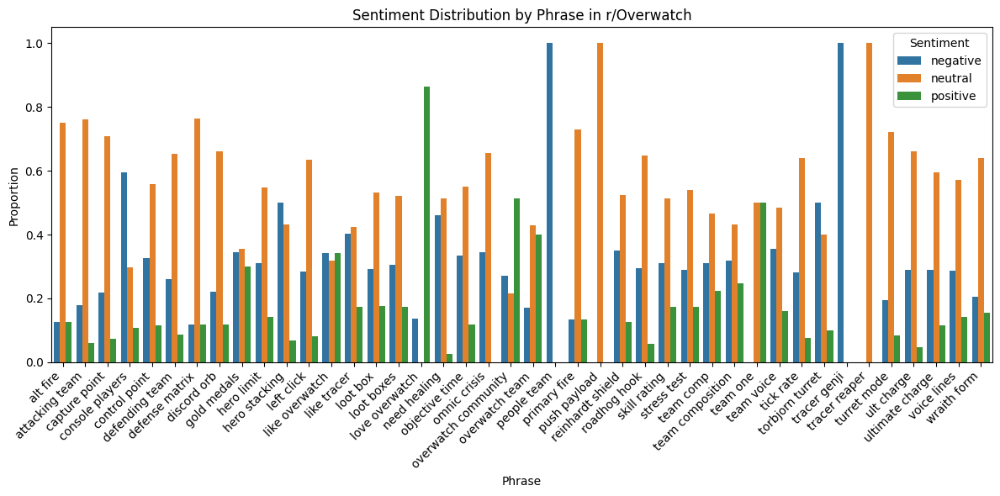
    


    
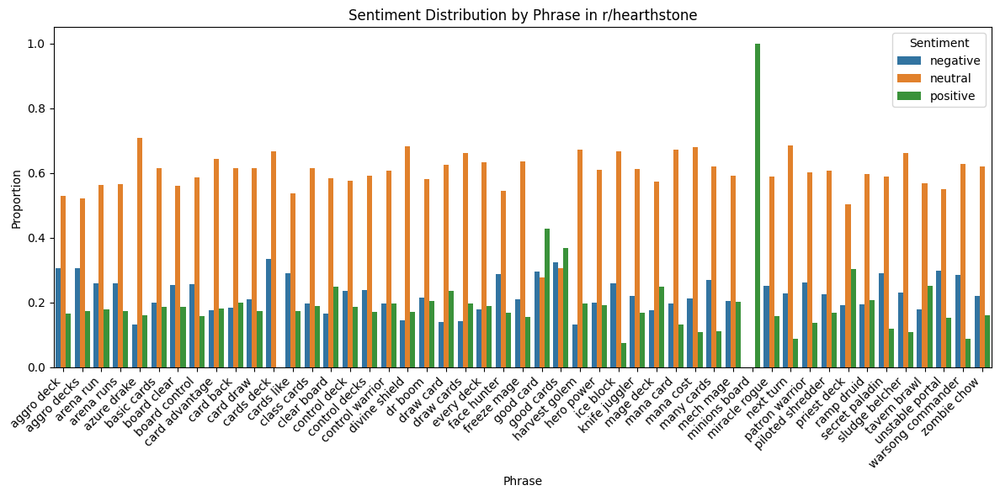
    


    
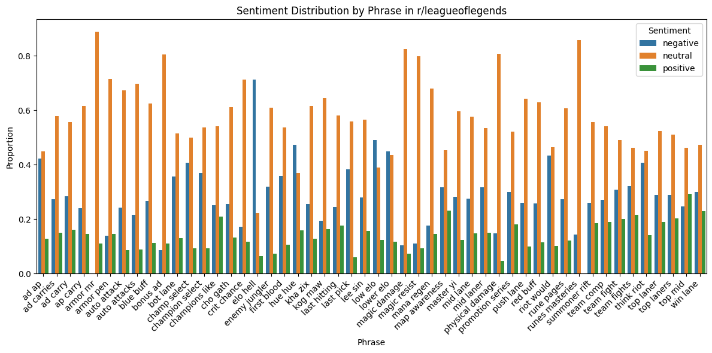
    


    
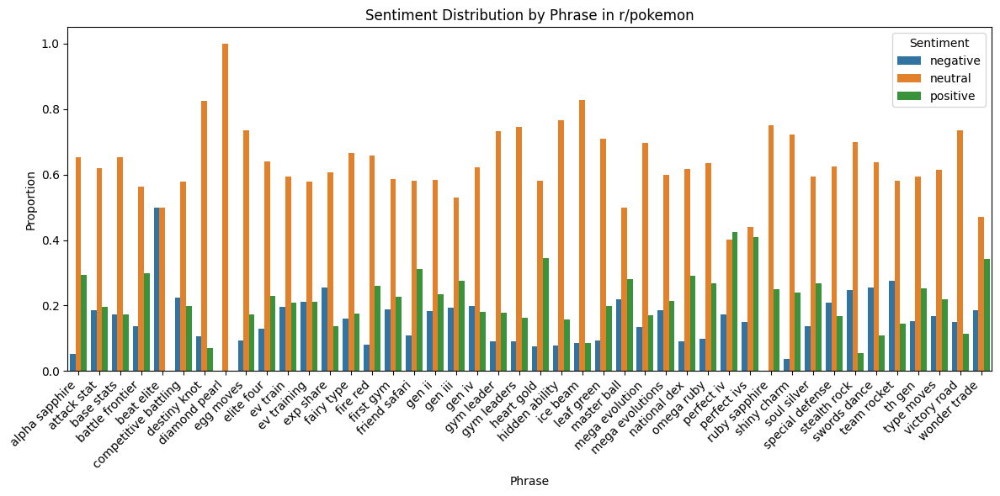
    


    
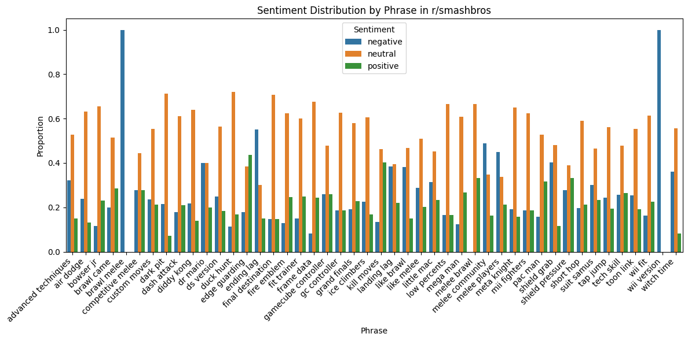
    


    
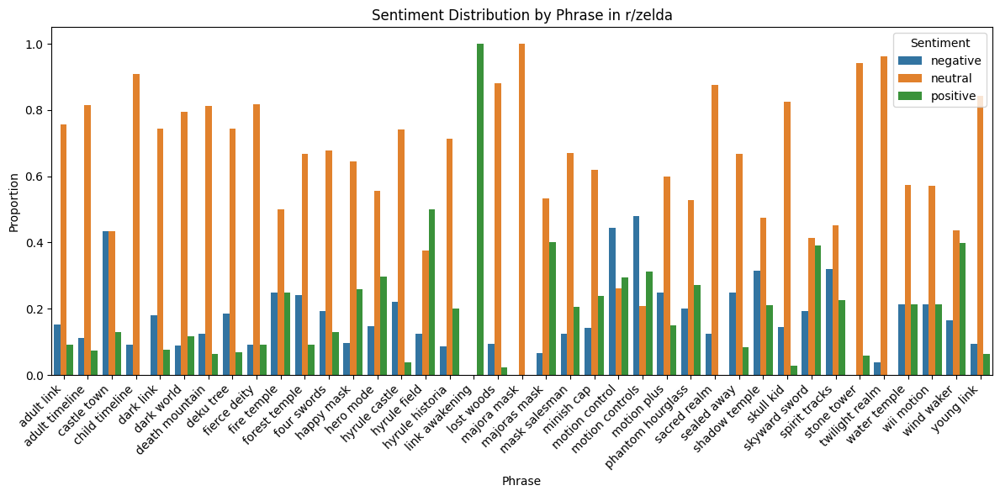
    


```python
# Get phrases with positive sentiment dominance
top_positive = (
    sentiment_summary[sentiment_summary['senti_label'] == 'positive']
    .sort_values(by='proportion', ascending=False)
    .head(20)
)

# Get phrases with negative sentiment dominance
top_negative = (
    sentiment_summary[sentiment_summary['senti_label'] == 'negative']
    .sort_values(by='proportion', ascending=False)
    .head(20)
)
```


```python
print("Top 20 Positive Phrases by Proportion:")
display(top_positive[['subreddit', 'phrase', 'proportion', 'avg_score']])

print("\nTop 20 Negative Phrases by Proportion:")
display(top_negative[['subreddit', 'phrase', 'proportion', 'avg_score']])
```

    Top 20 Positive Phrases by Proportion:
    


<div>
<style scoped>
    .dataframe tbody tr th:only-of-type {
        vertical-align: middle;
    }

    .dataframe tbody tr th {
        vertical-align: top;
    }

    .dataframe thead th {
        text-align: right;
    }
</style>
<table border="1" class="dataframe">
  <thead>
    <tr style="text-align: right;">
      <th></th>
      <th>subreddit</th>
      <th>phrase</th>
      <th>proportion</th>
      <th>avg_score</th>
    </tr>
  </thead>
  <tbody>
    <tr>
      <th>718</th>
      <td>zelda</td>
      <td>link awakening</td>
      <td>1.000000</td>
      <td>0.819074</td>
    </tr>
    <tr>
      <th>222</th>
      <td>hearthstone</td>
      <td>minions board</td>
      <td>1.000000</td>
      <td>0.509468</td>
    </tr>
    <tr>
      <th>49</th>
      <td>Overwatch</td>
      <td>love overwatch</td>
      <td>0.863636</td>
      <td>0.852015</td>
    </tr>
    <tr>
      <th>60</th>
      <td>Overwatch</td>
      <td>overwatch community</td>
      <td>0.513514</td>
      <td>0.841216</td>
    </tr>
    <tr>
      <th>88</th>
      <td>Overwatch</td>
      <td>team one</td>
      <td>0.500000</td>
      <td>0.980734</td>
    </tr>
    <tr>
      <th>714</th>
      <td>zelda</td>
      <td>hyrule field</td>
      <td>0.500000</td>
      <td>0.754940</td>
    </tr>
    <tr>
      <th>574</th>
      <td>smashbros</td>
      <td>edge guarding</td>
      <td>0.435897</td>
      <td>0.784901</td>
    </tr>
    <tr>
      <th>191</th>
      <td>hearthstone</td>
      <td>good card</td>
      <td>0.426710</td>
      <td>0.804488</td>
    </tr>
    <tr>
      <th>499</th>
      <td>pokemon</td>
      <td>perfect iv</td>
      <td>0.424581</td>
      <td>0.718369</td>
    </tr>
    <tr>
      <th>502</th>
      <td>pokemon</td>
      <td>perfect ivs</td>
      <td>0.408602</td>
      <td>0.712203</td>
    </tr>
    <tr>
      <th>604</th>
      <td>smashbros</td>
      <td>kill moves</td>
      <td>0.402985</td>
      <td>0.751578</td>
    </tr>
    <tr>
      <th>725</th>
      <td>zelda</td>
      <td>majoras mask</td>
      <td>0.400000</td>
      <td>0.900298</td>
    </tr>
    <tr>
      <th>63</th>
      <td>Overwatch</td>
      <td>overwatch team</td>
      <td>0.400000</td>
      <td>0.880437</td>
    </tr>
    <tr>
      <th>773</th>
      <td>zelda</td>
      <td>wind waker</td>
      <td>0.399329</td>
      <td>0.807920</td>
    </tr>
    <tr>
      <th>757</th>
      <td>zelda</td>
      <td>skyward sword</td>
      <td>0.392045</td>
      <td>0.813100</td>
    </tr>
    <tr>
      <th>194</th>
      <td>hearthstone</td>
      <td>good cards</td>
      <td>0.368750</td>
      <td>0.784246</td>
    </tr>
    <tr>
      <th>472</th>
      <td>pokemon</td>
      <td>heart gold</td>
      <td>0.345679</td>
      <td>0.815495</td>
    </tr>
    <tr>
      <th>534</th>
      <td>pokemon</td>
      <td>wonder trade</td>
      <td>0.342857</td>
      <td>0.744863</td>
    </tr>
    <tr>
      <th>38</th>
      <td>Overwatch</td>
      <td>like overwatch</td>
      <td>0.340909</td>
      <td>0.798802</td>
    </tr>
    <tr>
      <th>645</th>
      <td>smashbros</td>
      <td>shield pressure</td>
      <td>0.333333</td>
      <td>0.720046</td>
    </tr>
  </tbody>
</table>
</div>


    
    Top 20 Negative Phrases by Proportion:
    


<div>
<style scoped>
    .dataframe tbody tr th:only-of-type {
        vertical-align: middle;
    }

    .dataframe tbody tr th {
        vertical-align: top;
    }

    .dataframe thead th {
        text-align: right;
    }
</style>
<table border="1" class="dataframe">
  <thead>
    <tr style="text-align: right;">
      <th></th>
      <th>subreddit</th>
      <th>phrase</th>
      <th>proportion</th>
      <th>avg_score</th>
    </tr>
  </thead>
  <tbody>
    <tr>
      <th>547</th>
      <td>smashbros</td>
      <td>brawl melee</td>
      <td>1.000000</td>
      <td>0.606089</td>
    </tr>
    <tr>
      <th>664</th>
      <td>smashbros</td>
      <td>wii version</td>
      <td>1.000000</td>
      <td>0.567349</td>
    </tr>
    <tr>
      <th>64</th>
      <td>Overwatch</td>
      <td>people team</td>
      <td>1.000000</td>
      <td>0.761938</td>
    </tr>
    <tr>
      <th>98</th>
      <td>Overwatch</td>
      <td>tracer genji</td>
      <td>1.000000</td>
      <td>0.677416</td>
    </tr>
    <tr>
      <th>306</th>
      <td>leagueoflegends</td>
      <td>elo hell</td>
      <td>0.712476</td>
      <td>0.757885</td>
    </tr>
    <tr>
      <th>9</th>
      <td>Overwatch</td>
      <td>console players</td>
      <td>0.594595</td>
      <td>0.719417</td>
    </tr>
    <tr>
      <th>575</th>
      <td>smashbros</td>
      <td>ending lag</td>
      <td>0.550000</td>
      <td>0.714977</td>
    </tr>
    <tr>
      <th>419</th>
      <td>pokemon</td>
      <td>beat elite</td>
      <td>0.500000</td>
      <td>0.493966</td>
    </tr>
    <tr>
      <th>95</th>
      <td>Overwatch</td>
      <td>torbjorn turret</td>
      <td>0.500000</td>
      <td>0.698281</td>
    </tr>
    <tr>
      <th>30</th>
      <td>Overwatch</td>
      <td>hero stacking</td>
      <td>0.500000</td>
      <td>0.656602</td>
    </tr>
    <tr>
      <th>333</th>
      <td>leagueoflegends</td>
      <td>low elo</td>
      <td>0.489155</td>
      <td>0.741798</td>
    </tr>
    <tr>
      <th>625</th>
      <td>smashbros</td>
      <td>melee community</td>
      <td>0.488372</td>
      <td>0.741210</td>
    </tr>
    <tr>
      <th>735</th>
      <td>zelda</td>
      <td>motion controls</td>
      <td>0.479167</td>
      <td>0.778666</td>
    </tr>
    <tr>
      <th>315</th>
      <td>leagueoflegends</td>
      <td>hue hue</td>
      <td>0.473684</td>
      <td>0.716914</td>
    </tr>
    <tr>
      <th>50</th>
      <td>Overwatch</td>
      <td>need healing</td>
      <td>0.459459</td>
      <td>0.776415</td>
    </tr>
    <tr>
      <th>628</th>
      <td>smashbros</td>
      <td>melee players</td>
      <td>0.449438</td>
      <td>0.750196</td>
    </tr>
    <tr>
      <th>336</th>
      <td>leagueoflegends</td>
      <td>lower elo</td>
      <td>0.449438</td>
      <td>0.722040</td>
    </tr>
    <tr>
      <th>732</th>
      <td>zelda</td>
      <td>motion control</td>
      <td>0.445378</td>
      <td>0.774339</td>
    </tr>
    <tr>
      <th>674</th>
      <td>zelda</td>
      <td>castle town</td>
      <td>0.434783</td>
      <td>0.763934</td>
    </tr>
    <tr>
      <th>372</th>
      <td>leagueoflegends</td>
      <td>riot would</td>
      <td>0.433083</td>
      <td>0.711083</td>
    </tr>
  </tbody>
</table>
</div>


```python
pivot_df = sentiment_summary.pivot_table(
    index=['subreddit', 'phrase'],
    columns='senti_label',
    values='proportion',
    fill_value=0
).reset_index()

# Dominant label
pivot_df['dominant_label'] = pivot_df[['positive', 'negative', 'neutral']].idxmax(axis=1)

# Pozitif dominant
positive_dominant = pivot_df[pivot_df['dominant_label'] == 'positive']
# Negatif dominant
negative_dominant = pivot_df[pivot_df['dominant_label'] == 'negative']

# Phrase -> dict
positive_phrases = dict(zip(positive_dominant['phrase'], positive_dominant['positive']))
negative_phrases = dict(zip(negative_dominant['phrase'], negative_dominant['negative']))

fig, axes = plt.subplots(1, 2, figsize=(20, 10))

# Pozitif
wordcloud_pos = WordCloud(
    width=800, height=600, background_color='white', colormap='Greens'
).generate_from_frequencies(positive_phrases)

axes[0].imshow(wordcloud_pos, interpolation='bilinear')
axes[0].set_title('Positive-Dominant Phrases', fontsize=20)
axes[0].axis('off')

# Negatif
wordcloud_neg = WordCloud(
    width=800, height=600, background_color='white', colormap='Reds'
).generate_from_frequencies(negative_phrases)

axes[1].imshow(wordcloud_neg, interpolation='bilinear')
axes[1].set_title('Negative-Dominant Phrases', fontsize=20)
axes[1].axis('off')

plt.tight_layout()
plt.show()
```


    
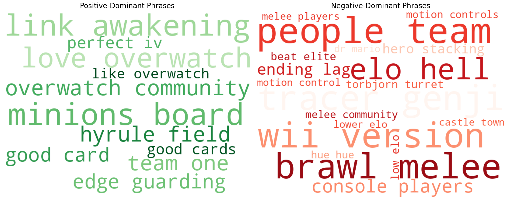
    


```python
import matplotlib.pyplot as plt
import seaborn as sns
from wordcloud import WordCloud

# Aggregate emotion summary (similar to your sentiment_summary)
emotion_summary = (
    phrase_sentiments_df
    .groupby(['subreddit', 'phrase', 'emo_label'])
    .agg(
        count=('emo_label', 'size'),
        avg_score=('emo_score', 'mean')
    )
    .reset_index()
)

# Get total counts per subreddit and phrase
total_counts_emo = (
    phrase_sentiments_df
    .groupby(['subreddit', 'phrase'])
    .size()
    .reset_index(name='total_count')
)

# Merge and compute proportions
emotion_summary = emotion_summary.merge(total_counts_emo, on=['subreddit', 'phrase'])
emotion_summary['proportion'] = emotion_summary['count'] / emotion_summary['total_count']

# Bar plots for emotions
subreddits = emotion_summary['subreddit'].unique()

for subreddit in subreddits:
    subset = emotion_summary[emotion_summary['subreddit'] == subreddit]
    
    plt.figure(figsize=(12, 6))
    sns.barplot(
        data=subset, 
        x='phrase', 
        y='proportion', 
        hue='emo_label'
    )
    plt.xticks(rotation=45, ha='right')
    plt.title(f'Emotion Distribution by Phrase in r/{subreddit}')
    plt.ylabel('Proportion')
    plt.xlabel('Phrase')
    plt.legend(title='Emotion')
    plt.tight_layout()
    plt.show()
```


    
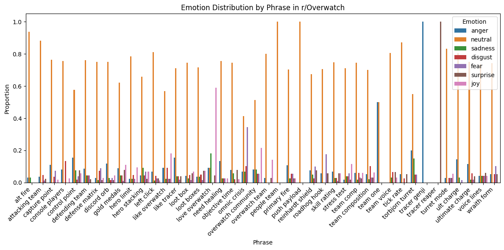
    


    
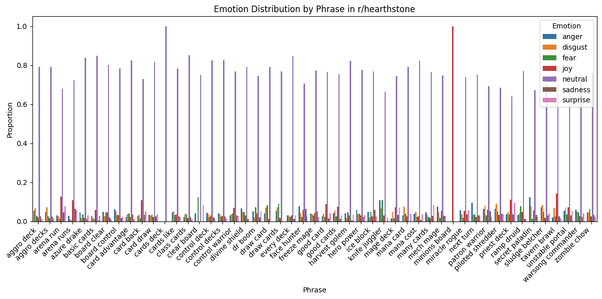
    


    
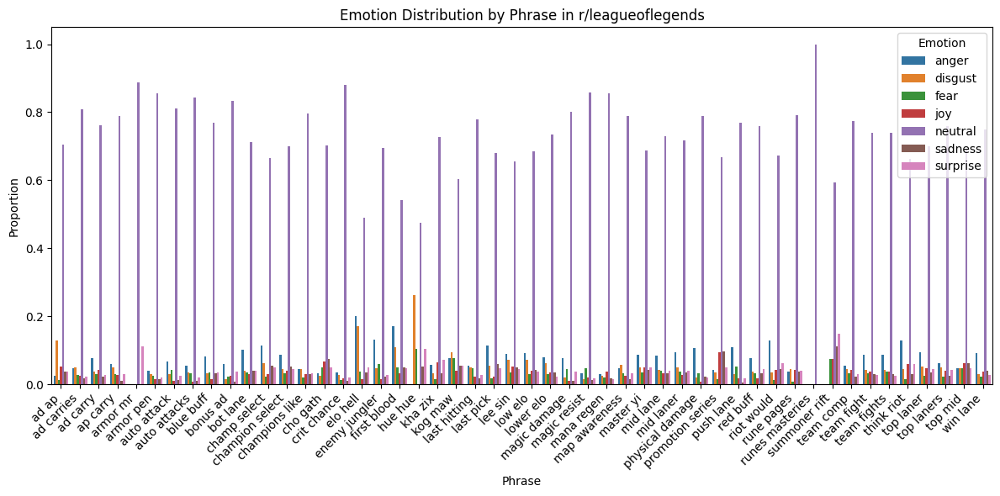
    


    
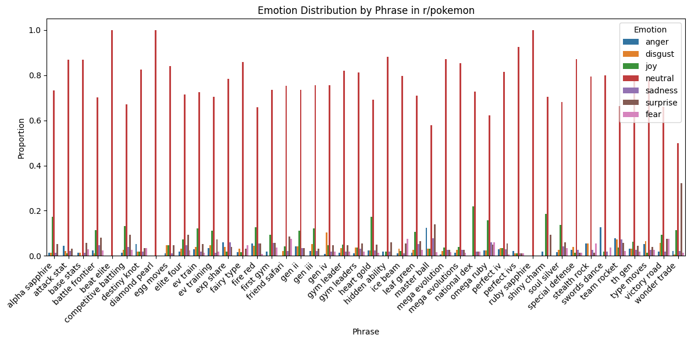
    


    
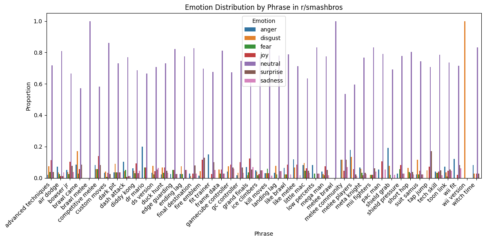
    


    
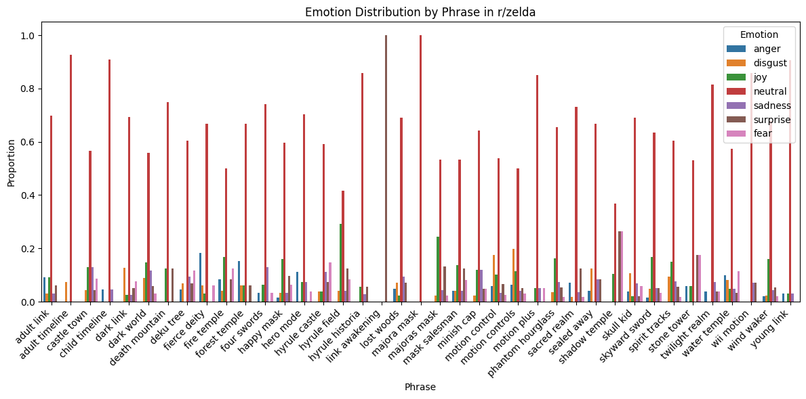
    


```python
# Pivot for dominant emotion per phrase
emotion_pivot_df = emotion_summary.pivot_table(
    index=['subreddit', 'phrase'],
    columns='emo_label',
    values='proportion',
    fill_value=0
).reset_index()

# Find dominant emotion excluding neutral later
emotion_pivot_df['dominant_emotion'] = emotion_pivot_df.loc[:, 
    [col for col in emotion_pivot_df.columns if col not in ['subreddit', 'phrase']]
].idxmax(axis=1)

# Exclude neutral dominant phrases
non_neutral_emotion_phrases = emotion_pivot_df[emotion_pivot_df['dominant_emotion'] != 'neutral']

print(non_neutral_emotion_phrases[['subreddit', 'phrase', 'dominant_emotion']].head(20))
```

    emo_label    subreddit          phrase dominant_emotion
    16           Overwatch  love overwatch              joy
    31           Overwatch        team one            anger
    35           Overwatch    tracer genji            anger
    36           Overwatch   tracer reaper         surprise
    78         hearthstone   minions board              joy
    229          smashbros     wii version          disgust
    248              zelda  link awakening         surprise
    


```python
def get_second_dominant(row):
    # Select only emotion columns (should be all floats)
    emotions = row[emotion_cols]

    # Sort descending
    sorted_emotions = emotions.sort_values(ascending=False)

    # Filter out zero or very small values (avoid meaningless seconds)
    filtered = sorted_emotions[sorted_emotions > 0]

    if len(filtered) < 2:
        return None  # no valid second dominant

    return filtered.index[1]  # second highest emotion label
```


```python
emotion_pivot_df['second_dominant_emotion'] = emotion_pivot_df.apply(get_second_dominant, axis=1)
```


```python
# Define your emotions and their corresponding colormaps
emotion_colormaps = {
    'anger': 'Reds',
    'disgust': 'Purples',
    'fear': 'Blues',
    'joy': 'Greens',
    'sadness': 'Greys',
    'surprise': 'Oranges',
    # 'neutral' intentionally excluded if you want to skip it
}

# Filter emotion columns (exclude meta columns)
emotion_cols = [col for col in emotion_pivot_df.columns if col not in ['subreddit', 'phrase', 'dominant_emotion', 'second_dominant_emotion']]

# Keep only emotions in your colormap dict and second dominant emotion
emotions_to_plot = [e for e in emotion_cols if e in emotion_colormaps]

# Set up the grid size for subplots dynamically (e.g., 2 cols)
cols = 2
rows = (len(emotions_to_plot) + cols - 1) // cols

fig, axes = plt.subplots(rows, cols, figsize=(15, 7*rows))
axes = axes.flatten()

for i, emotion in enumerate(emotions_to_plot):
    # Get phrases where second dominant emotion is this emotion
    filtered_phrases = emotion_pivot_df[emotion_pivot_df['second_dominant_emotion'] == emotion]
    
    if filtered_phrases.empty:
        axes[i].axis('off')
        axes[i].set_title(f'No data for {emotion}')
        continue
    
    freq_dict = dict(zip(filtered_phrases['phrase'], filtered_phrases[emotion]))
    
    wordcloud = WordCloud(
        width=800, height=600,
        background_color='white',
        colormap=emotion_colormaps[emotion]
    ).generate_from_frequencies(freq_dict)
    
    axes[i].imshow(wordcloud, interpolation='bilinear')
    axes[i].set_title(f'Second Dominant Emotion: {emotion.capitalize()}', fontsize=18)
    axes[i].axis('off')

# Turn off any unused axes if total emotions < rows*cols
for j in range(i+1, rows*cols):
    axes[j].axis('off')

plt.tight_layout()
plt.show()

```


    
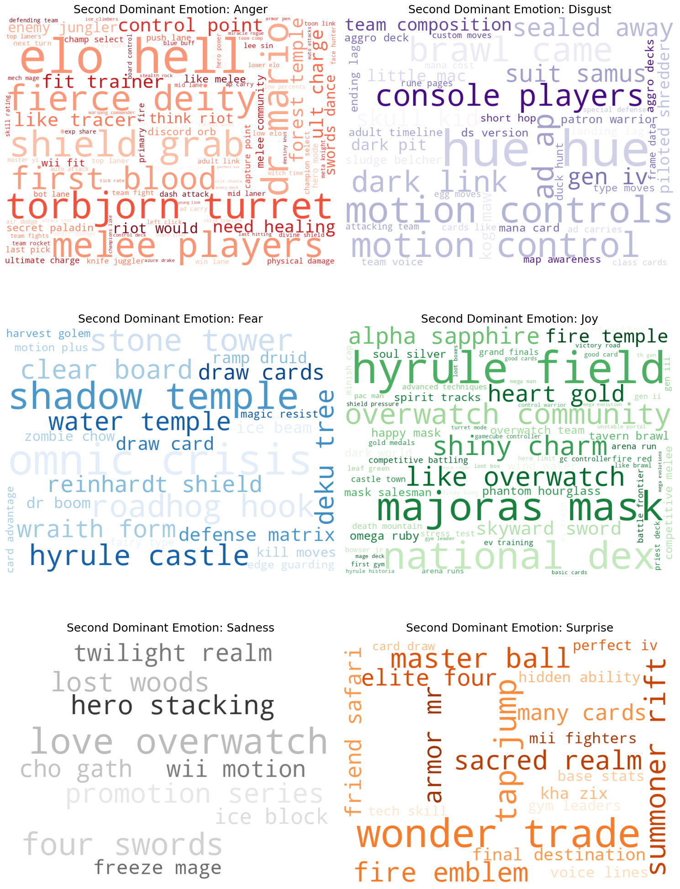
    


```python

```
