## 1. Introduction

Online gaming communities have become vibrant spaces where players interact, share experiences, and form collective identities. Reddit, as a popular platform hosting a diverse range of gaming subreddits, offers a rich opportunity to study how language reflects and shapes these unique gaming cultures. Each subreddit not only discusses gameplay and strategies but also develops its own distinctive language patterns, emotional expressions, and thematic references that define its community.

Understanding how these communities use language—particularly distinctive phrases and emotional tone—can provide valuable insights into their cultural identities. Phrases frequently used within a subreddit often encode information about the game’s mechanics, characters, and themes, revealing what is important to that community. Moreover, emotional language patterns can reflect the social dynamics and shared attitudes prevalent among players.

This part of our project investigates whether distinct gaming communities on Reddit exhibit unique gaming cultural signatures. Our goal is to uncover semantic and emotional patterns that either differentiate or unite these communities.

To achieve this, we extract distinctive phrases using TF-IDF, train Word2Vec embeddings to capture semantic relationships within and across gaming communities, and use dimensionality reduction and clustering techniques to analyze the data. Additionally, we perform sentiment analysis on key phrases to explore variations in emotional tone across subreddits.

We examine five major gaming communities on Reddit: Hearthstone, League of Legends, Overwatch, Pokémon, Zelda, and Smashbros. We seek to answer the following questions for the first part of our project:

1. Do unique phrases reflect the specific themes, mechanics, or any characteristics of their respective games?

2. What insights can Word2Vec embeddings provide about the shared or distinct gaming culture in different subreddits based on phrases?

3. Do emotional patterns in phrase usage reveal shared or distinct elements across different gaming communities on Reddit?

Hyptheses: 

1. The most distinctive bigrams in each subreddit reflect the core game mechanics, characters, and thematic concerns unique to that gaming community, indicating that phrase usage is shaped by the content and culture of the game being discussed.
   
2. Word2Vec embeddings will capture meaningful semantic relationships between phrases, such that subreddits with overlapping gameplay styles will show similar phrase neighborhoods, while distinct communities will form separate clusters in the embedding space.

3. Game terms that share more features may reflect similar emotional patterns in phrase usage across communities.


```python
pip install pandas
```

    Requirement already satisfied: pandas in /usr/local/lib/python3.11/dist-packages (2.2.3)
    Requirement already satisfied: numpy>=1.23.2 in /usr/local/lib/python3.11/dist-packages (from pandas) (1.26.4)
    Requirement already satisfied: python-dateutil>=2.8.2 in /usr/local/lib/python3.11/dist-packages (from pandas) (2.9.0.post0)
    Requirement already satisfied: pytz>=2020.1 in /usr/local/lib/python3.11/dist-packages (from pandas) (2025.2)
    Requirement already satisfied: tzdata>=2022.7 in /usr/local/lib/python3.11/dist-packages (from pandas) (2025.2)
    Requirement already satisfied: mkl_fft in /usr/local/lib/python3.11/dist-packages (from numpy>=1.23.2->pandas) (1.3.8)
    Requirement already satisfied: mkl_random in /usr/local/lib/python3.11/dist-packages (from numpy>=1.23.2->pandas) (1.2.4)
    Requirement already satisfied: mkl_umath in /usr/local/lib/python3.11/dist-packages (from numpy>=1.23.2->pandas) (0.1.1)
    Requirement already satisfied: mkl in /usr/local/lib/python3.11/dist-packages (from numpy>=1.23.2->pandas) (2025.1.0)
    Requirement already satisfied: tbb4py in /usr/local/lib/python3.11/dist-packages (from numpy>=1.23.2->pandas) (2022.1.0)
    Requirement already satisfied: mkl-service in /usr/local/lib/python3.11/dist-packages (from numpy>=1.23.2->pandas) (2.4.1)
    Requirement already satisfied: six>=1.5 in /usr/local/lib/python3.11/dist-packages (from python-dateutil>=2.8.2->pandas) (1.17.0)
    Requirement already satisfied: intel-openmp<2026,>=2024 in /usr/local/lib/python3.11/dist-packages (from mkl->numpy>=1.23.2->pandas) (2024.2.0)
    Requirement already satisfied: tbb==2022.* in /usr/local/lib/python3.11/dist-packages (from mkl->numpy>=1.23.2->pandas) (2022.1.0)
    Requirement already satisfied: tcmlib==1.* in /usr/local/lib/python3.11/dist-packages (from tbb==2022.*->mkl->numpy>=1.23.2->pandas) (1.3.0)
    Requirement already satisfied: intel-cmplr-lib-rt in /usr/local/lib/python3.11/dist-packages (from mkl_umath->numpy>=1.23.2->pandas) (2024.2.0)
    Requirement already satisfied: intel-cmplr-lib-ur==2024.2.0 in /usr/local/lib/python3.11/dist-packages (from intel-openmp<2026,>=2024->mkl->numpy>=1.23.2->pandas) (2024.2.0)
    Note: you may need to restart the kernel to use updated packages.
    


```python
import pandas as pd
from datasets import load_dataset, DownloadMode
import matplotlib.pyplot as plt
import re
import nltk
from nltk.corpus import stopwords
from sklearn.feature_extraction.text import TfidfVectorizer
nltk.download('punkt')
from nltk.tokenize import word_tokenize
nltk.download('stopwords')
stop_words = set(stopwords.words('english'))
from wordcloud import WordCloud
```

    [nltk_data] Downloading package punkt to /usr/share/nltk_data...
    [nltk_data]   Package punkt is already up-to-date!
    [nltk_data] Downloading package stopwords to /usr/share/nltk_data...
    [nltk_data]   Package stopwords is already up-to-date!
    


```python
ds = load_dataset("webis/tldr-17", split="train", trust_remote_code=True)
```


    README.md: 0.00B [00:00, ?B/s]


    tldr-17.py: 0.00B [00:00, ?B/s]


    dataset_infos.json: 0.00B [00:00, ?B/s]


    corpus-webis-tldr-17.zip:   0%|          | 0.00/3.14G [00:00<?, ?B/s]


    Generating train split:   0%|          | 0/3848330 [00:00<?, ? examples/s]


    Loading dataset shards:   0%|          | 0/38 [00:00<?, ?it/s]


```python
df = ds.to_pandas()
df = df[['subreddit', 'body', 'content']].dropna()
df
```


<div>
<style scoped>
    .dataframe tbody tr th:only-of-type {
        vertical-align: middle;
    }

    .dataframe tbody tr th {
        vertical-align: top;
    }

    .dataframe thead th {
        text-align: right;
    }
</style>
<table border="1" class="dataframe">
  <thead>
    <tr style="text-align: right;">
      <th></th>
      <th>subreddit</th>
      <th>body</th>
      <th>content</th>
    </tr>
  </thead>
  <tbody>
    <tr>
      <th>0</th>
      <td>math</td>
      <td>I think it should be fixed on either UTC stand...</td>
      <td>I think it should be fixed on either UTC stand...</td>
    </tr>
    <tr>
      <th>1</th>
      <td>funny</td>
      <td>Art is about the hardest thing to categorize i...</td>
      <td>Art is about the hardest thing to categorize i...</td>
    </tr>
    <tr>
      <th>2</th>
      <td>Borderlands</td>
      <td>Ask me what I think about the Wall Street Jour...</td>
      <td>Ask me what I think about the Wall Street Jour...</td>
    </tr>
    <tr>
      <th>3</th>
      <td>gamingpc</td>
      <td>In Mechwarrior Online, I have begun to use a m...</td>
      <td>In Mechwarrior Online, I have begun to use a m...</td>
    </tr>
    <tr>
      <th>4</th>
      <td>Diablo</td>
      <td>You are talking about the Charsi imbue, right?...</td>
      <td>You are talking about the Charsi imbue, right?...</td>
    </tr>
    <tr>
      <th>...</th>
      <td>...</td>
      <td>...</td>
      <td>...</td>
    </tr>
    <tr>
      <th>3848325</th>
      <td>sex</td>
      <td>I've finally gotten around to initiating plans...</td>
      <td>I've finally gotten around to initiating plans...</td>
    </tr>
    <tr>
      <th>3848326</th>
      <td>AskReddit</td>
      <td>Long time lurker, first time poster here. I'm ...</td>
      <td>Long time lurker, first time poster here. I'm ...</td>
    </tr>
    <tr>
      <th>3848327</th>
      <td>AskReddit</td>
      <td>Long time lurker, first time poster here. I'm ...</td>
      <td>Long time lurker, first time poster here. I'm ...</td>
    </tr>
    <tr>
      <th>3848328</th>
      <td>battlefield3</td>
      <td>My xbox hasn't been in the best of health rece...</td>
      <td>My xbox hasn't been in the best of health rece...</td>
    </tr>
    <tr>
      <th>3848329</th>
      <td>IASIP</td>
      <td>I found this sub-reddit by clicking 'random' a...</td>
      <td>I found this sub-reddit by clicking 'random' a...</td>
    </tr>
  </tbody>
</table>
<p>3848330 rows × 3 columns</p>
</div>


```python
# Define target game subreddits
game_subreddits = ['leagueoflegends', 'pokemon', 'zelda', 'Overwatch', 'smashbros', 'hearthstone']

# Filter the DataFrame
df_games = df[df['subreddit'].isin(game_subreddits)].copy()

df_games['subreddit'].value_counts()
```


    subreddit
    leagueoflegends    109307
    hearthstone          9500
    pokemon              6464
    smashbros            4464
    Overwatch            3633
    zelda                1182
    Name: count, dtype: int64


## 2. Methods

## -Step 1: Preprocessing and Data Cleaning

Firstly, we used the content text that doesn't include TL;DR part because it could bias the phrase extraction towards words that are common in summaries. Summaries often repeat key points in a condensed way rather than reflecting the natural flow of the document. 

We aimed to extract distinct phrases for each subreddit using a TF-IDF model. To improve the quality of the results, we first removed elements that are not useful for our task, such as links and stop words. In addition to stop words, we noticed that some phrases still appeared as important — for example, phrases like “quick play”, “ranked games”, or “playing overwatch”. To address this, we also removed certain domain-related words like “play”, “playing”, “game”, as well as the names of the games themselves, like "pokemon", "zelda", and "smash" etc., so that phrases containing these words would not dominate the results. Finally, we applied stemming to normalize word forms and avoid treating different surface forms of the same concept as distinct phrases.

Note: I did not apply stemming for TF-IDF because the Word2Vec model was trained on original (unstemmed) words. Stemming TF-IDF phrases created tokens that don’t match Word2Vec’s vocabulary, making it hard to retrieve embeddings or find similar words. Keeping original word forms ensures consistency between TF-IDF phrases and Word2Vec embeddings. That’s why our TF-IDF phrases may look a bit messy, but they work well for matching with the Word2Vec embeddings.


```python
common_words = {"game", "games", "gaming", "player", "play", "playing", "plays", "pokemon", "zelda", "smash", "smashbros" "overwatch", "hearthstone", "legends"}
    
def preprocess(text):
    text = text.lower()
    text = re.sub(r"http\S+|www\S+|https\S+", '', text) #removes links if any
    text = re.sub(r'[^a-z\s]', ' ', text) #replaces anything that is not a letter or space with a space
    text = re.sub(r'\s+', ' ', text).strip() #replace multiple whitespace characters with a single space
    tokens = text.split()
    tokens = [word for word in tokens if word not in stop_words and word not in common_words]
    return " ".join(tokens)

# Apply to the filtered gaming dataset
df_games['cleaned_body'] = df_games['content'].apply(preprocess)
```


```python
df_games[['subreddit', 'body', 'cleaned_body']].head()
```


<div>
<style scoped>
    .dataframe tbody tr th:only-of-type {
        vertical-align: middle;
    }

    .dataframe tbody tr th {
        vertical-align: top;
    }

    .dataframe thead th {
        text-align: right;
    }
</style>
<table border="1" class="dataframe">
  <thead>
    <tr style="text-align: right;">
      <th></th>
      <th>subreddit</th>
      <th>body</th>
      <th>cleaned_body</th>
    </tr>
  </thead>
  <tbody>
    <tr>
      <th>15</th>
      <td>leagueoflegends</td>
      <td>Didn't they lose 6 games in a row? Just becaus...</td>
      <td>lose row close mean lot weaker team love arkan...</td>
    </tr>
    <tr>
      <th>64</th>
      <td>leagueoflegends</td>
      <td>Because spinning axe is a massive damage buff(...</td>
      <td>spinning axe massive damage buff percent based...</td>
    </tr>
    <tr>
      <th>106</th>
      <td>zelda</td>
      <td>My thoughts from nine months ago and its corre...</td>
      <td>thoughts nine months ago corresponding discuss...</td>
    </tr>
    <tr>
      <th>123</th>
      <td>leagueoflegends</td>
      <td>I agree, and feel like TRM...may or may not ge...</td>
      <td>agree feel like trm may may get lot unnecessar...</td>
    </tr>
    <tr>
      <th>124</th>
      <td>leagueoflegends</td>
      <td>I kinda of have issue with putting blame on ju...</td>
      <td>kinda issue putting blame one party yes agree ...</td>
    </tr>
  </tbody>
</table>
</div>


```python
# quickly identify the word's frequencies
# Join all cleaned text
all_text = " ".join(df_games['cleaned_body'])

# Generate word cloud
wordcloud = WordCloud(width=800, height=400, background_color='white').generate(all_text)

wordcloud.to_image()
```


    
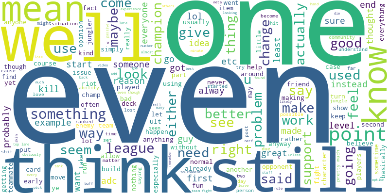
    


```python
# Group posts by subreddit and concatenate all texts
grouped = df_games.groupby('subreddit')['cleaned_body'].apply(lambda texts: ' '.join(texts)).reset_index()
```

We want to identify which bigrams are most characteristic of each subreddit. To do this, we compute the importance of specific bigrams (2-word phrases) for each subreddit using TF-IDF. We also experimented with extracting both unigrams and bigrams, but the results were mostly dominated by character names and failed to capture game-specific concepts or meaningful semantic clusters.


```python
# Create the vectorizer
vectorizer = TfidfVectorizer(ngram_range=(2,2), max_df=0.6, use_idf=True)  #max_df: ignores bigrams that appear in more than 60% of documents

# Fit and transform
tfidf_matrix = vectorizer.fit_transform(grouped['cleaned_body'])

# Convert to DataFrame
tfidf_df = pd.DataFrame(tfidf_matrix.toarray(), index=grouped['subreddit'], columns=vectorizer.get_feature_names_out())
```


```python
tfidf_df
```


<div>
<style scoped>
    .dataframe tbody tr th:only-of-type {
        vertical-align: middle;
    }

    .dataframe tbody tr th {
        vertical-align: top;
    }

    .dataframe thead th {
        text-align: right;
    }
</style>
<table border="1" class="dataframe">
  <thead>
    <tr style="text-align: right;">
      <th></th>
      <th>aa aa</th>
      <th>aa ab</th>
      <th>aa abilities</th>
      <th>aa ability</th>
      <th>aa able</th>
      <th>aa abuse</th>
      <th>aa activated</th>
      <th>aa activating</th>
      <th>aa active</th>
      <th>aa actually</th>
      <th>...</th>
      <th>zzzzzzz fuck</th>
      <th>zzzzzzz lock</th>
      <th>zzzzzzz shit</th>
      <th>zzzzzzzz deven</th>
      <th>zzzzzzzz seen</th>
      <th>zzzzzzzzzzz annoying</th>
      <th>zzzzzzzzzzz guys</th>
      <th>zzzzzzzzzzz jarvan</th>
      <th>zzzzzzzzzzzzzz friends</th>
      <th>zzzzzzzzzzzzzzzzzzzzzzzzzzzzzzzzzzz amourious</th>
    </tr>
    <tr>
      <th>subreddit</th>
      <th></th>
      <th></th>
      <th></th>
      <th></th>
      <th></th>
      <th></th>
      <th></th>
      <th></th>
      <th></th>
      <th></th>
      <th></th>
      <th></th>
      <th></th>
      <th></th>
      <th></th>
      <th></th>
      <th></th>
      <th></th>
      <th></th>
      <th></th>
      <th></th>
    </tr>
  </thead>
  <tbody>
    <tr>
      <th>Overwatch</th>
      <td>0.000000</td>
      <td>0.000000</td>
      <td>0.000000</td>
      <td>0.00000</td>
      <td>0.000000</td>
      <td>0.000000</td>
      <td>0.000000</td>
      <td>0.000000</td>
      <td>0.000000</td>
      <td>0.000000</td>
      <td>...</td>
      <td>0.000000</td>
      <td>0.000000</td>
      <td>0.000000</td>
      <td>0.000000</td>
      <td>0.000000</td>
      <td>0.000000</td>
      <td>0.000000</td>
      <td>0.000000</td>
      <td>0.000000</td>
      <td>0.000000</td>
    </tr>
    <tr>
      <th>hearthstone</th>
      <td>0.000000</td>
      <td>0.000000</td>
      <td>0.000000</td>
      <td>0.00000</td>
      <td>0.000000</td>
      <td>0.000000</td>
      <td>0.000000</td>
      <td>0.000000</td>
      <td>0.000000</td>
      <td>0.000000</td>
      <td>...</td>
      <td>0.000000</td>
      <td>0.000000</td>
      <td>0.000000</td>
      <td>0.000000</td>
      <td>0.000000</td>
      <td>0.000000</td>
      <td>0.000000</td>
      <td>0.000000</td>
      <td>0.000000</td>
      <td>0.000000</td>
    </tr>
    <tr>
      <th>leagueoflegends</th>
      <td>0.012194</td>
      <td>0.000061</td>
      <td>0.000368</td>
      <td>0.00049</td>
      <td>0.000123</td>
      <td>0.000061</td>
      <td>0.000061</td>
      <td>0.000061</td>
      <td>0.000245</td>
      <td>0.000245</td>
      <td>...</td>
      <td>0.000061</td>
      <td>0.000061</td>
      <td>0.000061</td>
      <td>0.000061</td>
      <td>0.000061</td>
      <td>0.000061</td>
      <td>0.000061</td>
      <td>0.000061</td>
      <td>0.000061</td>
      <td>0.000061</td>
    </tr>
    <tr>
      <th>pokemon</th>
      <td>0.000000</td>
      <td>0.000000</td>
      <td>0.000000</td>
      <td>0.00000</td>
      <td>0.000000</td>
      <td>0.000000</td>
      <td>0.000000</td>
      <td>0.000000</td>
      <td>0.000000</td>
      <td>0.000000</td>
      <td>...</td>
      <td>0.000000</td>
      <td>0.000000</td>
      <td>0.000000</td>
      <td>0.000000</td>
      <td>0.000000</td>
      <td>0.000000</td>
      <td>0.000000</td>
      <td>0.000000</td>
      <td>0.000000</td>
      <td>0.000000</td>
    </tr>
    <tr>
      <th>smashbros</th>
      <td>0.000000</td>
      <td>0.000000</td>
      <td>0.000000</td>
      <td>0.00000</td>
      <td>0.000000</td>
      <td>0.000000</td>
      <td>0.000000</td>
      <td>0.000000</td>
      <td>0.000000</td>
      <td>0.000000</td>
      <td>...</td>
      <td>0.000000</td>
      <td>0.000000</td>
      <td>0.000000</td>
      <td>0.000000</td>
      <td>0.000000</td>
      <td>0.000000</td>
      <td>0.000000</td>
      <td>0.000000</td>
      <td>0.000000</td>
      <td>0.000000</td>
    </tr>
    <tr>
      <th>zelda</th>
      <td>0.000000</td>
      <td>0.000000</td>
      <td>0.000000</td>
      <td>0.00000</td>
      <td>0.000000</td>
      <td>0.000000</td>
      <td>0.000000</td>
      <td>0.000000</td>
      <td>0.000000</td>
      <td>0.000000</td>
      <td>...</td>
      <td>0.000000</td>
      <td>0.000000</td>
      <td>0.000000</td>
      <td>0.000000</td>
      <td>0.000000</td>
      <td>0.000000</td>
      <td>0.000000</td>
      <td>0.000000</td>
      <td>0.000000</td>
      <td>0.000000</td>
    </tr>
  </tbody>
</table>
<p>6 rows × 4842295 columns</p>
</div>


There are some unusual bigrams that probably appear only in the League of Legends data, so their TF-IDF scores are non-zero there. All other subreddits lack these bigrams, resulting in TF-IDF scores of zero for those phrases. However, we assume these rare bigrams won’t significantly affect the results. We set max_df = 0.6 to ignore terms that appear in more than 60% of the documents. Such terms are considered too common and are excluded from the vocabulary.

 The higher the score, the more unique and important that bigram is for that subreddit.


```python
# Get top N unique terms
top_n = 20
for subreddit in tfidf_df.index:
    print(f"\n -Top {top_n} terms for r/{subreddit}:")
    print(f"\nPhrases \t TF-IDF score")
    top_terms = tfidf_df.loc[subreddit].sort_values(ascending=False).head(top_n)
    print(top_terms)
```

    
     -Top 20 terms for r/Overwatch:
    
    Phrases 	 TF-IDF score
    loot boxes          0.141670
    skill rating        0.098433
    torbj rn            0.086382
    mercy lucio         0.086382
    gold medals         0.082794
    reinhardt shield    0.080773
    capture point       0.079114
    tracer genji        0.078529
    attacking team      0.078194
    team comp           0.077667
    defense matrix      0.076286
    discord orb         0.070676
    loot box            0.069555
    overwatch team      0.067311
    fan hammer          0.067311
    team composition    0.065240
    lucio mercy         0.065067
    like tracer         0.062824
    left click          0.059804
    tracer reaper       0.056092
    Name: Overwatch, dtype: float64
    
     -Top 20 terms for r/hearthstone:
    
    Phrases 	 TF-IDF score
    hero power         0.218500
    control warrior    0.187971
    dr boom            0.171297
    card draw          0.170534
    next turn          0.155244
    board control      0.145845
    face hunter        0.142634
    control decks      0.129731
    aggro decks        0.124398
    cards like         0.120718
    freeze mage        0.112294
    miracle rogue      0.110202
    mana cost          0.098023
    class cards        0.090672
    knife juggler      0.082651
    mech mage          0.082303
    card advantage     0.079861
    arena run          0.077071
    board clear        0.071840
    patron warrior     0.068061
    Name: hearthstone, dtype: float64
    
     -Top 20 terms for r/leagueoflegends:
    
    Phrases 	 TF-IDF score
    bot lane           0.227563
    lee sin            0.226809
    ad carry           0.156063
    magic damage       0.131141
    champ select       0.130940
    team fight         0.127825
    team fights        0.127373
    top laner          0.116298
    kha zix            0.115808
    mid lane           0.113815
    elo hell           0.112902
    enemy jungler      0.105024
    low elo            0.092703
    auto attack        0.088829
    blue buff          0.086090
    win lane           0.078333
    champion select    0.077673
    mid laner          0.076926
    top mid            0.075980
    first blood        0.075117
    Name: leagueoflegends, dtype: float64
    
     -Top 20 terms for r/pokemon:
    
    Phrases 	 TF-IDF score
    elite four        0.160650
    rydel rydel       0.143845
    team rocket       0.122191
    gym leaders       0.121573
    wonder trade      0.116488
    ev training       0.112889
    gym leader        0.109428
    soul silver       0.104133
    fire red          0.101486
    th gen            0.095308
    ruby sapphire     0.094074
    perfect ivs       0.090896
    perfect iv        0.090896
    hg ss             0.088248
    mega evolution    0.085534
    egg moves         0.082953
    gen iv            0.081772
    gen iii           0.078878
    type moves        0.077659
    gen ii            0.076707
    Name: pokemon, dtype: float64
    
     -Top 20 terms for r/smashbros:
    
    Phrases 	 TF-IDF score
    sm sh                  0.431869
    little mac             0.236360
    dash attack            0.130365
    melee brawl            0.122242
    custom moves           0.114747
    dark pit               0.112786
    mega man               0.105354
    dr mario               0.101998
    tech skill             0.097311
    landing lag            0.095132
    meta knight            0.093700
    ice climbers           0.087589
    mew king               0.086306
    short hop              0.086052
    toon link              0.077404
    fox falco              0.074537
    duck hunt              0.073989
    gamecube controller    0.071293
    wii version            0.070772
    melee players          0.069935
    Name: smashbros, dtype: float64
    
     -Top 20 terms for r/zelda:
    
    Phrases 	 TF-IDF score
    majora mask          0.439466
    skyward sword        0.406535
    wind waker           0.350892
    motion controls      0.137194
    skull kid            0.123777
    mask salesman        0.123019
    happy mask           0.104977
    link awakening       0.104977
    sacred realm         0.096775
    water temple         0.078012
    phantom hourglass    0.075322
    deku tree            0.072171
    oot mm               0.072171
    majoras mask         0.061872
    spirit tracks        0.061321
    forest temple        0.059049
    temple time          0.056492
    minish cap           0.056492
    lost woods           0.054507
    dark link            0.053801
    Name: zelda, dtype: float64
    


```python
# !Run this if you want to see the top 50 phrases for each subreddit
top_phrases = []

for subreddit, row in tfidf_df.iterrows():
    top = row.sort_values(ascending=False).head(50)
    for phrase, score in top.items():
        top_phrases.append({'subreddit': subreddit, 'phrase': phrase, 'tfidf_score': score})

top_50_df = pd.DataFrame(top_phrases)
top_50_df.to_csv('top_50_phrases_per_subreddit.csv', index=False)
```

Overall, the top TF-IDF phrases extracted from each subreddit reflect community-specific language, centered around gameplay mechanics, character names, and strategic terminology unique to each game. These key phrases reveal topical markers that differentiate subreddits even before applying semantic embedding techniques.

## -Step 2: Collecting Gensim's Phrases and Training Wor2vec

To better understand the semantic relationships between the distinctive phrases identified in each gaming community, we trained a Word2Vec model on the combined corpus of all subreddit posts. Word2Vec will capture the meaning of words or phrases based on their surrounding context within text.

By learning vector representations, Word2Vec allows us to measure semantic similarity between phrases, explaning which concepts are closely related in the language used by these gaming communities. This approach helps uncover deeper patterns in how gamers discuss strategies, characters, and game mechanics across different subreddits.

----------------------------------------------------

We used Gensim’s Phrases model to identify phrases across all gaming communities:

- It automatically detects collocations based on their co-occurrence frequencies and statistical association

- Learns phrases that appear together significantly more than chance


```python
#FOR WORD2VEC
#Tokenize the cleaned body
tokenized_docs = df_games['cleaned_body'].apply(str.split).tolist()
print(tokenized_docs[0][:20])
```

    ['lose', 'row', 'close', 'mean', 'lot', 'weaker', 'team', 'love', 'arkansas', 'razorbacks', 'football', 'years', 'think', 'lost', 'alabama', 'lsu', 'field', 'goal', 'missed', 'less']
    


```python
from gensim.models import Phrases
from gensim.models.phrases import Phraser

#Train a Phrases model on tokenized_docs

# Detect frequent bigrams
phrases = Phrases(tokenized_docs, min_count=5, threshold=10)
bigram_model = Phraser(phrases) #bigrams are joined (wind_waker)

# Apply the model to tokenized text
corpus_phrased = [bigram_model[doc] for doc in tokenized_docs]

print(corpus_phrased[0][:50])  # it doesn’t have phrases that meet the criteria
print(corpus_phrased[1][:50])  # see the detected bigrams merged with underscores
```

    ['lose', 'row', 'close', 'mean', 'lot', 'weaker', 'team', 'love', 'arkansas', 'razorbacks', 'football', 'years', 'think', 'lost', 'alabama', 'lsu', 'field', 'goal', 'missed', 'less', 'yards', 'year', 'lost', 'alabam', 'team', 'isnt', 'young', 'ranked', 'quarterback', 'get', 'injured', 'ul', 'monroe', 'make', 'points']
    ['spinning_axe', 'massive', 'damage', 'buff', 'percent', 'based', 'damage', 'buff', 'applies', 'passive', 'dot', 'even', 'rank', 'one', 'use', 'spell', 'keep', 'buff', 'extended', 'amount', 'time', 'even', 'apply', 'asking', 'massive', 'damage', 'increase', 'countered', 'expire', 'set', 'time', 'like', 'asking', 'corki_rockets', 'home', 'nearest', 'low', 'heath', 'champion', 'deal', 'true_damage']
    

We used Gensim’s Phrases model to have multi-word expressions like "wind waker" or "spinning axe" and treat them as single tokens like wind_waker or spinning_axe.

## -Step 3: Training Word2Vec

- The Word2Vec model was trained on this phrased corpus (corpus_phrased), where common multi-word expressions were merged with underscores.

- We used the skip-gram architecture to learn embeddings that predict surrounding context words.

- The model had an embedding size of 100 dimensions, a window size of 5, ignored tokens that appeared fewer than 5 times, and was trained for 10 epochs.


```python
from gensim.models import Word2Vec
from gensim.models.callbacks import CallbackAny2Vec
from tqdm import tqdm

class EpochLogger(CallbackAny2Vec):
    def __init__(self, epochs):
        self.epochs = epochs
        self.pbar = tqdm(total=epochs, desc='Training Epochs')
    
    def on_epoch_end(self, model):
        self.pbar.update(1)
    
    def on_train_end(self, model):
        self.pbar.close()

# Then train the model with the callback

epoch_logger = EpochLogger(epochs=10)

w2v_model = Word2Vec(
    sentences=corpus_phrased,
    vector_size=100,   # Embedding dimensions
    window=5,    # Context window
    min_count=5,  # Ignore rare words
    sg=1,    # Use skip-gram (1) or CBOW (0)
    workers=4,
    epochs=10, # increase this for better training (epochs = 10)
    callbacks=[epoch_logger]
)
```

    Training Epochs: 100%|██████████| 10/10 [06:48<00:00, 40.81s/it]
    


```python
# Save the whole model
w2v_model.save("subreddit_bigrams_word2vec.model")

# Optionally:save just the vectors
#w2v_model.wv.save_word2vec_format("subreddit_bigrams_vectors.txt")
```

For each subreddit, we identified the top 20 most distinctive phrases (those with the highest TF-IDF scores).
These phrases were collected into a set, merged with underscores, and converted to the same format (e.g., wind waker - wind_waker), since the Word2Vec model was trained on text where frequent phrases were joined with underscores.


```python
# Initialize an empty set to avoid duplicates
unique_phrases = set()

# Collect top 20 TF-IDF phrases for each subreddit
top_n = 20
for subreddit in tfidf_df.index:
    top_terms = tfidf_df.loc[subreddit].sort_values(ascending=False).head(top_n)
    unique_phrases.update(top_terms.index)

# Convert set to list
unique_phrases = list(unique_phrases)

# Convert phrases to gensim format (with underscores)
unique_phrases = [phrase.replace(" ", "_") for phrase in unique_phrases]
```


```python
# See top 20 most similar word/phrases globally for each distinctive phrase
print(f"\n=== Word2Vec Similarity Results for {len(unique_phrases)} Global Key Phrases ===")
for phrase in unique_phrases:
    try:
        similar = w2v_model.wv.most_similar(phrase, topn=20)
        print("\n" + "=" * 60)
        print(f"Target Phrase: {phrase}")
        print("-" * 60)
        print(f"{'Rank':<4} {'Similar Phrase':<25} {'Similarity Score'}")
        print("-" * 60)
        for i, (word, score) in enumerate(similar, 1):
            print(f"{i:<4} {word:<25} {score:.3f}")
    except KeyError:
        print("\n" + "=" * 60)
        print(f"Target Phrase: {phrase.replace('_', ' ')}")
        print("  → Not found in Word2Vec vocabulary.")
```

    
    === Word2Vec Similarity Results for 120 Global Key Phrases ===
    
    ============================================================
    Target Phrase: sm_sh
    ------------------------------------------------------------
    Rank Similar Phrase            Similarity Score
    ------------------------------------------------------------
    1    melee_pm                  0.828
    2    brawl_melee               0.811
    3    melee_brawl               0.806
    4    brawl                     0.788
    5    bros                      0.784
    6    wii_u                     0.753
    7    brawl_sm                  0.753
    8    super_bros                0.747
    9    marth                     0.744
    10   sakurai                   0.739
    11   melee_project             0.737
    12   nintendo                  0.736
    13   samus                     0.735
    14   lucas                     0.734
    15   shulk                     0.727
    16   sheik                     0.726
    17   captain_falcon            0.726
    18   kirby                     0.725
    19   falco                     0.718
    20   brawl_pm                  0.715
    
    ============================================================
    Target Phrase: gamecube_controller
    ------------------------------------------------------------
    Rank Similar Phrase            Similarity Score
    ------------------------------------------------------------
    1    gc_controller             0.854
    2    nunchuk                   0.837
    3    controllers               0.832
    4    pro_controller            0.814
    5    controller                0.802
    6    gcn_controller            0.790
    7    classic_controller        0.789
    8    gamecube_controllers      0.788
    9    adapter                   0.775
    10   gamepad                   0.774
    11   pdp                       0.770
    12   control_scheme            0.767
    13   pro_controllers           0.761
    14   wii                       0.757
    15   wii_u                     0.754
    16   motion_plus               0.753
    17   fightpad                  0.752
    18   gcn                       0.750
    19   wiimote                   0.750
    20   button_layout             0.746
    
    ============================================================
    Target Phrase: lee_sin
    ------------------------------------------------------------
    Rank Similar Phrase            Similarity Score
    ------------------------------------------------------------
    1    lee                       0.900
    2    elise                     0.798
    3    pantheon                  0.798
    4    jarvan                    0.781
    5    panth                     0.772
    6    panth_vi                  0.771
    7    shyvana                   0.771
    8    wukong                    0.767
    9    xin                       0.766
    10   jax                       0.758
    11   vi                        0.756
    12   vi_elise                  0.756
    13   riven                     0.753
    14   renekton                  0.753
    15   udyr                      0.751
    16   nocturne                  0.748
    17   elise_vi                  0.748
    18   hecarim_vi                0.745
    19   shaco                     0.744
    20   vi_hecarim                0.742
    
    ============================================================
    Target Phrase: magic_damage
    ------------------------------------------------------------
    Rank Similar Phrase            Similarity Score
    ------------------------------------------------------------
    1    physical_damage           0.859
    2    magical_damage            0.810
    3    true_damage               0.793
    4    magic_dmg                 0.790
    5    reduces_armor             0.789
    6    liandry_burn              0.786
    7    deals_magic               0.784
    8    damage                    0.781
    9    mr_shred                  0.775
    10   spirit_visages            0.775
    11   physical_magical          0.774
    12   magic_resistance          0.773
    13   bonus_magic               0.773
    14   target_maximum            0.771
    15   magic_resist              0.771
    16   bonus_physical            0.769
    17   agony_embrace             0.767
    18   poison_dot                0.764
    19   dot_deals                 0.759
    20   amplifies_damage          0.759
    
    ============================================================
    Target Phrase: hero_power
    ------------------------------------------------------------
    Rank Similar Phrase            Similarity Score
    ------------------------------------------------------------
    1    water_elemental           0.828
    2    life_tap                  0.822
    3    mage_secrets              0.805
    4    rockbiter                 0.803
    5    board_clear               0.800
    6    draw_card                 0.800
    7    doomhammer                0.798
    8    clear_board               0.792
    9    abusive_sergeant          0.790
    10   gadgetzan_auctioneer      0.790
    11   summon_minions            0.789
    12   siphon_soul               0.787
    13   card_draw                 0.786
    14   draw_cards                0.785
    15   searing_totem             0.785
    16   ancestral_healing         0.785
    17   healing_touch             0.785
    18   druid_claw                0.784
    19   mana_wyrm                 0.783
    20   shaman                    0.781
    
    ============================================================
    Target Phrase: miracle_rogue
    ------------------------------------------------------------
    Rank Similar Phrase            Similarity Score
    ------------------------------------------------------------
    1    oil_rogue                 0.862
    2    patron_warrior            0.859
    3    handlock                  0.849
    4    mech_mage                 0.845
    5    freeze_mage               0.839
    6    control_warrior           0.839
    7    zoolock                   0.835
    8    patron                    0.831
    9    face_hunter               0.826
    10   secret_paladin            0.825
    11   shaman                    0.822
    12   combo_druid               0.818
    13   ramp_druid                0.815
    14   tempo_mage                0.811
    15   zoo                       0.810
    16   aggro_shaman              0.808
    17   secret_pally              0.806
    18   warrior_deck              0.806
    19   aggro_paladin             0.804
    20   rogue_deck                0.803
    
    ============================================================
    Target Phrase: top_laner
    ------------------------------------------------------------
    Rank Similar Phrase            Similarity Score
    ------------------------------------------------------------
    1    toplaner                  0.852
    2    top_lane                  0.829
    3    mid_laner                 0.823
    4    jungler                   0.792
    5    top_laners                0.752
    6    toplane                   0.751
    7    laner                     0.739
    8    solo_laner                0.732
    9    midlaner                  0.719
    10   bot_lane                  0.714
    11   ad_carry                  0.690
    12   botlane                   0.675
    13   midlane                   0.674
    14   huni                      0.674
    15   laners                    0.674
    16   toplaners                 0.672
    17   lourlo                    0.671
    18   adc                       0.671
    19   piglet_xpecial            0.666
    20   bottom_lane               0.663
    
    ============================================================
    Target Phrase: deku_tree
    ------------------------------------------------------------
    Rank Similar Phrase            Similarity Score
    ------------------------------------------------------------
    1    mask_salesman             0.810
    2    groose_descendant         0.806
    3    tael                      0.805
    4    link_tatl                 0.787
    5    child_link                0.785
    6    kafei                     0.780
    7    darmani                   0.777
    8    defeats_ganon             0.777
    9    anju                      0.775
    10   descendant                0.775
    11   guru_guru                 0.774
    12   confronts                 0.773
    13   slumber                   0.773
    14   deku_mask                 0.773
    15   skullkid                  0.769
    16   kokiri                    0.765
    17   deku_butler               0.762
    18   deku_link                 0.762
    19   gorons_zoras              0.760
    20   zant                      0.758
    
    ============================================================
    Target Phrase: control_warrior
    ------------------------------------------------------------
    Rank Similar Phrase            Similarity Score
    ------------------------------------------------------------
    1    handlock                  0.892
    2    zoo                       0.890
    3    ramp_druid                0.864
    4    tempo_mage                0.858
    5    mech_mage                 0.857
    6    midrange_hunter           0.843
    7    oil_rogue                 0.841
    8    freeze_mage               0.841
    9    control_priest            0.841
    10   miracle_rogue             0.839
    11   face_hunter               0.829
    12   control_paladin           0.828
    13   aggro_deck                0.827
    14   aggro_shaman              0.823
    15   handlock_deck             0.823
    16   zoolock                   0.821
    17   control_decks             0.819
    18   warrior_deck              0.816
    19   aggro_decks               0.813
    20   deck                      0.812
    
    ============================================================
    Target Phrase: mech_mage
    ------------------------------------------------------------
    Rank Similar Phrase            Similarity Score
    ------------------------------------------------------------
    1    face_hunter               0.878
    2    freeze_mage               0.872
    3    control_priest            0.865
    4    zoolock                   0.865
    5    oil_rogue                 0.859
    6    control_warrior           0.857
    7    handlock                  0.857
    8    ramp_druid                0.857
    9    combo_druid               0.857
    10   zoo                       0.855
    11   tempo_mage                0.847
    12   miracle_rogue             0.845
    13   shockadin                 0.836
    14   midrange_hunter           0.833
    15   shaman                    0.832
    16   handlock_deck             0.826
    17   secret_paladin            0.825
    18   dragon_priest             0.824
    19   aggro_shaman              0.824
    20   pali                      0.822
    
    ============================================================
    Target Phrase: mana_cost
    ------------------------------------------------------------
    Rank Similar Phrase            Similarity Score
    ------------------------------------------------------------
    1    mana_costs                0.793
    2    cost_mana                 0.783
    3    manacost                  0.776
    4    costing_mana              0.773
    5    costs_mana                0.765
    6    mana_restore              0.747
    7    energy_costs              0.744
    8    exceeds_manapool          0.727
    9    mana                      0.727
    10   cooldown                  0.723
    11   riftwalks                 0.716
    12   midgame_unusable          0.715
    13   aria_perseverance         0.712
    14   spirit_dread              0.711
    15   manacosts                 0.707
    16   base_dmgs                 0.693
    17   lowered_compensate        0.693
    18   shield_strength           0.688
    19   divine_blessing           0.688
    20   silence_duration          0.687
    
    ============================================================
    Target Phrase: link_awakening
    ------------------------------------------------------------
    Rank Similar Phrase            Similarity Score
    ------------------------------------------------------------
    1    oracle_ages               0.872
    2    oracle_seasons            0.859
    3    minish_cap                0.846
    4    phantom_hourglass         0.825
    5    prequels                  0.821
    6    spirit_tracks             0.820
    7    link_past                 0.820
    8    alttp_oot                 0.816
    9    alttp                     0.806
    10   direct_sequel             0.798
    11   links_awakening           0.798
    12   majoras_mask              0.790
    13   nes                       0.784
    14   oot_mm                    0.783
    15   lttp                      0.779
    16   windwaker                 0.778
    17   four_swords               0.778
    18   albw                      0.774
    19   original_loz              0.773
    20   adventure_link            0.771
    
    ============================================================
    Target Phrase: left_click
    ------------------------------------------------------------
    Rank Similar Phrase            Similarity Score
    ------------------------------------------------------------
    1    right_click               0.847
    2    left_clicking             0.811
    3    left_mouse                0.773
    4    press_bound               0.752
    5    leftclick                 0.749
    6    press_shift               0.747
    7    spacebar                  0.727
    8    shift_key                 0.722
    9    hold_shift                0.720
    10   mouse_button              0.720
    11   space_bar                 0.719
    12   mouse_click               0.719
    13   mouseclick                0.717
    14   secondary_fire            0.714
    15   reticle                   0.712
    16   tilde                     0.710
    17   attackmove                0.706
    18   move_mouse                0.703
    19   crosshair                 0.700
    20   rebind                    0.699
    
    ============================================================
    Target Phrase: torbj_rn
    ------------------------------------------------------------
    Rank Similar Phrase            Similarity Score
    ------------------------------------------------------------
    1    mccree_pharah             0.758
    2    widowmaker_hanzo          0.748
    3    tjorborn                  0.748
    4    reinhardt                 0.742
    5    hanzo_widowmaker          0.741
    6    bastion                   0.741
    7    zenyatta                  0.741
    8    bjorn                     0.732
    9    bastion_bastion           0.730
    10   symmetra                  0.722
    11   snipers                   0.721
    12   winston_tracer            0.720
    13   genji_widow               0.718
    14   alt_fire                  0.717
    15   bastion_torb              0.717
    16   genji_tracer              0.714
    17   reinhardt_shield          0.714
    18   bastion_mei               0.712
    19   pharah_reaper             0.711
    20   torbjorn_symmetra         0.711
    
    ============================================================
    Target Phrase: type_moves
    ------------------------------------------------------------
    Rank Similar Phrase            Similarity Score
    ------------------------------------------------------------
    1    dual_type                 0.855
    2    flying_types              0.839
    3    water_ice                 0.837
    4    water_electric            0.836
    5    poison_type               0.833
    6    dark_type                 0.832
    7    weaknesses_resistances    0.829
    8    rock_ground               0.827
    9    electric_types            0.825
    10   psychic_ghost             0.824
    11   ice_types                 0.823
    12   ghost_types               0.820
    13   water_types               0.819
    14   ghost_type                0.818
    15   water_type                0.818
    16   water_fighting            0.817
    17   water_flying              0.816
    18   ice_water                 0.814
    19   grass_poison              0.813
    20   status_moves              0.811
    
    ============================================================
    Target Phrase: win lane
      → Not found in Word2Vec vocabulary.
    
    ============================================================
    Target Phrase: dr_boom
    ------------------------------------------------------------
    Rank Similar Phrase            Similarity Score
    ------------------------------------------------------------
    1    bgh                       0.855
    2    big_hunter                0.842
    3    loatheb                   0.836
    4    ragnaros                  0.818
    5    black_knight              0.817
    6    leeroy                    0.816
    7    pagle                     0.815
    8    piloted_shredder          0.799
    9    deathwing                 0.798
    10   tirion                    0.798
    11   dark_cultist              0.798
    12   shredder                  0.797
    13   undertaker                0.796
    14   cairne                    0.795
    15   tinkmaster                0.793
    16   nat_pagle                 0.792
    17   sludge_belcher            0.792
    18   boom_bots                 0.792
    19   tinkmaster_overspark      0.788
    20   highmane                  0.785
    
    ============================================================
    Target Phrase: ad_carry
    ------------------------------------------------------------
    Rank Similar Phrase            Similarity Score
    ------------------------------------------------------------
    1    adc                       0.905
    2    ap_carry                  0.805
    3    ranged_ad                 0.782
    4    bot_lane                  0.776
    5    ad_carries                0.772
    6    marksman                  0.753
    7    adc_marksman              0.752
    8    ap_carrys                 0.740
    9    suppport                  0.737
    10   adc_supp                  0.722
    11   kogma                     0.719
    12   bottom_lane               0.716
    13   draven_caitlyn            0.710
    14   baby_sit                  0.709
    15   vayne                     0.709
    16   adcarry                   0.709
    17   toplane_bruiser           0.706
    18   ranged_carry              0.706
    19   carries                   0.704
    20   marksmen                  0.703
    
    ============================================================
    Target Phrase: defense_matrix
    ------------------------------------------------------------
    Rank Similar Phrase            Similarity Score
    ------------------------------------------------------------
    1    mei_wall                  0.807
    2    pulse_bomb                0.790
    3    graviton_surge            0.789
    4    concussion_mine           0.779
    5    biotic_field              0.773
    6    fire_strike               0.762
    7    alt_fire                  0.761
    8    sleep_dart                0.757
    9    nades                     0.753
    10   reinhardt_shield          0.752
    11   particle_beam             0.752
    12   zarya_ult                 0.749
    13   pharah_soldier            0.748
    14   teleporters               0.747
    15   rein_shield               0.746
    16   primary_fire              0.744
    17   scatter_arrow             0.744
    18   cryo_freeze               0.741
    19   symmetras                 0.740
    20   lshift                    0.740
    
    ============================================================
    Target Phrase: hg_ss
    ------------------------------------------------------------
    Rank Similar Phrase            Similarity Score
    ------------------------------------------------------------
    1    hgss                      0.840
    2    frlg                      0.837
    3    gen_v                     0.837
    4    gen_iii                   0.826
    5    diamond_pearl             0.826
    6    fr_lg                     0.823
    7    gen_ii                    0.823
    8    gen_remake                0.821
    9    oras                      0.820
    10   rby                       0.819
    11   gen                       0.816
    12   ruby_sapphire             0.816
    13   gsc                       0.814
    14   gen_gen                   0.814
    15   heartgold_soulsilver      0.813
    16   remakes_gen               0.812
    17   firered_leafgreen         0.808
    18   fire_red                  0.801
    19   rse                       0.799
    20   firered                   0.796
    
    ============================================================
    Target Phrase: face_hunter
    ------------------------------------------------------------
    Rank Similar Phrase            Similarity Score
    ------------------------------------------------------------
    1    mech_mage                 0.878
    2    zoo                       0.858
    3    zoolock                   0.844
    4    secret_paladin            0.842
    5    control_warrior           0.829
    6    freeze_mage               0.829
    7    miracle_rogue             0.826
    8    patron_warrior            0.826
    9    face_hunters              0.824
    10   handlock                  0.820
    11   aggro_shaman              0.817
    12   patron                    0.814
    13   midrange_hunter           0.814
    14   control_priest            0.814
    15   tempo_mage                0.812
    16   aggro_paladin             0.810
    17   zoo_lock                  0.801
    18   ramp_druid                0.796
    19   shaman                    0.794
    20   hunter                    0.793
    
    ============================================================
    Target Phrase: meta_knight
    ------------------------------------------------------------
    Rank Similar Phrase            Similarity Score
    ------------------------------------------------------------
    1    diddy                     0.811
    2    toon_link                 0.808
    3    kirby                     0.808
    4    sheik                     0.804
    5    samus                     0.796
    6    diddy_kong                0.795
    7    little_mac                0.792
    8    sonic                     0.783
    9    villager                  0.783
    10   metaknight                0.779
    11   olimar                    0.777
    12   megaman                   0.775
    13   shiek                     0.775
    14   captain_falcon            0.774
    15   falcon                    0.774
    16   shulk                     0.771
    17   mario                     0.771
    18   fox_falco                 0.771
    19   yoshi                     0.769
    20   wario                     0.768
    
    ============================================================
    Target Phrase: team_composition
    ------------------------------------------------------------
    Rank Similar Phrase            Similarity Score
    ------------------------------------------------------------
    1    team_comp                 0.860
    2    team_comps                0.768
    3    composition               0.750
    4    teamcomp                  0.746
    5    team_compositions         0.720
    6    comp                      0.709
    7    proper_itemization        0.699
    8    teamcomps                 0.681
    9    banning_picking           0.675
    10   preferred_playstyle       0.664
    11   compositions              0.663
    12   glaring_weaknesses        0.660
    13   smaller_skirmishes        0.657
    14   picks                     0.650
    15   coordination_communication 0.647
    16   shore_weaknesses          0.647
    17   counter_picks             0.645
    18   banphase                  0.642
    19   shoring                   0.639
    20   team                      0.637
    
    ============================================================
    Target Phrase: fan_hammer
    ------------------------------------------------------------
    Rank Similar Phrase            Similarity Score
    ------------------------------------------------------------
    1    flashbang                 0.827
    2    mccree_flashbang          0.797
    3    bodyshot                  0.797
    4    body_shot                 0.790
    5    fth                       0.782
    6    quickscope                0.766
    7    fth_combo                 0.759
    8    bodyshots                 0.755
    9    roadhog_hook              0.750
    10   primary_fire              0.740
    11   land_headshots            0.734
    12   alt_fire                  0.733
    13   scatter_arrow             0.731
    14   alternate_fire            0.728
    15   junkrat_pharah            0.727
    16   mccree                    0.726
    17   head_shots                0.726
    18   mccree_roadhog            0.725
    19   body_shots                0.723
    20   ana_shots                 0.722
    
    ============================================================
    Target Phrase: overwatch team
      → Not found in Word2Vec vocabulary.
    
    ============================================================
    Target Phrase: team_comp
    ------------------------------------------------------------
    Rank Similar Phrase            Similarity Score
    ------------------------------------------------------------
    1    team_composition          0.860
    2    teamcomp                  0.857
    3    comp                      0.855
    4    team_comps                0.841
    5    composition               0.811
    6    comps                     0.750
    7    compositions              0.704
    8    team_compositions         0.688
    9    teamcomps                 0.683
    10   picks                     0.683
    11   certain_comps             0.673
    12   glaring_weaknesses        0.672
    13   proper_itemization        0.660
    14   dive_comp                 0.659
    15   galio_amumu               0.651
    16   playstile                 0.649
    17   preferred_playstyle       0.641
    18   auto_locking              0.641
    19   siege_comps               0.639
    20   juggermaw                 0.639
    
    ============================================================
    Target Phrase: oot_mm
    ------------------------------------------------------------
    Rank Similar Phrase            Similarity Score
    ------------------------------------------------------------
    1    ww_tp                     0.873
    2    minish_cap                0.856
    3    phantom_hourglass         0.825
    4    oot                       0.823
    5    four_swords               0.818
    6    loz                       0.813
    7    albw                      0.811
    8    skyward_sword             0.811
    9    windwaker                 0.810
    10   spirit_tracks             0.809
    11   ocarina_time              0.808
    12   majoras_mask              0.806
    13   majora_mask               0.806
    14   direct_sequel             0.805
    15   twilight_princess         0.804
    16   link_past                 0.803
    17   alttp_oot                 0.799
    18   tp_ww                     0.793
    19   zeldas                    0.792
    20   wind_waker                0.784
    
    ============================================================
    Target Phrase: board_clear
    ------------------------------------------------------------
    Rank Similar Phrase            Similarity Score
    ------------------------------------------------------------
    1    board_presence            0.856
    2    card_draw                 0.845
    3    board_control             0.836
    4    board_wipes               0.823
    5    creatures_board           0.821
    6    mc_tech                   0.820
    7    board_wipe                0.820
    8    consecration              0.819
    9    clear_board               0.816
    10   auchenai_circle           0.815
    11   aoe_removal               0.815
    12   tempo                     0.811
    13   deathrattle_minions       0.810
    14   big_taunts                0.806
    15   minions_board             0.805
    16   consecrate                0.804
    17   twilight_drakes           0.804
    18   poison_seeds              0.801
    19   flamestrike               0.801
    20   hero_power                0.800
    
    ============================================================
    Target Phrase: toon_link
    ------------------------------------------------------------
    Rank Similar Phrase            Similarity Score
    ------------------------------------------------------------
    1    samus                     0.833
    2    captain_falcon            0.829
    3    sheik                     0.827
    4    luigi                     0.821
    5    yoshi                     0.817
    6    kirby                     0.815
    7    peach                     0.812
    8    mario                     0.809
    9    meta_knight               0.808
    10   ike                       0.803
    11   duck_hunt                 0.799
    12   shulk                     0.797
    13   wft                       0.797
    14   shiek                     0.796
    15   falco                     0.796
    16   zero_suit                 0.794
    17   wario                     0.793
    18   jigglypuff                0.790
    19   donkey_kong               0.783
    20   bowser                    0.783
    
    ============================================================
    Target Phrase: auto_attack
    ------------------------------------------------------------
    Rank Similar Phrase            Similarity Score
    ------------------------------------------------------------
    1    autoattack                0.888
    2    auto_attacks              0.876
    3    aa                        0.862
    4    autoattacks               0.814
    5    basic_attack              0.787
    6    autos                     0.785
    7    aas                       0.779
    8    auto_attacking            0.776
    9    caitlyn_headshot          0.774
    10   guaranteed_crit           0.772
    11   proc_passive              0.772
    12   autohit                   0.772
    13   catch_axe                 0.762
    14   aa_modifier               0.758
    15   silver_bolt               0.752
    16   autoattacking             0.752
    17   jinx_rocket               0.752
    18   critically_strike         0.750
    19   proccing_passive          0.740
    20   iron_ambassador           0.738
    
    ============================================================
    Target Phrase: fox_falco
    ------------------------------------------------------------
    Rank Similar Phrase            Similarity Score
    ------------------------------------------------------------
    1    rosaluma                  0.843
    2    marth                     0.833
    3    ness_lucas                0.831
    4    jiggs                     0.831
    5    sheik_fox                 0.830
    6    peach                     0.826
    7    falco                     0.826
    8    shiek                     0.825
    9    ike                       0.818
    10   zss                       0.815
    11   luigi                     0.812
    12   ics                       0.810
    13   wft                       0.809
    14   olimar                    0.808
    15   samus                     0.808
    16   falcon                    0.804
    17   fast_fallers              0.802
    18   diddy_kong                0.802
    19   duck_hunt                 0.802
    20   sheik                     0.801
    
    ============================================================
    Target Phrase: wii version
      → Not found in Word2Vec vocabulary.
    
    ============================================================
    Target Phrase: little_mac
    ------------------------------------------------------------
    Rank Similar Phrase            Similarity Score
    ------------------------------------------------------------
    1    shulk                     0.857
    2    diddy_kong                0.831
    3    yoshi                     0.825
    4    falcon                    0.823
    5    sheik                     0.819
    6    samus                     0.817
    7    kirby                     0.815
    8    diddy                     0.814
    9    captain_falcon            0.814
    10   ike                       0.814
    11   dedede                    0.806
    12   zss                       0.798
    13   wario                     0.798
    14   fox_falco                 0.796
    15   rosalina                  0.795
    16   jigglypuff                0.794
    17   meta_knight               0.792
    18   dr_mario                  0.791
    19   peach                     0.791
    20   olimar                    0.789
    
    ============================================================
    Target Phrase: skull_kid
    ------------------------------------------------------------
    Rank Similar Phrase            Similarity Score
    ------------------------------------------------------------
    1    happy_mask                0.846
    2    skullkid                  0.823
    3    lost_woods                0.819
    4    termina                   0.818
    5    adult_link                0.818
    6    salesman                  0.815
    7    hylia                     0.814
    8    kafei                     0.813
    9    mask_salesman             0.808
    10   oot_link                  0.807
    11   hyrule_castle             0.802
    12   majora                    0.800
    13   sages                     0.798
    14   master_sword              0.798
    15   kokiri                    0.788
    16   hyrule                    0.786
    17   child_timeline            0.777
    18   tael                      0.775
    19   darmani                   0.774
    20   epona                     0.773
    
    ============================================================
    Target Phrase: perfect_ivs
    ------------------------------------------------------------
    Rank Similar Phrase            Similarity Score
    ------------------------------------------------------------
    1    perfect_iv                0.885
    2    ivs                       0.836
    3    eevees                    0.824
    4    hidden_ability            0.820
    5    friend_safari             0.807
    6    iv_ditto                  0.805
    7    ev_trained                0.801
    8    breeders                  0.801
    9    egg_moves                 0.798
    10   breed_iv                  0.795
    11   egg_group                 0.791
    12   iv_spread                 0.785
    13   female_ha                 0.782
    14   destiny_knot              0.780
    15   gible                     0.780
    16   breeding_iv               0.779
    17   holding_everstone         0.777
    18   odds_finding              0.776
    19   iv_parents                0.775
    20   hidden_abilities          0.773
    
    ============================================================
    Target Phrase: wind_waker
    ------------------------------------------------------------
    Rank Similar Phrase            Similarity Score
    ------------------------------------------------------------
    1    twilight_princess         0.895
    2    skyward_sword             0.887
    3    oot                       0.873
    4    majora_mask               0.869
    5    ocarina_time              0.861
    6    spirit_tracks             0.844
    7    phantom_hourglass         0.842
    8    link_past                 0.839
    9    majoras_mask              0.824
    10   loz                       0.822
    11   windwaker                 0.814
    12   ocarina                   0.791
    13   lttp                      0.786
    14   oot_mm                    0.784
    15   alttp                     0.770
    16   ww_tp                     0.763
    17   albw                      0.762
    18   link_awakening            0.755
    19   zeldas                    0.749
    20   minish_cap                0.740
    
    ============================================================
    Target Phrase: ruby_sapphire
    ------------------------------------------------------------
    Rank Similar Phrase            Similarity Score
    ------------------------------------------------------------
    1    firered_leafgreen         0.868
    2    fire_red                  0.852
    3    emerald                   0.851
    4    black_white               0.841
    5    leaf_green                0.837
    6    soul_silver               0.836
    7    rse                       0.834
    8    diamond_pearl             0.830
    9    remakes_gen               0.825
    10   rby                       0.825
    11   firered                   0.819
    12   alpha_sapphire            0.817
    13   hg_ss                     0.816
    14   heartgold_soulsilver      0.811
    15   gen_gen                   0.807
    16   hgss                      0.807
    17   third_generation          0.805
    18   rd_gen                    0.805
    19   gen                       0.803
    20   gen_ii                    0.803
    
    ============================================================
    Target Phrase: th_gen
    ------------------------------------------------------------
    Rank Similar Phrase            Similarity Score
    ------------------------------------------------------------
    1    gen_v                     0.814
    2    gen                       0.814
    3    gen_vi                    0.793
    4    gen_ii                    0.777
    5    hg_ss                     0.774
    6    gen_gen                   0.772
    7    gen_iii                   0.767
    8    gen_iv                    0.766
    9    gen_remake                0.763
    10   b_w                       0.749
    11   oras                      0.747
    12   previous_generations      0.740
    13   gen_remakes               0.739
    14   firered                   0.734
    15   gens                      0.733
    16   megas                     0.731
    17   battle_frontier           0.731
    18   remakes_gen               0.731
    19   ruby_sapphire             0.730
    20   black_white               0.729
    
    ============================================================
    Target Phrase: water_temple
    ------------------------------------------------------------
    Rank Similar Phrase            Similarity Score
    ------------------------------------------------------------
    1    fire_temple               0.811
    2    forest_temple             0.789
    3    temples                   0.775
    4    majoras_mask              0.767
    5    phantom_hourglass         0.765
    6    shadow_temple             0.763
    7    temple                    0.763
    8    skyward_sword             0.762
    9    epona                     0.760
    10   puzzles                   0.756
    11   sense_adventure           0.755
    12   hyrule_field              0.754
    13   ocean_king                0.753
    14   ocarina                   0.750
    15   girahim                   0.737
    16   boss_battle               0.736
    17   oot_mm                    0.735
    18   ww_tp                     0.730
    19   twilight_princess         0.727
    20   main_storyline            0.727
    
    ============================================================
    Target Phrase: lucio_mercy
    ------------------------------------------------------------
    Rank Similar Phrase            Similarity Score
    ------------------------------------------------------------
    1    mercy_lucio               0.848
    2    healer                    0.815
    3    reinhardt_roadhog         0.812
    4    lucio_zen                 0.808
    5    healers                   0.803
    6    zenyatta_ana              0.787
    7    winston_zarya             0.785
    8    reinhardt_zarya           0.785
    9    reaper_genji              0.783
    10   defense_heroes            0.781
    11   pharah_mccree             0.778
    12   widow_hanzo               0.777
    13   zenyatta_lucio            0.770
    14   reinhart                  0.770
    15   flanker                   0.770
    16   mccree_genji              0.769
    17   lucio                     0.768
    18   mercy                     0.767
    19   zarya_zenyatta            0.765
    20   mccree_pharah             0.764
    
    ============================================================
    Target Phrase: melee_brawl
    ------------------------------------------------------------
    Rank Similar Phrase            Similarity Score
    ------------------------------------------------------------
    1    brawl_melee               0.818
    2    sm_sh                     0.806
    3    melee_pm                  0.775
    4    melee_project             0.764
    5    mario                     0.758
    6    super_bros                0.752
    7    brawl                     0.750
    8    falco                     0.722
    9    bros                      0.719
    10   kirby                     0.719
    11   sheik                     0.717
    12   marth_falco               0.716
    13   ssbb                      0.712
    14   super_brothers            0.711
    15   brawl_sm                  0.711
    16   marth_ike                 0.710
    17   ssbm                      0.707
    18   subspace_emissary         0.706
    19   star_fox                  0.703
    20   melee_sm                  0.700
    
    ============================================================
    Target Phrase: motion_controls
    ------------------------------------------------------------
    Rank Similar Phrase            Similarity Score
    ------------------------------------------------------------
    1    motion_control            0.809
    2    skyward_sword             0.772
    3    phantom_hourglass         0.727
    4    backtracking              0.723
    5    water_temple              0.720
    6    ww_tp                     0.713
    7    control_scheme            0.712
    8    wii                       0.702
    9    tp_ss                     0.700
    10   wii_motion                0.696
    11   sense_adventure           0.695
    12   twilight_princess         0.692
    13   ocarina                   0.691
    14   overworld                 0.691
    15   oot_mm                    0.690
    16   gamepad                   0.682
    17   nunchuk                   0.682
    18   silent_realm              0.681
    19   repetitiveness            0.679
    20   spirit_tracks             0.678
    
    ============================================================
    Target Phrase: board_control
    ------------------------------------------------------------
    Rank Similar Phrase            Similarity Score
    ------------------------------------------------------------
    1    card_advantage            0.894
    2    tempo                     0.862
    3    board_clear               0.836
    4    board_presence            0.809
    5    card_draw                 0.804
    6    controlling_board         0.798
    7    creatures_board           0.795
    8    board_state               0.791
    9    maintaining_board         0.786
    10   priest                    0.784
    11   northshire                0.784
    12   big_creatures             0.782
    13   questing_adventurer       0.775
    14   topdecking                0.774
    15   maintain_board            0.772
    16   tempo_advantage           0.771
    17   clear_board               0.768
    18   flooding_board            0.767
    19   drawing_cards             0.765
    20   life_tap                  0.765
    
    ============================================================
    Target Phrase: mega_man
    ------------------------------------------------------------
    Rank Similar Phrase            Similarity Score
    ------------------------------------------------------------
    1    samus                     0.838
    2    mario                     0.833
    3    megaman                   0.829
    4    dr_mario                  0.806
    5    dedede                    0.790
    6    zero_suit                 0.790
    7    captain_falcon            0.790
    8    sheik                     0.786
    9    toon_link                 0.782
    10   dark_pit                  0.779
    11   rosalina                  0.776
    12   peach                     0.775
    13   olimar                    0.775
    14   sonic                     0.774
    15   luigi                     0.773
    16   zss                       0.772
    17   wario                     0.771
    18   bowser                    0.769
    19   king_dedede               0.768
    20   kirby                     0.766
    
    ============================================================
    Target Phrase: class_cards
    ------------------------------------------------------------
    Rank Similar Phrase            Similarity Score
    ------------------------------------------------------------
    1    neutral_cards             0.846
    2    cards                     0.809
    3    neutrals                  0.780
    4    druid_class               0.779
    5    class_specific            0.772
    6    firelands_portal          0.763
    7    shaman_class              0.762
    8    cards_tgt                 0.757
    9    rares_epics               0.757
    10   beast_synergy             0.755
    11   neutral_drops             0.753
    12   staple_cards              0.753
    13   basic_cards               0.747
    14   epics                     0.746
    15   tgt_cards                 0.746
    16   chillwind_yeti            0.745
    17   commons                   0.745
    18   novice_engineer           0.745
    19   epics_legendaries         0.743
    20   warrior_priest            0.743
    
    ============================================================
    Target Phrase: elo_hell
    ------------------------------------------------------------
    Rank Similar Phrase            Similarity Score
    ------------------------------------------------------------
    1    elohell                   0.837
    2    stuck_elo                 0.808
    3    elo                       0.717
    4    bronze                    0.706
    5    belong_higher             0.696
    6    doesnt_exist              0.691
    7    low_elo                   0.684
    8    elohell_exist             0.679
    9    trolls_afkers             0.677
    10   elo_bracket               0.675
    11   current_rating            0.672
    12   elo_heaven                0.663
    13   stuck_bronze              0.663
    14   belong_elo                0.660
    15   higher_elo                0.657
    16   belong                    0.656
    17   belong_bronze             0.651
    18   deserve_higher            0.645
    19   bronze_v                  0.644
    20   lesson_learned            0.639
    
    ============================================================
    Target Phrase: champion_select
    ------------------------------------------------------------
    Rank Similar Phrase            Similarity Score
    ------------------------------------------------------------
    1    champ_select              0.935
    2    lobby                     0.838
    3    champion_selection        0.825
    4    pre_lobby                 0.801
    5    champselect               0.748
    6    selecting_champion        0.743
    7    champ_selects             0.731
    8    pregame_lobby             0.730
    9    queue                     0.728
    10   instalockers              0.726
    11   insta_lockers             0.722
    12   champ_selection           0.713
    13   someone_dodges            0.713
    14   banning_phase             0.708
    15   team_builder              0.708
    16   queue_pops                0.703
    17   clicked_accept            0.702
    18   insta_lock                0.702
    19   last_pick                 0.700
    20   queue_popped              0.698
    
    ============================================================
    Target Phrase: gold_medals
    ------------------------------------------------------------
    Rank Similar Phrase            Similarity Score
    ------------------------------------------------------------
    1    eliminations              0.850
    2    gold_medal                0.806
    3    elims                     0.787
    4    eliminations_objective    0.756
    5    gold_elims                0.737
    6    gold_eliminations         0.726
    7    medals                    0.714
    8    killstreak                0.696
    9    obj                       0.652
    10   healer_healer             0.651
    11   zero_deaths               0.649
    12   potg                      0.643
    13   resurrections             0.636
    14   widow_hanzo               0.634
    15   eli                       0.634
    16   hanzo_genji               0.626
    17   zarya_mercy               0.626
    18   assists                   0.625
    19   kills_deaths              0.623
    20   killstreaks               0.622
    
    ============================================================
    Target Phrase: like tracer
      → Not found in Word2Vec vocabulary.
    
    ============================================================
    Target Phrase: elite_four
    ------------------------------------------------------------
    Rank Similar Phrase            Similarity Score
    ------------------------------------------------------------
    1    victory_road              0.818
    2    th_gym                    0.797
    3    gym_leaders               0.791
    4    beat_elite                0.775
    5    kanto                     0.756
    6    gym_leader                0.754
    7    gyms                      0.754
    8    gym                       0.752
    9    whitney                   0.748
    10   bagon                     0.743
    11   diantha                   0.741
    12   battle_frontier           0.735
    13   battle_maison             0.734
    14   feraligatr                0.732
    15   full_restores             0.727
    16   defeat_elite              0.725
    17   gym_battles               0.724
    18   trainers                  0.723
    19   swinub                    0.722
    20   viridian_forest           0.715
    
    ============================================================
    Target Phrase: card_advantage
    ------------------------------------------------------------
    Rank Similar Phrase            Similarity Score
    ------------------------------------------------------------
    1    board_control             0.894
    2    tempo                     0.828
    3    board_presence            0.794
    4    tempo_advantage           0.786
    5    board_state               0.782
    6    card_draw                 0.769
    7    card_draws                0.767
    8    board_clear               0.757
    9    controlling_board         0.756
    10   northshire                0.754
    11   drawing_cards             0.746
    12   tempo_gain                0.745
    13   establishing_board        0.740
    14   topdecking                0.731
    15   boardcontrol              0.725
    16   board_wipe                0.722
    17   gain_tempo                0.720
    18   value_tempo               0.717
    19   aoe_removal               0.716
    20   run_steam                 0.715
    
    ============================================================
    Target Phrase: short_hop
    ------------------------------------------------------------
    Rank Similar Phrase            Similarity Score
    ------------------------------------------------------------
    1    shffl                     0.877
    2    aerial                    0.869
    3    shl                       0.853
    4    upb                       0.850
    5    dair                      0.848
    6    uptilt                    0.843
    7    uair                      0.841
    8    short_hops                0.840
    9    fair_bair                 0.840
    10   short_hopping             0.837
    11   bair                      0.836
    12   dash_grab                 0.835
    13   bouncing_fish             0.835
    14   aerials                   0.835
    15   shorthop                  0.834
    16   dthrow                    0.834
    17   wavedash                  0.834
    18   neutral_air               0.832
    19   crouch_cancel             0.831
    20   wavedash_l                0.830
    
    ============================================================
    Target Phrase: capture_point
    ------------------------------------------------------------
    Rank Similar Phrase            Similarity Score
    ------------------------------------------------------------
    1    capturing_point           0.836
    2    payload                   0.835
    3    last_checkpoint           0.807
    4    pushing_payload           0.805
    5    payload_maps              0.804
    6    push_payload              0.798
    7    assault_maps              0.797
    8    volskaya                  0.791
    9    hanamura                  0.786
    10   escort                    0.785
    11   kings_row                 0.775
    12   volskaya_industries       0.775
    13   hanamura_temple           0.765
    14   payload_hybrid            0.763
    15   watchpoint_gibraltar      0.758
    16   escorting_payload         0.758
    17   overtime                  0.757
    18   defenders                 0.751
    19   first_checkpoint          0.749
    20   king_row                  0.749
    
    ============================================================
    Target Phrase: egg_moves
    ------------------------------------------------------------
    Rank Similar Phrase            Similarity Score
    ------------------------------------------------------------
    1    hidden_abilities          0.866
    2    hidden_ability            0.849
    3    perfect_iv                0.827
    4    egg_move                  0.816
    5    breed                     0.809
    6    breeders                  0.808
    7    ivs                       0.804
    8    hm_moves                  0.801
    9    perfect_ivs               0.798
    10   breeding                  0.789
    11   iv_breeding               0.784
    12   egg_group                 0.779
    13   genderless                0.774
    14   natures                   0.773
    15   breed_ditto               0.773
    16   egg_groups                0.771
    17   mons                      0.770
    18   check_ivs                 0.769
    19   iv_spread                 0.767
    20   eevee                     0.766
    
    ============================================================
    Target Phrase: enemy_jungler
    ------------------------------------------------------------
    Rank Similar Phrase            Similarity Score
    ------------------------------------------------------------
    1    opposing_jungler          0.837
    2    gank                      0.835
    3    ganking                   0.820
    4    countergank               0.818
    5    getting_invaded           0.804
    6    jungler                   0.798
    7    counter_gank              0.791
    8    warded                    0.788
    9    counterganks              0.782
    10   getting_ganked            0.775
    11   laner                     0.767
    12   counterjungle             0.761
    13   buffs_stolen              0.758
    14   incoming_gank             0.757
    15   topside                   0.756
    16   ganks                     0.752
    17   gank_lanes                0.750
    18   river_warded              0.750
    19   counterjungling           0.748
    20   enemy_laner               0.746
    
    ============================================================
    Target Phrase: discord_orb
    ------------------------------------------------------------
    Rank Similar Phrase            Similarity Score
    ------------------------------------------------------------
    1    healing_orb               0.825
    2    orb_discord               0.816
    3    zenyattas                 0.814
    4    bodyshots                 0.794
    5    zenyatta_discord          0.792
    6    orb_harmony               0.787
    7    zenyatta_lucio            0.774
    8    harmony_orb               0.768
    9    ana_shots                 0.767
    10   zarya_barrier             0.760
    11   reaper_roadhog            0.758
    12   transcendence             0.755
    13   sentry_mode               0.749
    14   biotic_grenade            0.749
    15   mccree_mccree             0.747
    16   nanoboost                 0.745
    17   roadhog_zarya             0.744
    18   zenyatta_orbs             0.744
    19   photon_shield             0.744
    20   body_shots                0.743
    
    ============================================================
    Target Phrase: spirit_tracks
    ------------------------------------------------------------
    Rank Similar Phrase            Similarity Score
    ------------------------------------------------------------
    1    phantom_hourglass         0.928
    2    windwaker                 0.860
    3    minish_cap                0.844
    4    wind_waker                0.844
    5    ww_tp                     0.842
    6    loz                       0.842
    7    twilight_princess         0.825
    8    alttp_oot                 0.823
    9    link_awakening            0.820
    10   albw                      0.819
    11   oracle_ages               0.816
    12   skyward_sword             0.816
    13   majoras_mask              0.815
    14   link_past                 0.813
    15   alttp                     0.812
    16   oot_mm                    0.809
    17   lttp                      0.807
    18   prequels                  0.804
    19   oracle_seasons            0.791
    20   direct_sequel             0.791
    
    ============================================================
    Target Phrase: gen_iv
    ------------------------------------------------------------
    Rank Similar Phrase            Similarity Score
    ------------------------------------------------------------
    1    gen_v                     0.837
    2    gen_iii                   0.822
    3    gen_gen                   0.809
    4    gen                       0.808
    5    gen_ii                    0.803
    6    rby                       0.782
    7    gen_vi                    0.779
    8    hg_ss                     0.777
    9    gens                      0.772
    10   hgss                      0.767
    11   th_gen                    0.766
    12   sinnoh                    0.764
    13   gen_remake                0.760
    14   johto_region              0.757
    15   frlg                      0.755
    16   gsc                       0.754
    17   ruby_sapphire             0.753
    18   remakes_gen               0.744
    19   b_w                       0.739
    20   transfer_gen              0.738
    
    ============================================================
    Target Phrase: ice_climbers
    ------------------------------------------------------------
    Rank Similar Phrase            Similarity Score
    ------------------------------------------------------------
    1    roy                       0.775
    2    duck_hunt                 0.775
    3    samus                     0.769
    4    wft                       0.763
    5    lucas_wolf                0.760
    6    wario                     0.758
    7    olimar                    0.753
    8    sheik                     0.752
    9    mario                     0.749
    10   ics                       0.748
    11   zero_suit                 0.741
    12   luigi                     0.738
    13   kirby                     0.737
    14   dr_mario                  0.736
    15   c_falcon                  0.734
    16   mega_man                  0.734
    17   dark_pit                  0.734
    18   lucas                     0.733
    19   alt_costume               0.733
    20   palutena                  0.731
    
    ============================================================
    Target Phrase: forest_temple
    ------------------------------------------------------------
    Rank Similar Phrase            Similarity Score
    ------------------------------------------------------------
    1    fire_temple               0.844
    2    water_temple              0.789
    3    lanayru                   0.784
    4    shadow_temple             0.780
    5    eldin                     0.767
    6    sealed_temple             0.759
    7    faron_woods               0.755
    8    kakariko                  0.755
    9    koroks                    0.754
    10   ocean_king                0.753
    11   parallel_worlds           0.748
    12   temple                    0.748
    13   epona                     0.747
    14   goron                     0.743
    15   redeads                   0.743
    16   saria                     0.741
    17   song_storms               0.740
    18   lost_woods                0.735
    19   hyrule_market             0.733
    20   girahim                   0.732
    
    ============================================================
    Target Phrase: lost_woods
    ------------------------------------------------------------
    Rank Similar Phrase            Similarity Score
    ------------------------------------------------------------
    1    oot_link                  0.838
    2    child_timeline            0.838
    3    skull_kid                 0.819
    4    guru_guru                 0.818
    5    tael                      0.816
    6    mask_salesman             0.811
    7    kafei                     0.796
    8    child_link                0.796
    9    song_storms               0.795
    10   clock_town                0.795
    11   adult_link                0.793
    12   sealed_temple             0.793
    13   kokiri_forest             0.788
    14   stalfos                   0.787
    15   link_tatl                 0.787
    16   hylia                     0.786
    17   groose_descendant         0.785
    18   gorons                    0.784
    19   hyrule_castle             0.783
    20   kakariko                  0.782
    
    ============================================================
    Target Phrase: dr_mario
    ------------------------------------------------------------
    Rank Similar Phrase            Similarity Score
    ------------------------------------------------------------
    1    mario                     0.810
    2    dark_pit                  0.807
    3    mega_man                  0.806
    4    samus                     0.806
    5    sheik                     0.804
    6    roy                       0.799
    7    lucina                    0.797
    8    wario                     0.797
    9    duck_hunt                 0.797
    10   dedede                    0.793
    11   little_mac                0.791
    12   king_dedede               0.790
    13   lucas                     0.790
    14   shiek                     0.789
    15   luigi                     0.789
    16   diddy                     0.789
    17   megaman                   0.788
    18   captain_falcon            0.786
    19   rosalina                  0.784
    20   zss                       0.782
    
    ============================================================
    Target Phrase: patron_warrior
    ------------------------------------------------------------
    Rank Similar Phrase            Similarity Score
    ------------------------------------------------------------
    1    patron                    0.872
    2    secret_paladin            0.870
    3    miracle_rogue             0.859
    4    otk                       0.827
    5    face_hunter               0.826
    6    zoolock                   0.812
    7    control_warrior           0.803
    8    handlock                  0.798
    9    mech_mage                 0.797
    10   uth                       0.796
    11   midrange_paladin          0.789
    12   secret_pally              0.786
    13   midrange_hunter           0.786
    14   freeze_mage               0.784
    15   aggro_paladin             0.783
    16   grim_patron               0.782
    17   zoo                       0.779
    18   aggro_shaman              0.778
    19   zoo_decks                 0.773
    20   ramp_druid                0.772
    
    ============================================================
    Target Phrase: aggro_decks
    ------------------------------------------------------------
    Rank Similar Phrase            Similarity Score
    ------------------------------------------------------------
    1    control_decks             0.915
    2    aggro_deck                0.859
    3    midrange_decks            0.854
    4    zoo                       0.854
    5    rush_decks                0.833
    6    zoolock                   0.831
    7    zoo_decks                 0.814
    8    control_warrior           0.813
    9    handlock                  0.809
    10   slower_decks              0.806
    11   midrange_control          0.803
    12   ramp_druid                0.803
    13   decks                     0.801
    14   druids                    0.797
    15   aggro_tempo               0.795
    16   zoo_hunter                0.790
    17   secret_paladin            0.789
    18   tempo                     0.786
    19   midrange                  0.785
    20   paladin_decks             0.784
    
    ============================================================
    Target Phrase: soul_silver
    ------------------------------------------------------------
    Rank Similar Phrase            Similarity Score
    ------------------------------------------------------------
    1    emerald                   0.874
    2    heartgold                 0.873
    3    white_white               0.867
    4    fire_red                  0.853
    5    leaf_green                0.847
    6    omega_ruby                0.847
    7    firered_leafgreen         0.845
    8    firered                   0.840
    9    soulsilver                0.838
    10   emerald_ruby              0.836
    11   ruby_sapphire             0.836
    12   leafgreen_firered         0.836
    13   red_version               0.835
    14   diamond_pearl             0.830
    15   ss_hg                     0.828
    16   sapphire_version          0.827
    17   leafgreen                 0.826
    18   ds_lite                   0.824
    19   black_black               0.824
    20   pearl                     0.821
    
    ============================================================
    Target Phrase: skyward_sword
    ------------------------------------------------------------
    Rank Similar Phrase            Similarity Score
    ------------------------------------------------------------
    1    twilight_princess         0.908
    2    wind_waker                0.887
    3    oot                       0.867
    4    ocarina_time              0.865
    5    phantom_hourglass         0.849
    6    majora_mask               0.848
    7    loz                       0.837
    8    ocarina                   0.830
    9    link_past                 0.826
    10   majoras_mask              0.825
    11   spirit_tracks             0.816
    12   windwaker                 0.813
    13   oot_mm                    0.811
    14   albw                      0.785
    15   minish_cap                0.784
    16   alttp                     0.781
    17   zeldas                    0.774
    18   motion_controls           0.772
    19   ww_tp                     0.769
    20   lttp                      0.764
    
    ============================================================
    Target Phrase: card_draw
    ------------------------------------------------------------
    Rank Similar Phrase            Similarity Score
    ------------------------------------------------------------
    1    board_clear               0.845
    2    draw_cards                0.830
    3    arcane_intellect          0.821
    4    board_presence            0.818
    5    spellpower                0.818
    6    tempo                     0.812
    7    aoe_removal               0.805
    8    board_control             0.804
    9    northshire                0.803
    10   rockbiter                 0.800
    11   ancient_lore              0.795
    12   removal_spells            0.793
    13   board_wipes               0.792
    14   activator                 0.788
    15   draw_card                 0.787
    16   hero_power                0.786
    17   card_draws                0.785
    18   auctioneer                0.785
    19   value_tempo               0.781
    20   opening_hand              0.780
    
    ============================================================
    Target Phrase: landing_lag
    ------------------------------------------------------------
    Rank Similar Phrase            Similarity Score
    ------------------------------------------------------------
    1    ending_lag                0.852
    2    endlag                    0.851
    3    hitstun                   0.839
    4    utilt                     0.827
    5    dtilt                     0.822
    6    aerial                    0.816
    7    airdodges                 0.807
    8    nair                      0.806
    9    air_dodging               0.805
    10   aerials                   0.804
    11   airdodge                  0.797
    12   followups                 0.795
    13   upsmash                   0.795
    14   f_air                     0.793
    15   chaingrabs                0.793
    16   spotdodge                 0.790
    17   jump_cancel               0.790
    18   aerial_attacks            0.789
    19   fsmash                    0.786
    20   usmash                    0.785
    
    ============================================================
    Target Phrase: team_rocket
    ------------------------------------------------------------
    Rank Similar Phrase            Similarity Score
    ------------------------------------------------------------
    1    giovanni                  0.807
    2    johto                     0.744
    3    team_plasma               0.743
    4    gym_leader                0.735
    5    misty                     0.706
    6    cerulean                  0.706
    7    team_galactic             0.703
    8    magma_aqua                0.702
    9    kanto                     0.699
    10   ash                       0.696
    11   xerneas_yveltal           0.695
    12   ghetsis                   0.692
    13   silph                     0.690
    14   dialga_palkia             0.685
    15   norman                    0.685
    16   reshiram_zekrom           0.683
    17   ho_oh                     0.683
    18   yveltal                   0.683
    19   lysandre                  0.682
    20   brock_misty               0.678
    
    ============================================================
    Target Phrase: gym_leaders
    ------------------------------------------------------------
    Rank Similar Phrase            Similarity Score
    ------------------------------------------------------------
    1    gym_leader                0.798
    2    trainers                  0.795
    3    elite_four                0.791
    4    gyms                      0.767
    5    kanto                     0.757
    6    victory_road              0.748
    7    johto                     0.741
    8    gym_battles               0.725
    9    defeat_elite              0.724
    10   hoenn                     0.723
    11   kalos                     0.722
    12   th_gym                    0.718
    13   unova                     0.715
    14   duchess                   0.714
    15   gym_badges                0.709
    16   beating_elite             0.707
    17   trial_captains            0.705
    18   norman                    0.703
    19   fully_evolved             0.701
    20   johto_hoenn               0.696
    
    ============================================================
    Target Phrase: happy_mask
    ------------------------------------------------------------
    Rank Similar Phrase            Similarity Score
    ------------------------------------------------------------
    1    salesman                  0.938
    2    skull_kid                 0.846
    3    mask_salesman             0.819
    4    skullkid                  0.819
    5    tael                      0.809
    6    descendant                0.809
    7    groose_descendant         0.809
    8    kafei                     0.806
    9    hero_shade                0.804
    10   oot_link                  0.803
    11   hylia                     0.801
    12   epona                     0.794
    13   darmani                   0.794
    14   song_healing              0.794
    15   tatl                      0.793
    16   termina                   0.792
    17   groose                    0.791
    18   defeats_ganon             0.788
    19   lunar_children            0.788
    20   mask_majora               0.787
    
    ============================================================
    Target Phrase: perfect_iv
    ------------------------------------------------------------
    Rank Similar Phrase            Similarity Score
    ------------------------------------------------------------
    1    perfect_ivs               0.885
    2    ivs                       0.860
    3    hidden_abilities          0.836
    4    hidden_ability            0.833
    5    iv_spread                 0.829
    6    egg_moves                 0.827
    7    breed_iv                  0.827
    8    iv_breeding               0.819
    9    breeding_iv               0.819
    10   eevees                    0.816
    11   gible                     0.806
    12   breed_perfect             0.806
    13   breeding                  0.798
    14   egg_group                 0.795
    15   female_ha                 0.791
    16   iv_parents                0.790
    17   iv_ditto                  0.789
    18   check_ivs                 0.786
    19   iv_parent                 0.785
    20   destiny_knot              0.785
    
    ============================================================
    Target Phrase: temple time
      → Not found in Word2Vec vocabulary.
    
    ============================================================
    Target Phrase: team_fight
    ------------------------------------------------------------
    Rank Similar Phrase            Similarity Score
    ------------------------------------------------------------
    1    teamfight                 0.946
    2    team_fights               0.870
    3    teamfights                0.858
    4    fights                    0.778
    5    fight                     0.762
    6    skirmish                  0.730
    7    engage                    0.718
    8    engages                   0.700
    9    fight_breaks              0.699
    10   teamfight_breaks          0.699
    11   initiate                  0.694
    12   teamfighting              0.692
    13   pop_ult                   0.685
    14   small_skirmish            0.684
    15   securing_kills            0.682
    16   squishy_carries           0.673
    17   initiation                0.671
    18   suicide_mission           0.669
    19   managed_ace               0.669
    20   ace_push                  0.669
    
    ============================================================
    Target Phrase: custom_moves
    ------------------------------------------------------------
    Rank Similar Phrase            Similarity Score
    ------------------------------------------------------------
    1    palutena                  0.789
    2    miis                      0.785
    3    mii                       0.768
    4    mii_fighters              0.739
    5    customs                   0.720
    6    legal_stages              0.715
    7    amiibos                   0.710
    8    sm_sh                     0.683
    9    customizations            0.681
    10   little_mac                0.681
    11   corrin                    0.681
    12   custom_movesets           0.679
    13   dlc_characters            0.677
    14   melee_pm                  0.676
    15   training_room             0.674
    16   mii_fighter               0.672
    17   omega_stages              0.671
    18   specials                  0.670
    19   sheik_marth               0.668
    20   melee_brawl               0.667
    
    ============================================================
    Target Phrase: next_turn
    ------------------------------------------------------------
    Rank Similar Phrase            Similarity Score
    ------------------------------------------------------------
    1    turns_later               0.791
    2    whelps                    0.782
    3    board_empty               0.782
    4    clear_board               0.779
    5    lethal_next               0.779
    6    rhonin                    0.778
    7    noble_sacrifice           0.775
    8    turn_drew                 0.774
    9    cleared_board             0.774
    10   lethal_turn               0.769
    11   lethal                    0.769
    12   wipe_board                0.769
    13   coldlight_oracle          0.765
    14   demolisher                0.765
    15   turn                      0.764
    16   rag_hits                  0.762
    17   mirror_entity             0.761
    18   kranich                   0.761
    19   topdecking                0.759
    20   voidcaller                0.759
    
    ============================================================
    Target Phrase: skill_rating
    ------------------------------------------------------------
    Rank Similar Phrase            Similarity Score
    ------------------------------------------------------------
    1    hidden_mmr                0.766
    2    mmr                       0.742
    3    rating                    0.732
    4    rated_players             0.724
    5    placement_matches         0.722
    6    hidden_elo                0.717
    7    ranking                   0.716
    8    matchmaking_rating        0.699
    9    current_rating            0.695
    10   th_percentile             0.693
    11   placement                 0.688
    12   hidden_rating             0.684
    13   amounts_lp                0.684
    14   division_mmr              0.683
    15   hidden_matchmaking        0.682
    16   higher_mmr                0.679
    17   lp_gained                 0.678
    18   matchmaking               0.676
    19   lolking_score             0.674
    20   mmrs                      0.673
    
    ============================================================
    Target Phrase: team_fights
    ------------------------------------------------------------
    Rank Similar Phrase            Similarity Score
    ------------------------------------------------------------
    1    teamfights                0.954
    2    teamfight                 0.876
    3    team_fight                0.870
    4    fights                    0.819
    5    laning_phase              0.786
    6    teamfighting              0.770
    7    skirmishes                0.764
    8    mid_late                  0.762
    9    lane_phase                0.732
    10   squishy_carries           0.722
    11   teamfights_skirmishes     0.719
    12   securing_kills            0.711
    13   protecting_adc            0.711
    14   engages                   0.709
    15   engaging_disengaging      0.704
    16   initiations               0.704
    17   small_skirmish            0.702
    18   changing_ultimates        0.696
    19   initiate_teamfights       0.696
    20   sieging_towers            0.694
    
    ============================================================
    Target Phrase: mid lane
      → Not found in Word2Vec vocabulary.
    
    ============================================================
    Target Phrase: tech_skill
    ------------------------------------------------------------
    Rank Similar Phrase            Similarity Score
    ------------------------------------------------------------
    1    advanced_techniques       0.805
    2    techskill                 0.782
    3    wavedashing               0.769
    4    wave_dashing              0.768
    5    shffls                    0.766
    6    dash_dancing              0.764
    7    bait_punish               0.762
    8    wavedashes                0.760
    9    short_hopping             0.753
    10   wavedash                  0.751
    11   movement_options          0.748
    12   l_canceling               0.747
    13   advanced_techs            0.746
    14   edge_guarding             0.744
    15   shffl                     0.741
    16   spacing                   0.740
    17   l_cancelling              0.736
    18   waveshining               0.736
    19   practicing_tech           0.735
    20   oos_options               0.734
    
    ============================================================
    Target Phrase: mew_king
    ------------------------------------------------------------
    Rank Similar Phrase            Similarity Score
    ------------------------------------------------------------
    1    westballz                 0.826
    2    armada                    0.822
    3    hbox                      0.804
    4    leffen                    0.802
    5    mango                     0.786
    6    hungrybox                 0.783
    7    ppmd                      0.780
    8    ppmd_armada               0.774
    9    armada_peach              0.767
    10   sfat                      0.762
    11   plup                      0.760
    12   wizzrobe                  0.757
    13   nairo                     0.746
    14   wobbles                   0.746
    15   fc_return                 0.745
    16   esam                      0.739
    17   mango_leffen              0.730
    18   nakat                     0.729
    19   amsa                      0.723
    20   jigglypuff                0.719
    
    ============================================================
    Target Phrase: gen_ii
    ------------------------------------------------------------
    Rank Similar Phrase            Similarity Score
    ------------------------------------------------------------
    1    gen                       0.857
    2    gen_iii                   0.845
    3    hg_ss                     0.823
    4    gen_v                     0.822
    5    gen_gen                   0.816
    6    gsc                       0.809
    7    ruby_sapphire             0.803
    8    gen_iv                    0.803
    9    rby                       0.798
    10   hgss                      0.789
    11   johto                     0.787
    12   fifth_generation          0.786
    13   fr_lg                     0.782
    14   dpp                       0.780
    15   gamefreak                 0.778
    16   th_gen                    0.777
    17   diamond_pearl             0.775
    18   generation                0.771
    19   originals                 0.768
    20   black_white               0.768
    
    ============================================================
    Target Phrase: bot_lane
    ------------------------------------------------------------
    Rank Similar Phrase            Similarity Score
    ------------------------------------------------------------
    1    botlane                   0.900
    2    bottom_lane               0.896
    3    lane                      0.817
    4    lanes                     0.809
    5    bot                       0.789
    6    top_lane                  0.785
    7    ad_carry                  0.776
    8    adc                       0.757
    9    starts_roaming            0.748
    10   roamed_mid                0.744
    11   solo_lanes                0.744
    12   cait_nunu                 0.732
    13   zoned_cs                  0.731
    14   wildturtle_lustboy        0.730
    15   jungler                   0.730
    16   cait_janna                0.726
    17   babysitted                0.725
    18   adc_supp                  0.724
    19   warded_river              0.722
    20   ez_taric                  0.720
    
    ============================================================
    Target Phrase: top mid
      → Not found in Word2Vec vocabulary.
    
    ============================================================
    Target Phrase: dash_attack
    ------------------------------------------------------------
    Rank Similar Phrase            Similarity Score
    ------------------------------------------------------------
    1    dair                      0.861
    2    fsmash                    0.857
    3    bair                      0.857
    4    side_b                    0.851
    5    f_tilt                    0.849
    6    aerials                   0.847
    7    u_tilt                    0.841
    8    aerial                    0.839
    9    f_air                     0.837
    10   ftilt                     0.836
    11   dtilt                     0.831
    12   n_air                     0.830
    13   usmash                    0.827
    14   neutral_air               0.826
    15   upthrow                   0.825
    16   neutral_b                 0.824
    17   grab_throw                0.823
    18   short_hop                 0.821
    19   nair                      0.820
    20   u_air                     0.820
    
    ============================================================
    Target Phrase: gym_leader
    ------------------------------------------------------------
    Rank Similar Phrase            Similarity Score
    ------------------------------------------------------------
    1    gym_leaders               0.798
    2    gym                       0.765
    3    electric_type             0.757
    4    elite_four                0.754
    5    brock_misty               0.753
    6    gym_trainer               0.745
    7    johto                     0.744
    8    cerulean                  0.743
    9    team_rocket               0.735
    10   defeat_elite              0.734
    11   trainers                  0.733
    12   trainer_battle            0.732
    13   norman                    0.728
    14   diantha                   0.725
    15   th_gym                    0.724
    16   unova                     0.721
    17   johto_hoenn               0.720
    18   water_type                0.718
    19   trainer                   0.717
    20   misty                     0.716
    
    ============================================================
    Target Phrase: phantom_hourglass
    ------------------------------------------------------------
    Rank Similar Phrase            Similarity Score
    ------------------------------------------------------------
    1    spirit_tracks             0.928
    2    windwaker                 0.855
    3    loz                       0.850
    4    skyward_sword             0.849
    5    minish_cap                0.848
    6    ww_tp                     0.848
    7    wind_waker                0.842
    8    oracle_ages               0.841
    9    majoras_mask              0.838
    10   alttp_oot                 0.834
    11   twilight_princess         0.830
    12   alttp                     0.830
    13   tp_ss                     0.828
    14   oot_mm                    0.825
    15   link_awakening            0.825
    16   albw                      0.823
    17   four_swords               0.813
    18   wwhd                      0.808
    19   direct_sequel             0.804
    20   oot                       0.803
    
    ============================================================
    Target Phrase: dark_link
    ------------------------------------------------------------
    Rank Similar Phrase            Similarity Score
    ------------------------------------------------------------
    1    gannon                    0.780
    2    gannondorf                0.771
    3    arbiter_grounds           0.759
    4    midna                     0.757
    5    save_hyrule               0.755
    6    tael                      0.755
    7    goron                     0.755
    8    ghiraham                  0.753
    9    twinrova                  0.748
    10   defeated_ganon            0.746
    11   girahim                   0.745
    12   six_sages                 0.742
    13   wind_fish                 0.742
    14   gohma                     0.741
    15   spiritual_stones          0.741
    16   tatl                      0.740
    17   hylia                     0.739
    18   tetra                     0.738
    19   lorulean                  0.737
    20   mask_majora               0.737
    
    ============================================================
    Target Phrase: duck_hunt
    ------------------------------------------------------------
    Rank Similar Phrase            Similarity Score
    ------------------------------------------------------------
    1    ness_luigi                0.820
    2    wft                       0.816
    3    zero_suit                 0.809
    4    link_toon                 0.809
    5    yoshi                     0.806
    6    king_dedede               0.803
    7    fox_falco                 0.802
    8    pit_dark                  0.801
    9    diddy_kong                0.799
    10   lucina                    0.799
    11   toon_link                 0.799
    12   dr_mario                  0.797
    13   wario                     0.795
    14   kirby                     0.790
    15   samus                     0.789
    16   olimar                    0.789
    17   ike                       0.789
    18   shiek                     0.788
    19   dhd                       0.786
    20   ics                       0.786
    
    ============================================================
    Target Phrase: arena_run
    ------------------------------------------------------------
    Rank Similar Phrase            Similarity Score
    ------------------------------------------------------------
    1    arena                     0.807
    2    arena_runs                0.780
    3    card_pack                 0.766
    4    opening_packs             0.765
    5    dailies                   0.759
    6    naxx_wing                 0.753
    7    classic_pack              0.748
    8    golden_legendary          0.745
    9    opened_pack               0.740
    10   wins_arena                0.739
    11   arena_draft               0.735
    12   constructed               0.728
    13   buy_packs                 0.728
    14   first_wing                0.727
    15   gvg_pack                  0.722
    16   dust_pack                 0.719
    17   nax                       0.719
    18   tavern_brawl              0.718
    19   gvg_packs                 0.718
    20   open_pack                 0.713
    
    ============================================================
    Target Phrase: low_elo
    ------------------------------------------------------------
    Rank Similar Phrase            Similarity Score
    ------------------------------------------------------------
    1    lower_elo                 0.861
    2    higher_elo                0.833
    3    high_elo                  0.826
    4    lower_elos                0.806
    5    bronze                    0.771
    6    bronze_silver             0.762
    7    plat_diamond              0.735
    8    gold_plat                 0.722
    9    higher_elos               0.721
    10   silver_bronze             0.720
    11   solo_queue                0.709
    12   soloq                     0.708
    13   soloqueue                 0.703
    14   low_elos                  0.701
    15   shitland                  0.697
    16   bronzie                   0.696
    17   plat                      0.694
    18   high_elos                 0.693
    19   singlehandedly_carry      0.693
    20   elohell_exist             0.692
    
    ============================================================
    Target Phrase: rydel_rydel
    ------------------------------------------------------------
    Rank Similar Phrase            Similarity Score
    ------------------------------------------------------------
    1    rydel_rydelrydel          0.979
    2    rydelrydel_rydel          0.977
    3    pika_pika                 0.952
    4    blablabla_rantrantrant    0.947
    5    ramblerambleramble        0.941
    6    chu_pika                  0.940
    7    pika_pikachu              0.940
    8    pika_chu                  0.939
    9    pikachu_pika              0.938
    10   warnung_warnung           0.926
    11   must_outplay              0.904
    12   yoplay                    0.884
    13   zeit                      0.883
    14   la_gb                     0.883
    15   topjorri                  0.882
    16   avec                      0.878
    17   fran_ais                  0.877
    18   doch                      0.876
    19   lks_enemy                 0.873
    20   wird                      0.872
    
    ============================================================
    Target Phrase: mercy_lucio
    ------------------------------------------------------------
    Rank Similar Phrase            Similarity Score
    ------------------------------------------------------------
    1    lucio_mercy               0.848
    2    healers                   0.818
    3    lucio_zen                 0.793
    4    l_cio                     0.790
    5    zenyatta                  0.789
    6    reinhardt_zarya           0.788
    7    lucio                     0.780
    8    offense_heroes            0.780
    9    pharah_mccree             0.778
    10   defense_heroes            0.775
    11   symmetra_defense          0.773
    12   lucio_zenyatta            0.770
    13   mercy                     0.766
    14   mercys                    0.765
    15   reinhardt                 0.751
    16   reinhardt_roadhog         0.749
    17   flanker                   0.746
    18   mercy_zen                 0.745
    19   zenyatta_lucio            0.743
    20   reinhardt_winston         0.743
    
    ============================================================
    Target Phrase: sacred_realm
    ------------------------------------------------------------
    Rank Similar Phrase            Similarity Score
    ------------------------------------------------------------
    1    hyrule                    0.834
    2    twilight_realm            0.830
    3    adult_timeline            0.824
    4    termina                   0.815
    5    hylia                     0.814
    6    timeline_split            0.809
    7    interlopers               0.808
    8    goddesses                 0.806
    9    sages                     0.803
    10   lorulean                  0.801
    11   sealing                   0.799
    12   land_hyrule               0.792
    13   hyrulean                  0.790
    14   adult_link                0.790
    15   child_timeline            0.788
    16   hyrule_castle             0.787
    17   gorons                    0.786
    18   kokiri                    0.786
    19   lorule                    0.785
    20   rauru                     0.785
    
    ============================================================
    Target Phrase: champ_select
    ------------------------------------------------------------
    Rank Similar Phrase            Similarity Score
    ------------------------------------------------------------
    1    champion_select           0.935
    2    lobby                     0.864
    3    pre_lobby                 0.815
    4    champion_selection        0.803
    5    champselect               0.798
    6    last_pick                 0.755
    7    champ_selects             0.753
    8    instalockers              0.746
    9    client_bugged             0.737
    10   insta_lockers             0.734
    11   someone_dodges            0.724
    12   queue                     0.722
    13   calling_roles             0.721
    14   prefered_role             0.719
    15   pregame_lobby             0.718
    16   troll_instalock           0.718
    17   someone_instalocks        0.717
    18   insta_lock                0.714
    19   queue_pops                0.711
    20   champ_selection           0.707
    
    ============================================================
    Target Phrase: fire_red
    ------------------------------------------------------------
    Rank Similar Phrase            Similarity Score
    ------------------------------------------------------------
    1    leaf_green                0.930
    2    firered                   0.884
    3    firered_leafgreen         0.880
    4    heartgold                 0.869
    5    emerald                   0.853
    6    soul_silver               0.853
    7    ruby_sapphire             0.852
    8    white_white               0.846
    9    red_version               0.845
    10   ss_hg                     0.843
    11   soulsilver                0.840
    12   alpha_sapphire            0.838
    13   yellow_version            0.836
    14   sapphire_emerald          0.833
    15   white_version             0.830
    16   emerald_version           0.828
    17   leafgreen_firered         0.828
    18   diamond_pearl             0.826
    19   emerald_ruby              0.821
    20   leafgreen                 0.821
    
    ============================================================
    Target Phrase: tracer_reaper
    ------------------------------------------------------------
    Rank Similar Phrase            Similarity Score
    ------------------------------------------------------------
    1    hanzo_widowmaker          0.847
    2    widows                    0.835
    3    winston_reinhardt         0.820
    4    widowmaker_hanzo          0.820
    5    mccree_pharah             0.816
    6    reaper_pharah             0.814
    7    reaper_roadhog            0.810
    8    widowmakers               0.808
    9    tracer_pharah             0.801
    10   soldier_tracer            0.799
    11   va_winston                0.798
    12   reaper_genji              0.798
    13   flankers                  0.796
    14   winston_genji             0.795
    15   mccree_genji              0.794
    16   pharah_junkrat            0.794
    17   hanzo_junkrat             0.792
    18   reaper_tracer             0.787
    19   meis                      0.787
    20   offense_heroes            0.785
    
    ============================================================
    Target Phrase: majoras_mask
    ------------------------------------------------------------
    Rank Similar Phrase            Similarity Score
    ------------------------------------------------------------
    1    phantom_hourglass         0.838
    2    majora_mask               0.829
    3    epona                     0.828
    4    ocarina_time              0.825
    5    skyward_sword             0.825
    6    wind_waker                0.824
    7    oot                       0.823
    8    windwaker                 0.822
    9    spirit_tracks             0.815
    10   defeated_ganon            0.810
    11   ocean_king                0.809
    12   alttp_oot                 0.807
    13   adult_link                0.807
    14   oot_mm                    0.806
    15   minish_cap                0.800
    16   prequels                  0.796
    17   original_loz              0.795
    18   sense_adventure           0.795
    19   twilight_princess         0.794
    20   ww_tp                     0.792
    
    ============================================================
    Target Phrase: loot_box
    ------------------------------------------------------------
    Rank Similar Phrase            Similarity Score
    ------------------------------------------------------------
    1    loot_boxes                0.804
    2    lootbox                   0.792
    3    loot_crates               0.781
    4    crates                    0.778
    5    duplicates                0.772
    6    currency_purchase         0.765
    7    lootboxes                 0.760
    8    event_currency            0.756
    9    seasonal_event            0.733
    10   cosmetic                  0.733
    11   currency_earned           0.724
    12   cosmetic_item             0.722
    13   card_pack                 0.718
    14   crate                     0.716
    15   currency                  0.714
    16   ingame_currency           0.710
    17   summer_loot               0.708
    18   arena_entries             0.704
    19   rare_gems                 0.704
    20   loot                      0.702
    
    ============================================================
    Target Phrase: reinhardt_shield
    ------------------------------------------------------------
    Rank Similar Phrase            Similarity Score
    ------------------------------------------------------------
    1    genji_tracer              0.819
    2    reinhardt                 0.812
    3    reinhardt_winston         0.811
    4    junkrats                  0.808
    5    roadhog_zarya             0.801
    6    flankers                  0.796
    7    va_winston                0.793
    8    mercys                    0.790
    9    reinhard                  0.790
    10   tracer_genji              0.789
    11   bastion_reinhardt         0.783
    12   bastions                  0.783
    13   hanzo_junkrat             0.782
    14   tracer_reaper             0.781
    15   widows                    0.780
    16   pharah_soldier            0.779
    17   zarya_roadhog             0.779
    18   reaper_pharah             0.777
    19   zen_ana                   0.777
    20   roadhog                   0.776
    
    ============================================================
    Target Phrase: majora_mask
    ------------------------------------------------------------
    Rank Similar Phrase            Similarity Score
    ------------------------------------------------------------
    1    oot                       0.872
    2    wind_waker                0.869
    3    ocarina_time              0.865
    4    twilight_princess         0.849
    5    skyward_sword             0.848
    6    ocarina                   0.832
    7    majoras_mask              0.829
    8    link_past                 0.818
    9    oot_mm                    0.806
    10   loz                       0.791
    11   albw                      0.784
    12   phantom_hourglass         0.778
    13   minish_cap                0.765
    14   spirit_tracks             0.763
    15   epona                     0.763
    16   alttp                     0.760
    17   master_sword              0.759
    18   link_awakening            0.751
    19   windwaker                 0.749
    20   termina                   0.749
    
    ============================================================
    Target Phrase: mid_laner
    ------------------------------------------------------------
    Rank Similar Phrase            Similarity Score
    ------------------------------------------------------------
    1    midlaner                  0.872
    2    top_laner                 0.823
    3    mid_laners                0.784
    4    jungler                   0.761
    5    midlane                   0.736
    6    toplaner                  0.705
    7    laner                     0.702
    8    solo_laner                0.696
    9    mids                      0.691
    10   midlaners                 0.688
    11   mid                       0.672
    12   adc                       0.671
    13   top_lane                  0.667
    14   bot_lane                  0.667
    15   ad_carry                  0.660
    16   ap_carry                  0.642
    17   botlane                   0.640
    18   roam_lanes                0.636
    19   roamer                    0.636
    20   laners                    0.633
    
    ============================================================
    Target Phrase: minish_cap
    ------------------------------------------------------------
    Rank Similar Phrase            Similarity Score
    ------------------------------------------------------------
    1    oracle_seasons            0.867
    2    oot_mm                    0.856
    3    phantom_hourglass         0.848
    4    alttp_oot                 0.847
    5    four_swords               0.847
    6    link_awakening            0.846
    7    oracle_ages               0.845
    8    windwaker                 0.845
    9    spirit_tracks             0.844
    10   albw                      0.839
    11   direct_sequel             0.829
    12   prequels                  0.814
    13   wwhd                      0.814
    14   alttp                     0.801
    15   majoras_mask              0.800
    16   master_quest              0.799
    17   original_loz              0.797
    18   ww_tp                     0.794
    19   nes                       0.793
    20   tp_ss                     0.789
    
    ============================================================
    Target Phrase: knife_juggler
    ------------------------------------------------------------
    Rank Similar Phrase            Similarity Score
    ------------------------------------------------------------
    1    juggler                   0.861
    2    snake_trap                0.853
    3    savannah_highmane         0.835
    4    stampeding_kodo           0.830
    5    faerie_dragon             0.829
    6    highmane                  0.825
    7    haunted_creeper           0.825
    8    noble_sacrifice           0.824
    9    unbound_elemental         0.822
    10   abusive_sergeant          0.819
    11   timber_wolf               0.819
    12   void_terror               0.819
    13   leper_gnome               0.818
    14   turn_coin                 0.817
    15   battlecry_effect          0.817
    16   sylvanas_deathrattle      0.817
    17   mc_tech                   0.815
    18   scavenging_hyena          0.813
    19   cult_master               0.811
    20   huge_toad                 0.811
    
    ============================================================
    Target Phrase: cards like
      → Not found in Word2Vec vocabulary.
    
    ============================================================
    Target Phrase: freeze_mage
    ------------------------------------------------------------
    Rank Similar Phrase            Similarity Score
    ------------------------------------------------------------
    1    handlock                  0.890
    2    mech_mage                 0.872
    3    zoo                       0.859
    4    ramp_druid                0.858
    5    shaman                    0.851
    6    oil_rogue                 0.850
    7    zoolock                   0.843
    8    control_warrior           0.841
    9    miracle_rogue             0.839
    10   control_priest            0.838
    11   combo_druid               0.836
    12   face_hunter               0.829
    13   midrange_hunter           0.822
    14   deck                      0.816
    15   handlock_deck             0.816
    16   midrange_druid            0.815
    17   aggro_mage                0.814
    18   rogue                     0.811
    19   miracle_rogues            0.810
    20   shockadin                 0.809
    
    ============================================================
    Target Phrase: dark_pit
    ------------------------------------------------------------
    Rank Similar Phrase            Similarity Score
    ------------------------------------------------------------
    1    palutena                  0.823
    2    lucina                    0.820
    3    dr_mario                  0.807
    4    samus                     0.800
    5    captain_falcon            0.793
    6    chrom                     0.785
    7    kirby                     0.785
    8    wario                     0.783
    9    bandana_dee               0.782
    10   duck_hunt                 0.779
    11   mega_man                  0.779
    12   lucas                     0.776
    13   king_dedede               0.773
    14   robin                     0.771
    15   pacman                    0.768
    16   roy                       0.767
    17   little_mac                0.766
    18   olimar                    0.766
    19   zero_suit                 0.765
    20   shulk                     0.762
    
    ============================================================
    Target Phrase: attacking team
      → Not found in Word2Vec vocabulary.
    
    ============================================================
    Target Phrase: loot_boxes
    ------------------------------------------------------------
    Rank Similar Phrase            Similarity Score
    ------------------------------------------------------------
    1    loot_box                  0.804
    2    loot_crates               0.784
    3    event_currency            0.766
    4    lootbox                   0.760
    5    currency_purchase         0.760
    6    currency                  0.751
    7    duplicates                0.750
    8    summer_loot               0.746
    9    packs_arena               0.736
    10   arena_entries             0.734
    11   cosmetic_item             0.733
    12   crates                    0.731
    13   lootboxes                 0.726
    14   pre_ordering              0.719
    15   seasonal_event            0.707
    16   card_packs                0.706
    17   currency_earned           0.706
    18   tgt_packs                 0.704
    19   amounts_rp                0.698
    20   unlock_everything         0.694
    
    ============================================================
    Target Phrase: first_blood
    ------------------------------------------------------------
    Rank Similar Phrase            Similarity Score
    ------------------------------------------------------------
    1    firstblood                0.847
    2    double_kill               0.844
    3    doublebuffs               0.783
    4    fb                        0.774
    5    doublekill                0.764
    6    got_fb                    0.750
    7    shutdown_gold             0.746
    8    double_buffs              0.744
    9    first_blooded             0.738
    10   failed_gank               0.735
    11   triple_kill               0.734
    12   st_blood                  0.728
    13   ganked_bot                0.711
    14   towerdove                 0.708
    15   tower_dove                0.701
    16   ganked_twice              0.700
    17   killed_twice              0.698
    18   starts_roaming            0.690
    19   towerdived                0.690
    20   kass_kass                 0.686
    
    ============================================================
    Target Phrase: wonder_trade
    ------------------------------------------------------------
    Rank Similar Phrase            Similarity Score
    ------------------------------------------------------------
    1    wondertrade               0.790
    2    breeding                  0.775
    3    gts                       0.769
    4    eevees                    0.752
    5    breeders                  0.752
    6    wondertrading             0.745
    7    bunnelby                  0.745
    8    iv_ditto                  0.730
    9    gible                     0.729
    10   daycare                   0.727
    11   wonder_trading            0.726
    12   gen_vi                    0.726
    13   shinies                   0.724
    14   torchic                   0.722
    15   r_pokemontrades           0.722
    16   breed                     0.719
    17   friend_safari             0.718
    18   mudkips                   0.717
    19   wondertraded              0.716
    20   shinys                    0.715
    
    ============================================================
    Target Phrase: blue_buff
    ------------------------------------------------------------
    Rank Similar Phrase            Similarity Score
    ------------------------------------------------------------
    1    blue_buffs                0.783
    2    wraiths                   0.739
    3    bluebuff                  0.726
    4    red_buff                  0.721
    5    wraiths_wolves            0.719
    6    farm_wraiths              0.718
    7    smiteless                 0.716
    8    smiteless_blue            0.707
    9    golems_red                0.702
    10   raptors_wolves            0.688
    11   krugs                     0.684
    12   blue                      0.679
    13   small_camps               0.673
    14   wolves_wraiths            0.671
    15   crest_ancient             0.667
    16   pushed_tower              0.666
    17   blue_golem                0.662
    18   wraiths_golems            0.662
    19   leash                     0.661
    20   scuttle                   0.660
    
    ============================================================
    Target Phrase: control_decks
    ------------------------------------------------------------
    Rank Similar Phrase            Similarity Score
    ------------------------------------------------------------
    1    aggro_decks               0.915
    2    zoo                       0.872
    3    aggro_deck                0.844
    4    handlock                  0.842
    5    midrange_decks            0.838
    6    rush_decks                0.828
    7    control_warrior           0.819
    8    druids                    0.816
    9    decks                     0.810
    10   deck                      0.802
    11   ramp_druid                0.800
    12   zoolock                   0.800
    13   priests                   0.799
    14   priest                    0.799
    15   zoo_hunter                0.795
    16   freeze_mage               0.793
    17   shaman                    0.793
    18   druid                     0.792
    19   midrange                  0.792
    20   control_paladin           0.788
    
    ============================================================
    Target Phrase: mega_evolution
    ------------------------------------------------------------
    Rank Similar Phrase            Similarity Score
    ------------------------------------------------------------
    1    megas                     0.764
    2    fairy_type                0.757
    3    mega_evolve               0.745
    4    mega_evolutions           0.739
    5    ash_greninja              0.736
    6    rotom                     0.734
    7    ash_pikachu               0.725
    8    brock_misty               0.723
    9    electric_type             0.720
    10   jirachi                   0.718
    11   celebi                    0.716
    12   genesect                  0.716
    13   zygarde                   0.715
    14   heracross                 0.713
    15   alolan_form               0.711
    16   mew                       0.708
    17   gamefreak                 0.708
    18   gen_vi                    0.708
    19   forme                     0.707
    20   pok_mon                   0.707
    
    ============================================================
    Target Phrase: gen_iii
    ------------------------------------------------------------
    Rank Similar Phrase            Similarity Score
    ------------------------------------------------------------
    1    gen_ii                    0.845
    2    gen_gen                   0.837
    3    rd_gen                    0.832
    4    gen_v                     0.829
    5    hg_ss                     0.826
    6    gen                       0.823
    7    gen_iv                    0.822
    8    previous_generations      0.816
    9    rby                       0.810
    10   rse                       0.804
    11   oras                      0.801
    12   gsc                       0.799
    13   gen_remake                0.798
    14   gen_vi                    0.797
    15   diamond_pearl             0.795
    16   generation                0.793
    17   ruby_sapphire             0.793
    18   sinnoh_region             0.790
    19   pok_mon                   0.783
    20   emerald                   0.783
    
    ============================================================
    Target Phrase: mask_salesman
    ------------------------------------------------------------
    Rank Similar Phrase            Similarity Score
    ------------------------------------------------------------
    1    groose_descendant         0.926
    2    departs                   0.865
    3    defeats_ganon             0.857
    4    oot_link                  0.857
    5    defeated_ganon            0.854
    6    link_tatl                 0.852
    7    child_link                0.848
    8    save_hyrule               0.847
    9    confronts                 0.845
    10   descendant                0.844
    11   hero_shade                0.842
    12   sealed_temple             0.841
    13   clock_town                0.838
    14   spiritual_stones          0.836
    15   tael                      0.835
    16   downfall_timeline         0.831
    17   kokiri_forest             0.830
    18   rauru                     0.829
    19   saria_song                0.828
    20   triforce_courage          0.828
    
    ============================================================
    Target Phrase: kha_zix
    ------------------------------------------------------------
    Rank Similar Phrase            Similarity Score
    ------------------------------------------------------------
    1    kha                       0.891
    2    rengar                    0.860
    3    khazix                    0.837
    4    diana                     0.752
    5    zed                       0.751
    6    akali                     0.743
    7    pantheon                  0.739
    8    wukong                    0.734
    9    talon                     0.734
    10   evelyn                    0.733
    11   elise                     0.728
    12   fizz                      0.728
    13   jayce                     0.720
    14   lee_sin                   0.719
    15   evelynn                   0.712
    16   leblanc                   0.706
    17   talon_zed                 0.701
    18   riven                     0.701
    19   katarina                  0.701
    20   kassadin                  0.698
    
    ============================================================
    Target Phrase: melee players
      → Not found in Word2Vec vocabulary.
    
    ============================================================
    Target Phrase: tracer_genji
    ------------------------------------------------------------
    Rank Similar Phrase            Similarity Score
    ------------------------------------------------------------
    1    flankers                  0.829
    2    reaper_mccree             0.800
    3    tracer                    0.797
    4    offense_heroes            0.796
    5    genji_tracer              0.793
    6    flanker                   0.792
    7    junkrat_pharah            0.790
    8    reinhardt_shield          0.789
    9    winston_reinhardt         0.789
    10   pharah_junkrat            0.787
    11   snipers                   0.786
    12   lucios                    0.780
    13   pharahs                   0.779
    14   reaper_roadhog            0.779
    15   roadhog_zarya             0.776
    16   mccree                    0.775
    17   soldier_mccree            0.775
    18   widowmaker_hanzo          0.774
    19   reaper_pharah             0.774
    20   zen_ana                   0.774
    
    ============================================================
    Target Phrase: ev_training
    ------------------------------------------------------------
    Rank Similar Phrase            Similarity Score
    ------------------------------------------------------------
    1    iv_breeding               0.821
    2    ev_iv                     0.810
    3    breeding_perfect          0.800
    4    super_training            0.799
    5    breeding                  0.788
    6    competitive_battling      0.776
    7    iv_ev                     0.761
    8    breeding_ivs              0.753
    9    battle_maison             0.752
    10   ev_train                  0.750
    11   ev_trained                0.745
    12   perfect_iv                0.735
    13   evs                       0.732
    14   breed_perfect             0.731
    15   iv_breed                  0.729
    16   ivs                       0.729
    17   natures                   0.728
    18   exp_share                 0.722
    19   egg_moves                 0.719
    20   ivs_evs                   0.717
    

We extracted the 20 nearest neighbors determined by cosine similarity in vector space to chosen phrase. The results reflect how phrases are used in context across communities, offering insight into their meanings and associations in gaming discourse.

For example:

Skull Kid: A child-like character who lives in the "lost woods" and carries a sword as a weapon.

Majora's Mask: A powerful and evil mask that the Skull Kid steals from the Happy Mask Salesman.

Happy Mask Salesman: A mysterious character who travels the land selling and collecting masks. He is the original owner of Majora's Mask.

The Skull Kid, under the influence of Majora's Mask, becomes the main antagonist, causing chaos and attempting to destroy Termina. The Happy Mask Salesman's primary goal is to recover Majora's Mask, which he considers dangerous to be left in the wrong hands.
Skull Kid was originally part of the "Kokiri" world but became corrupted by Majora’s Mask, causing him to cause chaos and separate from the Kokiri.

## -Step 4: PCA

Since the embeddings are high-dimensional, we applied Principal Component Analysis (PCA) to reduce them to 2 dimensions (X_reduced) for visualization.


```python
import numpy as np
import plotly.express as px
from sklearn.decomposition import PCA
from sklearn.cluster import KMeans
import pandas as pd
import plotly.io as pio
```


```python
phrase_to_subreddit = {}

top_n = 20
for subreddit in tfidf_df.index:
    top_terms = tfidf_df.loc[subreddit].sort_values(ascending=False).head(top_n)
    for phrase in top_terms.index:
        phrase_to_subreddit[phrase.replace(" ", "_")] = subreddit
```


```python
# Filter to only those in the vocab
valid_phrases = [p for p in unique_phrases if p in w2v_model.wv]

# Get their vectors
X = np.array([w2v_model.wv[p] for p in valid_phrases])

# Reduce to 2D
pca = PCA(n_components=2)
X_reduced = pca.fit_transform(X)

# Set Plotly renderer
pio.renderers.default = 'notebook'

# Check data availability
#print(X_reduced.shape)
#print(valid_phrases)

# Prepare subreddit info for each phrase in valid_phrases
subreddit_info = [phrase_to_subreddit.get(p, 'unknown') for p in valid_phrases]

# Create DataFrame with subreddit info included
pca_df = pd.DataFrame({
    'x': X_reduced[:, 0],
    'y': X_reduced[:, 1],
    'phrase': valid_phrases,
    'subreddit': subreddit_info
})

# Create interactive scatter plot with hover showing phrase + subreddit
fig = px.scatter(
    pca_df,
    x='x',
    y='y',
    text='phrase',
    hover_data={'phrase': True, 'subreddit': True},  # shows both phrase and subreddit on hover
    title="Interactive 2D PCA Visualization of Subreddit Bigrams"
)

fig.update_traces(
    textposition='top center',
    textfont_size=10,
    marker=dict(size=8)
)

fig.update_layout(
    xaxis_title="PCA 1",
    yaxis_title="PCA 2",
    hovermode='closest'
)

fig.show(renderer='iframe')

```


<iframe
    scrolling="no"
    width="100%"
    height="545px"
    src="iframe_figures/figure_22.html"
    frameborder="0"
    allowfullscreen
></iframe>


Phrases that appear close together likely have similar meanings or occur in similar contexts in subreddit data.

Phrases that are far apart are less related in terms of usage/context.

----------------------------------------------

Since TfidfVectorizer was set to ngram_range=(2, 2), it only considered bigrams. As a result, all the top terms I extracted were bigrams in PCA. 

## -Step 5: K-Means Clustering

KMeans groups phrases with similar vector representations.

- The model tries to group together bigrams that appeared in similar contexts across the data. For example, phrases about a particular game or character might cluster together because their usage patterns are similar.

- Each cluster may represent a different topic  (e.g., one cluster's tokens could be related to Overwatch, another to Pokémon, etc.).


```python
n_clusters = 6  # adjust this
kmeans = KMeans(n_clusters=n_clusters, random_state=42)
labels = kmeans.fit_predict(X)

# Create DataFrame for plotting
pca_cluster_df = pd.DataFrame({
    'x': X_reduced[:, 0],
    'y': X_reduced[:, 1],
    'phrase': valid_phrases,
    'subreddit': subreddit_info,
    'cluster': labels.astype(str)  # Convert to string for nicer labels
})

# Plotly scatter plot
fig = px.scatter(
    pca_cluster_df,
    x='x',
    y='y',
    color='cluster',
    text='phrase',
    hover_data=['phrase', 'subreddit', 'cluster'],
    title="Interactive PCA + KMeans Clustering of Subreddit Bigrams",
    color_discrete_sequence=px.colors.qualitative.Safe  # or other color set
)

# Tweak marker and text appearance
fig.update_traces(
    textposition='top center',
    textfont_size=10,
    marker=dict(size=8, line=dict(width=0.5, color='black'))
)

# Axis labels and layout
fig.update_layout(
    xaxis_title="PCA 1",
    yaxis_title="PCA 2",
    hovermode='closest',
    legend_title="Cluster"
)

# Show the plot
fig.show(renderer='iframe')
```

    /usr/local/lib/python3.11/dist-packages/sklearn/cluster/_kmeans.py:870: FutureWarning:
    
    The default value of `n_init` will change from 10 to 'auto' in 1.4. Set the value of `n_init` explicitly to suppress the warning
    
    


<iframe
    scrolling="no"
    width="100%"
    height="545px"
    src="iframe_figures/figure_23.html"
    frameborder="0"
    allowfullscreen
></iframe>


Hearthstone terms are distinctly separated and located far from the clusters of other games, and they are more compactly grouped than others. This separation likely reflects the unique nature of Hearthstone as a card game, which differs significantly from the other games in our dataset.

Additionally, phrases related to League of Legends(LoL) and Overwatch are positioned relatively close to each other in the embedding space. This proximity may indicate overlapping gameplay elements between these two games, such as team-based strategy and a competitive multiplayer focus. Some phrases from Overwatch are clustered together with phrases from LoL.

For example, the embeddings for Zelda and Pokémon are also really close to each other. Both take place in rich, imaginative worlds, which could explain why their related phrases are embedded more closely than others.

Overall, the representation of phrases follows a consistent pattern.

## PCA with Similar Word2vec embeddings

We want to see the distribution of each phrase in vector space along with their similar meanings, as included below.


```python
# TF-IDF phrases
all_terms = set(unique_phrases)

# For each, add its top similar terms
for phrase in unique_phrases:
    if phrase in w2v_model.wv:
        similar_terms = w2v_model.wv.most_similar(phrase, topn=20)
        for word, _ in similar_terms:
            all_terms.add(word)

# Convert to list
all_terms = list(all_terms)

# Filter to those in vocab
valid_terms = [t for t in all_terms if t in w2v_model.wv]

# Get vectors
X = np.array([w2v_model.wv[t] for t in valid_terms])

# PCA
pca = PCA(n_components=2)
X_reduced = pca.fit_transform(X)

# Set Plotly renderer
pio.renderers.default = 'notebook'

# Create a DataFrame for Plotly
pca_df_word2vec = pd.DataFrame({
    'x': X_reduced[:, 0],
    'y': X_reduced[:, 1],
    'phrase': valid_terms
})

# Create interactive scatter plot
fig = px.scatter(
    pca_df_word2vec, 
    x='x', 
    y='y', 
    #text='phrase', #if this commented out, no text will show unless mouseover
    #hover_name='phrase',  # Show phrase on hover
    hover_data={'phrase'},
    title="PCA: TF-IDF Phrases + Their Similar Terms"
)

# Adjust text position and size
fig.update_traces(
    textposition='top center',
    textfont_size=10,
    marker=dict(size=8)
)

# Add axis labels
fig.update_layout(
    xaxis_title="PCA 1",
    yaxis_title="PCA 2",
    hovermode='closest'
)

# Show the figure
fig.show(renderer='iframe')
```


<iframe
    scrolling="no"
    width="100%"
    height="545px"
    src="iframe_figures/figure_24.html"
    frameborder="0"
    allowfullscreen
></iframe>


## K-Means Clustering with Similar Word2vec embeddings


```python
# Create DataFrame for plotting
n_clusters = 6  # adjust this
kmeans = KMeans(n_clusters=n_clusters, random_state=42)
labels = kmeans.fit_predict(X)

pca_cluster_word2vec_df = pd.DataFrame({
    'x': X_reduced[:, 0],
    'y': X_reduced[:, 1],
    'phrase': valid_terms,
    'cluster': labels.astype(str)
})

# Plotly scatter plot
fig = px.scatter(
    pca_cluster_word2vec_df,
    x='x',
    y='y',
    color='cluster',
    #text='phrase',
    hover_data=['phrase'],
    title="K-Means Clustering of Phrases + Similar Terms (PCA Reduced)",
    color_discrete_sequence=px.colors.qualitative.Safe
)

fig.update_traces(
    textposition='top center',
    textfont_size=10,
    marker=dict(size=8, line=dict(width=0.5, color='black'))
)

fig.update_layout(
    xaxis_title="PCA 1",
    yaxis_title="PCA 2",
    hovermode='closest',
    legend_title="Cluster"
)

fig.show(renderer='iframe')
```

    /usr/local/lib/python3.11/dist-packages/sklearn/cluster/_kmeans.py:870: FutureWarning:
    
    The default value of `n_init` will change from 10 to 'auto' in 1.4. Set the value of `n_init` explicitly to suppress the warning
    
    


<iframe
    scrolling="no"
    width="100%"
    height="545px"
    src="iframe_figures/figure_25.html"
    frameborder="0"
    allowfullscreen
></iframe>


```python
# Load the full model
#from gensim.models import Word2Vec
#model = Word2Vec.load("subreddit_bigrams_word2vec.model")

# Load vectors only
#from gensim.models import KeyedVectors
#vectors = KeyedVectors.load_word2vec_format("subreddit_bigrams_vectors.txt")
```

## -Step 6: Sentiment Analysis

We conduct phrase-focused sentiment analysis that:¶

1. Finds subreddit-specific phrases in their respective comment sentences (e.g., "boss fight" in gaming subs)
   
2. Runs dual BERT analysis on those sentences
   
* one for emotions (anger/disgust/fear/joy/neutral/sadness/surprise)
   
* and one for sentiment (negative/neutral/positive)

  
3. Creates insights about how communities feel when discussing specific subreddit-specific terms, rather than analyzing all text broadly

DistilRoBERTa is a (compressed) version of RoBERTa that retains ~97% of the performance while being faster and more memory efficient. I was trained on 6 diverse emotion datasets and uses Ekman's basic emotions framework that covers the core human emotional responses. The 7 classes (6 emotions + neutral) give good granularity without being overwhelming, perfect for analyzing gaming community reactions. We especially appreciate that this model provides category 'neutral', since not necessarily all things said are laden with emotion.

Twitter-RoBERTa-base is trained on ~124M tweets (2018-2021). Thus, it is closer to Reddit language than formal text and understands internet slang, abbreviations, and casual tone. Gaming communities likely use similar informal communication styles.

* DistilRoBERTa: Captures emotional nuance (anger vs sadness vs fear)

* Twitter-RoBERTa: Captures overall sentiment polarity in social media context

Make sure to set up GPU (in Kaggle):¶

* Settings → Accelerator → GPU T4x2


```python
# These are also loaded with the inital 'import' code chunk
import pandas as pd
import nltk
from tqdm import tqdm
from transformers import pipeline
import torch
import gc
```

    2025-07-03 21:30:22.908324: E external/local_xla/xla/stream_executor/cuda/cuda_fft.cc:477] Unable to register cuFFT factory: Attempting to register factory for plugin cuFFT when one has already been registered
    WARNING: All log messages before absl::InitializeLog() is called are written to STDERR
    E0000 00:00:1751578223.120596      19 cuda_dnn.cc:8310] Unable to register cuDNN factory: Attempting to register factory for plugin cuDNN when one has already been registered
    E0000 00:00:1751578223.190125      19 cuda_blas.cc:1418] Unable to register cuBLAS factory: Attempting to register factory for plugin cuBLAS when one has already been registered
    


```python
# Check GPU availability
print("GPU Available:", torch.cuda.is_available())
if torch.cuda.is_available():
    print("CUDA Device:", torch.cuda.get_device_name(0))

# Load phrases once and convert to sets for faster lookup
phrases_df = pd.read_csv('top_50_phrases_per_subreddit.csv')
phrases_per_subreddit = {
    sub: set(phrases.str.lower()) 
    for sub, phrases in phrases_df.groupby('subreddit')['phrase']
}
```

    GPU Available: True
    CUDA Device: Tesla T4
    


```python
# Initialize pipelines
pipe_distilbert = pipeline(
    "text-classification",
    model="j-hartmann/emotion-english-distilroberta-base",
    truncation=True,
    max_length=512,
    device=0 if torch.cuda.is_available() else -1,
    batch_size=16  # Process multiple sentences at once
)

pipe_roberta = pipeline(
    "sentiment-analysis", 
    model="cardiffnlp/twitter-roberta-base-sentiment-latest",
    truncation=True,
    max_length=512,
    device=0 if torch.cuda.is_available() else -1,
    batch_size=16
)
```


    config.json: 0.00B [00:00, ?B/s]


    pytorch_model.bin:   0%|          | 0.00/329M [00:00<?, ?B/s]


    tokenizer_config.json:   0%|          | 0.00/294 [00:00<?, ?B/s]


    model.safetensors:   0%|          | 0.00/329M [00:00<?, ?B/s]


    vocab.json: 0.00B [00:00, ?B/s]


    merges.txt: 0.00B [00:00, ?B/s]


    tokenizer.json: 0.00B [00:00, ?B/s]


    special_tokens_map.json:   0%|          | 0.00/239 [00:00<?, ?B/s]


    Device set to use cuda:0
    


    config.json:   0%|          | 0.00/929 [00:00<?, ?B/s]


    pytorch_model.bin:   0%|          | 0.00/501M [00:00<?, ?B/s]


    model.safetensors:   0%|          | 0.00/501M [00:00<?, ?B/s]


    Some weights of the model checkpoint at cardiffnlp/twitter-roberta-base-sentiment-latest were not used when initializing RobertaForSequenceClassification: ['roberta.pooler.dense.bias', 'roberta.pooler.dense.weight']
    - This IS expected if you are initializing RobertaForSequenceClassification from the checkpoint of a model trained on another task or with another architecture (e.g. initializing a BertForSequenceClassification model from a BertForPreTraining model).
    - This IS NOT expected if you are initializing RobertaForSequenceClassification from the checkpoint of a model that you expect to be exactly identical (initializing a BertForSequenceClassification model from a BertForSequenceClassification model).
    


    vocab.json: 0.00B [00:00, ?B/s]


    merges.txt: 0.00B [00:00, ?B/s]


    special_tokens_map.json:   0%|          | 0.00/239 [00:00<?, ?B/s]


    Device set to use cuda:0
    


```python
def find_matching_sentences(content, phrases_set):
    """Find sentences containing phrases - more efficient version"""
    sentences = nltk.sent_tokenize(content)
    matches = []
    
    for sent in sentences:
        sent_lower = sent.lower()
        matched_phrases = [p for p in phrases_set if p in sent_lower]
        if matched_phrases:
            matches.append((sent, matched_phrases))
    
    return matches
```


```python
# Process data in chunks to save memory
chunk_size = 1000
results = []

for chunk_start in range(0, len(df_games), chunk_size):
    chunk_end = min(chunk_start + chunk_size, len(df_games))
    chunk = df_games.iloc[chunk_start:chunk_end].copy()
    
    # Find matches for this chunk
    all_sentences = []
    sentence_metadata = []  # Track which sentence belongs to which row/phrase
    
    for idx, row in chunk.iterrows():
        subreddit = row['subreddit']
        phrases_set = phrases_per_subreddit.get(subreddit, set())
        
        if phrases_set:
            matches = find_matching_sentences(row['content'], phrases_set)
            for sentence, matched_phrases in matches:
                all_sentences.append(sentence)
                sentence_metadata.append({
                    'subreddit': subreddit,
                    'sentence': sentence,
                    'phrases': matched_phrases
                })
    
    # Batch process all sentences
    if all_sentences:
        try:
            # Get emotions and sentiments for all sentences in batch
            emo_results = pipe_distilbert(all_sentences)
            senti_results = pipe_roberta(all_sentences)
            
            # Combine results
            for i, meta in enumerate(sentence_metadata):
                emo_result = emo_results[i]
                senti_result = senti_results[i]
                
                for phrase in meta['phrases']:
                    results.append({
                        'subreddit': meta['subreddit'],
                        'phrase': phrase,
                        'sentence': meta['sentence'],
                        'emo_label': emo_result['label'],
                        'emo_score': emo_result['score'],
                        'senti_label': senti_result['label'],
                        'senti_score': senti_result['score']
                    })
        
        except Exception as e:
            print(f"Error processing chunk {chunk_start}-{chunk_end}: {e}")
            continue
    
    # Clear memory after each chunk
    del chunk
    gc.collect()
    if torch.cuda.is_available():
        torch.cuda.empty_cache()
    
    print(f"Processed chunk {chunk_start}-{chunk_end}")

print("Finished Sentiment Analysis")
```

    Processed chunk 0-1000
    Processed chunk 1000-2000
    Processed chunk 2000-3000
    Processed chunk 3000-4000
    Processed chunk 4000-5000
    Processed chunk 5000-6000
    Processed chunk 6000-7000
    Processed chunk 7000-8000
    Processed chunk 8000-9000
    Processed chunk 9000-10000
    

    You seem to be using the pipelines sequentially on GPU. In order to maximize efficiency please use a dataset
    

    Processed chunk 10000-11000
    Processed chunk 11000-12000
    Processed chunk 12000-13000
    Processed chunk 13000-14000
    Processed chunk 14000-15000
    Processed chunk 15000-16000
    Processed chunk 16000-17000
    Processed chunk 17000-18000
    Processed chunk 18000-19000
    Processed chunk 19000-20000
    Processed chunk 20000-21000
    Processed chunk 21000-22000
    Processed chunk 22000-23000
    Processed chunk 23000-24000
    Processed chunk 24000-25000
    Processed chunk 25000-26000
    Processed chunk 26000-27000
    Processed chunk 27000-28000
    Processed chunk 28000-29000
    Processed chunk 29000-30000
    Processed chunk 30000-31000
    Processed chunk 31000-32000
    Processed chunk 32000-33000
    Processed chunk 33000-34000
    Processed chunk 34000-35000
    Processed chunk 35000-36000
    Processed chunk 36000-37000
    Processed chunk 37000-38000
    Processed chunk 38000-39000
    Processed chunk 39000-40000
    Processed chunk 40000-41000
    Processed chunk 41000-42000
    Processed chunk 42000-43000
    Processed chunk 43000-44000
    Processed chunk 44000-45000
    Processed chunk 45000-46000
    Processed chunk 46000-47000
    Processed chunk 47000-48000
    Processed chunk 48000-49000
    Processed chunk 49000-50000
    Processed chunk 50000-51000
    Processed chunk 51000-52000
    Processed chunk 52000-53000
    Processed chunk 53000-54000
    Processed chunk 54000-55000
    Processed chunk 55000-56000
    Processed chunk 56000-57000
    Processed chunk 57000-58000
    Processed chunk 58000-59000
    Processed chunk 59000-60000
    Processed chunk 60000-61000
    Processed chunk 61000-62000
    Processed chunk 62000-63000
    Processed chunk 63000-64000
    Processed chunk 64000-65000
    Processed chunk 65000-66000
    Processed chunk 66000-67000
    Processed chunk 67000-68000
    Processed chunk 68000-69000
    Processed chunk 69000-70000
    Processed chunk 70000-71000
    Processed chunk 71000-72000
    Processed chunk 72000-73000
    Processed chunk 73000-74000
    Processed chunk 74000-75000
    Processed chunk 75000-76000
    Processed chunk 76000-77000
    Processed chunk 77000-78000
    Processed chunk 78000-79000
    Processed chunk 79000-80000
    Processed chunk 80000-81000
    Processed chunk 81000-82000
    Processed chunk 82000-83000
    Processed chunk 83000-84000
    Processed chunk 84000-85000
    Processed chunk 85000-86000
    Processed chunk 86000-87000
    Processed chunk 87000-88000
    Processed chunk 88000-89000
    Processed chunk 89000-90000
    Processed chunk 90000-91000
    Processed chunk 91000-92000
    Processed chunk 92000-93000
    Processed chunk 93000-94000
    Processed chunk 94000-95000
    Processed chunk 95000-96000
    Processed chunk 96000-97000
    Processed chunk 97000-98000
    Processed chunk 98000-99000
    Processed chunk 99000-100000
    Processed chunk 100000-101000
    Processed chunk 101000-102000
    Processed chunk 102000-103000
    Processed chunk 103000-104000
    Processed chunk 104000-105000
    Processed chunk 105000-106000
    Processed chunk 106000-107000
    Processed chunk 107000-108000
    Processed chunk 108000-109000
    Processed chunk 109000-110000
    Processed chunk 110000-111000
    Processed chunk 111000-112000
    Processed chunk 112000-113000
    Processed chunk 113000-114000
    Processed chunk 114000-115000
    Processed chunk 115000-116000
    Processed chunk 116000-117000
    Processed chunk 117000-118000
    Processed chunk 118000-119000
    Processed chunk 119000-120000
    Processed chunk 120000-121000
    Processed chunk 121000-122000
    Processed chunk 122000-123000
    Processed chunk 123000-124000
    Processed chunk 124000-125000
    Processed chunk 125000-126000
    Processed chunk 126000-127000
    Processed chunk 127000-128000
    Processed chunk 128000-129000
    Processed chunk 129000-130000
    Processed chunk 130000-131000
    Processed chunk 131000-132000
    Processed chunk 132000-133000
    Processed chunk 133000-134000
    Processed chunk 134000-134550
    Finished Sentiment Analysis
    


```python
# Convert results to DataFrame
phrase_sentiments_df = pd.DataFrame(results)
# Save to Kaggle output directory
phrase_sentiments_df.to_csv('/kaggle/working/phrase_sentiments.csv', index=False)
print("Saved to /kaggle/working/phrase_sentiments.csv")

# Optional: Save as parquet for better performance
phrase_sentiments_df.to_parquet('/kaggle/working/phrase_sentiments_analysis.parquet', index=False)
print("Saved to /kaggle/working/phrase_sentiments_analysis.parquet")

# See summary statistics
summary_stats = phrase_sentiments_df.groupby(['subreddit', 'phrase', 'emo_label', 'senti_label']).size().reset_index(name='count')
summary_stats
```

    Saved to /kaggle/working/phrase_sentiments.csv
    Saved to /kaggle/working/phrase_sentiments_analysis.parquet
    


<div>
<style scoped>
    .dataframe tbody tr th:only-of-type {
        vertical-align: middle;
    }

    .dataframe tbody tr th {
        vertical-align: top;
    }

    .dataframe thead th {
        text-align: right;
    }
</style>
<table border="1" class="dataframe">
  <thead>
    <tr style="text-align: right;">
      <th></th>
      <th>subreddit</th>
      <th>phrase</th>
      <th>emo_label</th>
      <th>senti_label</th>
      <th>count</th>
    </tr>
  </thead>
  <tbody>
    <tr>
      <th>0</th>
      <td>Overwatch</td>
      <td>alt fire</td>
      <td>anger</td>
      <td>negative</td>
      <td>1</td>
    </tr>
    <tr>
      <th>1</th>
      <td>Overwatch</td>
      <td>alt fire</td>
      <td>neutral</td>
      <td>negative</td>
      <td>2</td>
    </tr>
    <tr>
      <th>2</th>
      <td>Overwatch</td>
      <td>alt fire</td>
      <td>neutral</td>
      <td>neutral</td>
      <td>24</td>
    </tr>
    <tr>
      <th>3</th>
      <td>Overwatch</td>
      <td>alt fire</td>
      <td>neutral</td>
      <td>positive</td>
      <td>4</td>
    </tr>
    <tr>
      <th>4</th>
      <td>Overwatch</td>
      <td>alt fire</td>
      <td>sadness</td>
      <td>negative</td>
      <td>1</td>
    </tr>
    <tr>
      <th>...</th>
      <td>...</td>
      <td>...</td>
      <td>...</td>
      <td>...</td>
      <td>...</td>
    </tr>
    <tr>
      <th>3451</th>
      <td>zelda</td>
      <td>young link</td>
      <td>joy</td>
      <td>positive</td>
      <td>1</td>
    </tr>
    <tr>
      <th>3452</th>
      <td>zelda</td>
      <td>young link</td>
      <td>neutral</td>
      <td>negative</td>
      <td>2</td>
    </tr>
    <tr>
      <th>3453</th>
      <td>zelda</td>
      <td>young link</td>
      <td>neutral</td>
      <td>neutral</td>
      <td>26</td>
    </tr>
    <tr>
      <th>3454</th>
      <td>zelda</td>
      <td>young link</td>
      <td>neutral</td>
      <td>positive</td>
      <td>1</td>
    </tr>
    <tr>
      <th>3455</th>
      <td>zelda</td>
      <td>young link</td>
      <td>sadness</td>
      <td>negative</td>
      <td>1</td>
    </tr>
  </tbody>
</table>
<p>3456 rows × 5 columns</p>
</div>


To better understand the sentiment associated with each phrase, we compute aggregated statistics based on all its occurrences in the data. Since the same phrase can appear in multiple sentences—sometimes with different sentiment labels and confidence scores—we summarize the results at the phrase level.

For each (subreddit, phrase, sentiment label) combination, we calculate:

* count: How many times the phrase appeared with this sentiment label
    
* avg_score: The average model confidence score for that sentiment
    
* proportion: The fraction of times this sentiment was assigned out of all sentiment assignments for that phrase

By focusing on the proportion, we can assess which sentiment is most frequently associated with a phrase, regardless of variations in score.


```python
# Aggregate sentiment by phrase
sentiment_summary = (
    phrase_sentiments_df
    .groupby(['subreddit', 'phrase', 'senti_label'])
    .agg(
        count=('senti_label', 'size'),
        avg_score=('senti_score', 'mean')
    )
    .reset_index()
)


# Get proportions
total_counts = (
    phrase_sentiments_df
    .groupby(['subreddit', 'phrase'])
    .size()
    .reset_index(name='total_count')
)

sentiment_summary = sentiment_summary.merge(total_counts, on=['subreddit', 'phrase'])
sentiment_summary['proportion'] = sentiment_summary['count'] / sentiment_summary['total_count']
```


```python
# Define color palette for 3 sentiment labels
sentiment_colors = {
    'negative': '#FF6F61',  # red-ish
    'neutral': '#B0B0B0',   # gray
    'positive': '#c5b0d5'   # green
}

subreddits = sentiment_summary['subreddit'].unique()

for subreddit in subreddits:
    subset = sentiment_summary[sentiment_summary['subreddit'] == subreddit]

    # Pivot to have phrases as rows and senti_label as columns, values = proportion
    pivot_df = subset.pivot(index='phrase', columns='senti_label', values='proportion').fillna(0)
    
    # Sort phrases by negative proportion descending (optional)
    pivot_df = pivot_df.sort_values(by='negative', ascending=False)
    
    # Plot stacked horizontal bar chart
    pivot_df.plot(
        kind='barh',
        stacked=True,
        color=[sentiment_colors.get(x, '#333333') for x in pivot_df.columns],  # color order by columns
        figsize=(12, 8),
        width=0.8
    )
    
    plt.title(f'Sentiment Distribution by Phrase (Proportion) in r/{subreddit}')
    plt.xlabel('Proportion')
    plt.ylabel('Phrase')
    plt.legend(title='Sentiment', bbox_to_anchor=(1.05, 1), loc='upper left')
    plt.tight_layout()
    plt.show()
```


    
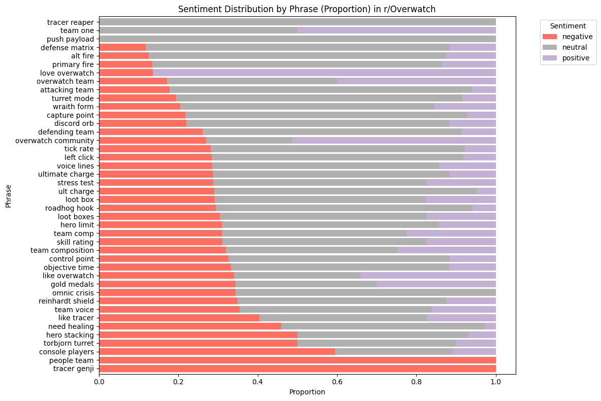
    


    
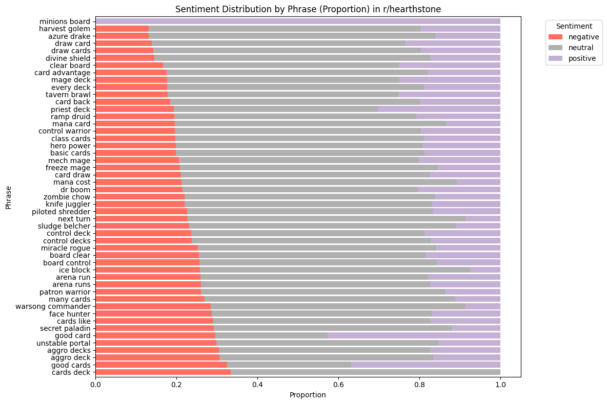
    


    
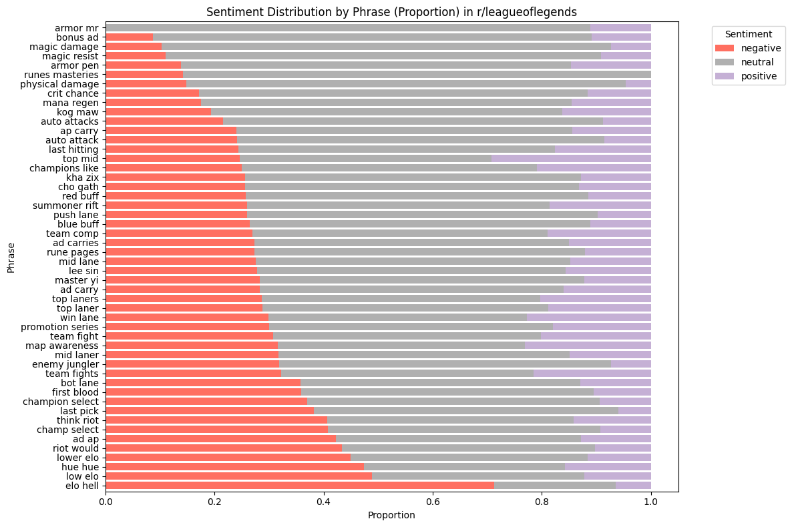
    


    
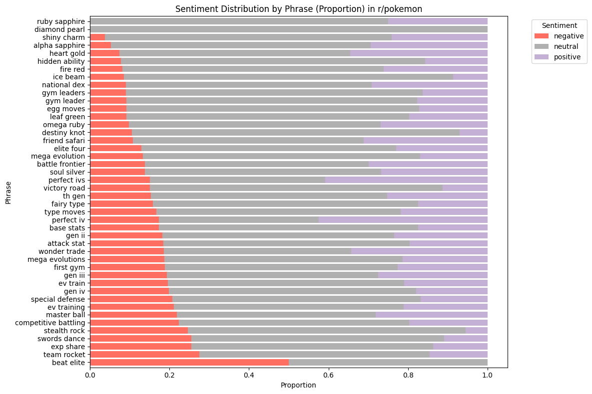
    


    
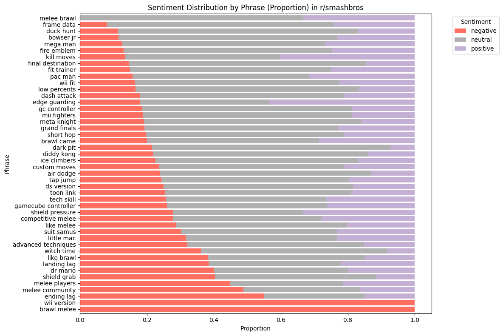
    


    
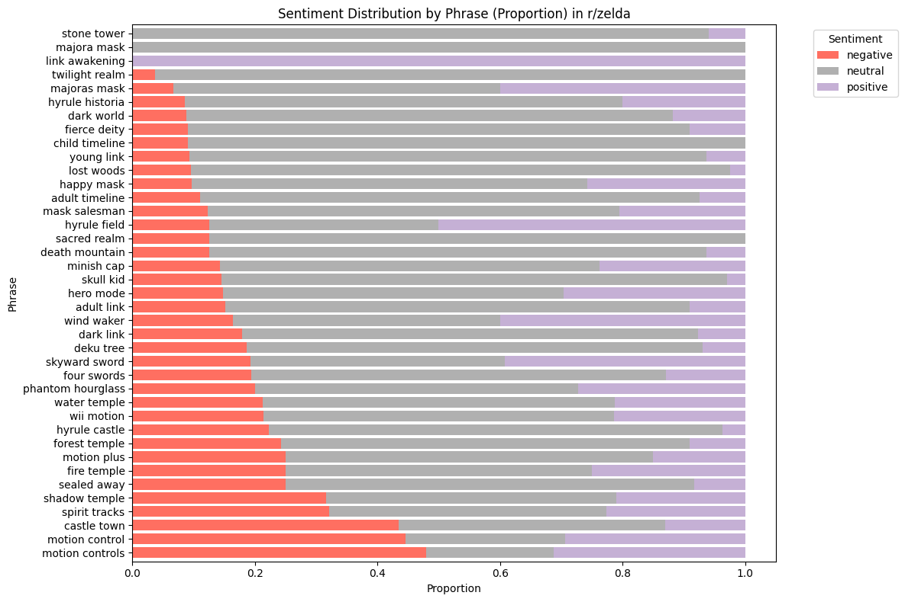
    


Most terms were classified as neutral in sentiment, with only a few showing clear positive or negative sentiment. To better understand what phrases are classified as positive or negative, we narrowed down the set by removing phrases that do not carry either positive or negative sentiment.


```python
pivot_df = sentiment_summary.pivot_table(
    index=['subreddit', 'phrase'],
    columns='senti_label',
    values='proportion',
    fill_value=0
).reset_index()

# Dominant label
pivot_df['dominant_label'] = pivot_df[['positive', 'negative', 'neutral']].idxmax(axis=1)

# Pozitif dominant
positive_dominant = pivot_df[pivot_df['dominant_label'] == 'positive']
# Negatif dominant
negative_dominant = pivot_df[pivot_df['dominant_label'] == 'negative']

# Phrase -> dict
positive_phrases = dict(zip(positive_dominant['phrase'], positive_dominant['positive']))
negative_phrases = dict(zip(negative_dominant['phrase'], negative_dominant['negative']))
```


```python
top_positive = positive_dominant.sort_values(by='positive', ascending=False).head(20).reset_index()
top_negative = negative_dominant.sort_values(by='negative', ascending=False).head(20).reset_index()

print("Positive-Dominant Phrases by Proportion:")
display(top_positive[['subreddit', 'phrase', 'positive']].rename(columns={'positive': 'proportion'}))

print("\nNegative-Dominant Phrases by Proportion:")
display(top_negative[['subreddit', 'phrase', 'negative']].rename(columns={'negative': 'proportion'}))
```

    Positive-Dominant Phrases by Proportion:
    


<div>
<style scoped>
    .dataframe tbody tr th:only-of-type {
        vertical-align: middle;
    }

    .dataframe tbody tr th {
        vertical-align: top;
    }

    .dataframe thead th {
        text-align: right;
    }
</style>
<table border="1" class="dataframe">
  <thead>
    <tr style="text-align: right;">
      <th>senti_label</th>
      <th>subreddit</th>
      <th>phrase</th>
      <th>proportion</th>
    </tr>
  </thead>
  <tbody>
    <tr>
      <th>0</th>
      <td>hearthstone</td>
      <td>minions board</td>
      <td>1.000000</td>
    </tr>
    <tr>
      <th>1</th>
      <td>zelda</td>
      <td>link awakening</td>
      <td>1.000000</td>
    </tr>
    <tr>
      <th>2</th>
      <td>Overwatch</td>
      <td>love overwatch</td>
      <td>0.863636</td>
    </tr>
    <tr>
      <th>3</th>
      <td>Overwatch</td>
      <td>overwatch community</td>
      <td>0.513514</td>
    </tr>
    <tr>
      <th>4</th>
      <td>zelda</td>
      <td>hyrule field</td>
      <td>0.500000</td>
    </tr>
    <tr>
      <th>5</th>
      <td>Overwatch</td>
      <td>team one</td>
      <td>0.500000</td>
    </tr>
    <tr>
      <th>6</th>
      <td>smashbros</td>
      <td>edge guarding</td>
      <td>0.435897</td>
    </tr>
    <tr>
      <th>7</th>
      <td>hearthstone</td>
      <td>good card</td>
      <td>0.426710</td>
    </tr>
    <tr>
      <th>8</th>
      <td>pokemon</td>
      <td>perfect iv</td>
      <td>0.424581</td>
    </tr>
    <tr>
      <th>9</th>
      <td>hearthstone</td>
      <td>good cards</td>
      <td>0.368750</td>
    </tr>
    <tr>
      <th>10</th>
      <td>Overwatch</td>
      <td>like overwatch</td>
      <td>0.340909</td>
    </tr>
  </tbody>
</table>
</div>


    
    Negative-Dominant Phrases by Proportion:
    


<div>
<style scoped>
    .dataframe tbody tr th:only-of-type {
        vertical-align: middle;
    }

    .dataframe tbody tr th {
        vertical-align: top;
    }

    .dataframe thead th {
        text-align: right;
    }
</style>
<table border="1" class="dataframe">
  <thead>
    <tr style="text-align: right;">
      <th>senti_label</th>
      <th>subreddit</th>
      <th>phrase</th>
      <th>proportion</th>
    </tr>
  </thead>
  <tbody>
    <tr>
      <th>0</th>
      <td>Overwatch</td>
      <td>people team</td>
      <td>1.000000</td>
    </tr>
    <tr>
      <th>1</th>
      <td>smashbros</td>
      <td>brawl melee</td>
      <td>1.000000</td>
    </tr>
    <tr>
      <th>2</th>
      <td>Overwatch</td>
      <td>tracer genji</td>
      <td>1.000000</td>
    </tr>
    <tr>
      <th>3</th>
      <td>smashbros</td>
      <td>wii version</td>
      <td>1.000000</td>
    </tr>
    <tr>
      <th>4</th>
      <td>leagueoflegends</td>
      <td>elo hell</td>
      <td>0.712476</td>
    </tr>
    <tr>
      <th>5</th>
      <td>Overwatch</td>
      <td>console players</td>
      <td>0.594595</td>
    </tr>
    <tr>
      <th>6</th>
      <td>smashbros</td>
      <td>ending lag</td>
      <td>0.550000</td>
    </tr>
    <tr>
      <th>7</th>
      <td>Overwatch</td>
      <td>hero stacking</td>
      <td>0.500000</td>
    </tr>
    <tr>
      <th>8</th>
      <td>Overwatch</td>
      <td>torbjorn turret</td>
      <td>0.500000</td>
    </tr>
    <tr>
      <th>9</th>
      <td>pokemon</td>
      <td>beat elite</td>
      <td>0.500000</td>
    </tr>
    <tr>
      <th>10</th>
      <td>leagueoflegends</td>
      <td>low elo</td>
      <td>0.489155</td>
    </tr>
    <tr>
      <th>11</th>
      <td>smashbros</td>
      <td>melee community</td>
      <td>0.488372</td>
    </tr>
    <tr>
      <th>12</th>
      <td>zelda</td>
      <td>motion controls</td>
      <td>0.479167</td>
    </tr>
    <tr>
      <th>13</th>
      <td>leagueoflegends</td>
      <td>hue hue</td>
      <td>0.473684</td>
    </tr>
    <tr>
      <th>14</th>
      <td>leagueoflegends</td>
      <td>lower elo</td>
      <td>0.449438</td>
    </tr>
    <tr>
      <th>15</th>
      <td>smashbros</td>
      <td>melee players</td>
      <td>0.449438</td>
    </tr>
    <tr>
      <th>16</th>
      <td>zelda</td>
      <td>motion control</td>
      <td>0.445378</td>
    </tr>
    <tr>
      <th>17</th>
      <td>zelda</td>
      <td>castle town</td>
      <td>0.434783</td>
    </tr>
    <tr>
      <th>18</th>
      <td>smashbros</td>
      <td>dr mario</td>
      <td>0.400000</td>
    </tr>
  </tbody>
</table>
</div>


```python
fig, axes = plt.subplots(1, 2, figsize=(20, 10))

# Pozitif
wordcloud_pos = WordCloud(
    width=800, height=600, background_color='white', colormap='Greens'
).generate_from_frequencies(positive_phrases)

axes[0].imshow(wordcloud_pos, interpolation='bilinear')
axes[0].set_title('Positive-Dominant Phrases', fontsize=20)
axes[0].axis('off')

# Negatif
wordcloud_neg = WordCloud(
    width=800, height=600, background_color='white', colormap='Reds'
).generate_from_frequencies(negative_phrases)

axes[1].imshow(wordcloud_neg, interpolation='bilinear')
axes[1].set_title('Negative-Dominant Phrases', fontsize=20)
axes[1].axis('off')

plt.tight_layout()
plt.show()
```


    
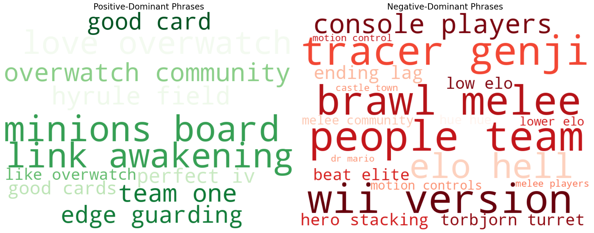
    


From just a few examples, we could say that negative sentiment tends to focus on game mechanics and competitiveness. For example, negative phrases like “people team”, “console players”, "beat elite" could refer to multiplayer aspects, while “lower elo” is a term used in League of Legends to describe less skilled players. Additionally, some negative phrases include character names as well such as Tracer, Genji, and Dr. Mario. Most of these negative phrases come primarily from Overwatch, League of Legends, and Smash Bros, all of which are competitive multiplayer games.

### Sentiments by Emotions


```python
# Aggregate emotion summary
emotion_summary = (
    phrase_sentiments_df
    .groupby(['subreddit', 'phrase', 'emo_label'])
    .agg(
        count=('emo_label', 'size'),
        avg_score=('emo_score', 'mean')
    )
    .reset_index()
)

# Get total counts per subreddit and phrase
total_counts_emo = (
    phrase_sentiments_df
    .groupby(['subreddit', 'phrase'])
    .size()
    .reset_index(name='total_count')
)

# Merge and compute proportions
emotion_summary = emotion_summary.merge(total_counts_emo, on=['subreddit', 'phrase'])
emotion_summary['proportion'] = emotion_summary['count'] / emotion_summary['total_count']
```


```python
# Define your 7 colors for the emotion labels
emo_colors = ['#ffb3b3', '#ffcc99', '#b3d9ff', '#98df8a', '#c5b0d5', '#d4c5a9', '#b3e5d1']

# We need to pivot emotion_summary so each emo_label becomes a column with proportion values
emotion_pivot = emotion_summary.pivot_table(
    index=['subreddit', 'phrase'], 
    columns='emo_label', 
    values='proportion', 
    fill_value=0
).reset_index()

# Plot for each subreddit
subreddits = emotion_pivot['subreddit'].unique()

for subreddit in subreddits:
    subset = emotion_pivot[emotion_pivot['subreddit'] == subreddit].set_index('phrase')
    
    # Drop 'subreddit' column because index is phrase now
    subset = subset.drop(columns='subreddit', errors='ignore')
    
    # Sort phrases
    subset = subset.sort_values(by=subset.columns[0], ascending=False)  
    
    plt.figure(figsize=(12, 8))
    subset.plot(kind='barh', stacked=True, color=emo_colors, figsize=(12,8))
    
    plt.title(f"Emotion Distribution by Phrase in r/{subreddit}")
    plt.xlabel('Proportion')
    plt.ylabel('Phrase')
    plt.legend(title='Emotion', bbox_to_anchor=(1.05, 1), loc='upper left')
    plt.tight_layout()
    plt.show()
```


    <Figure size 1200x800 with 0 Axes>


    
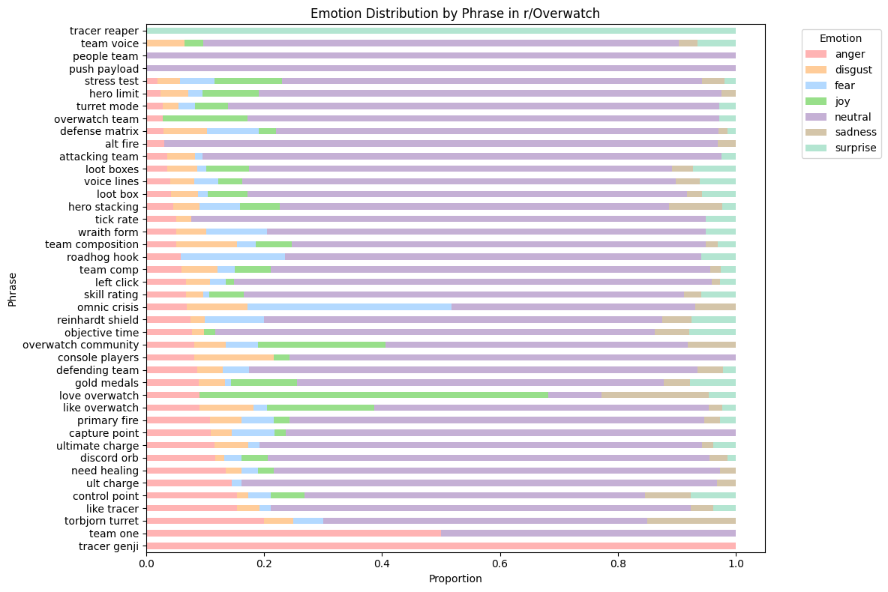
    


    <Figure size 1200x800 with 0 Axes>


    
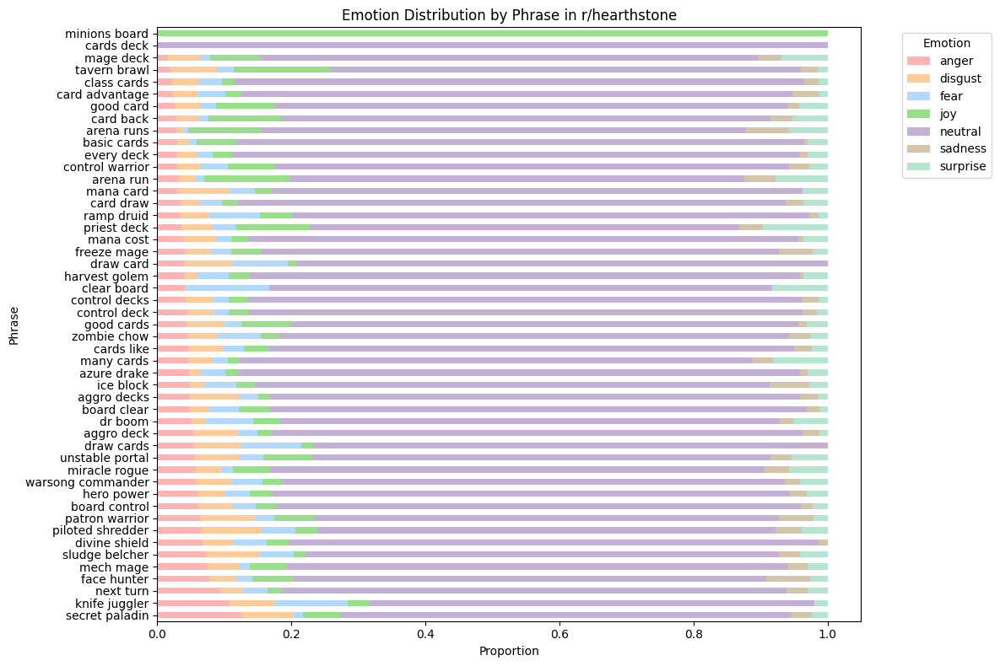
    


    <Figure size 1200x800 with 0 Axes>


    
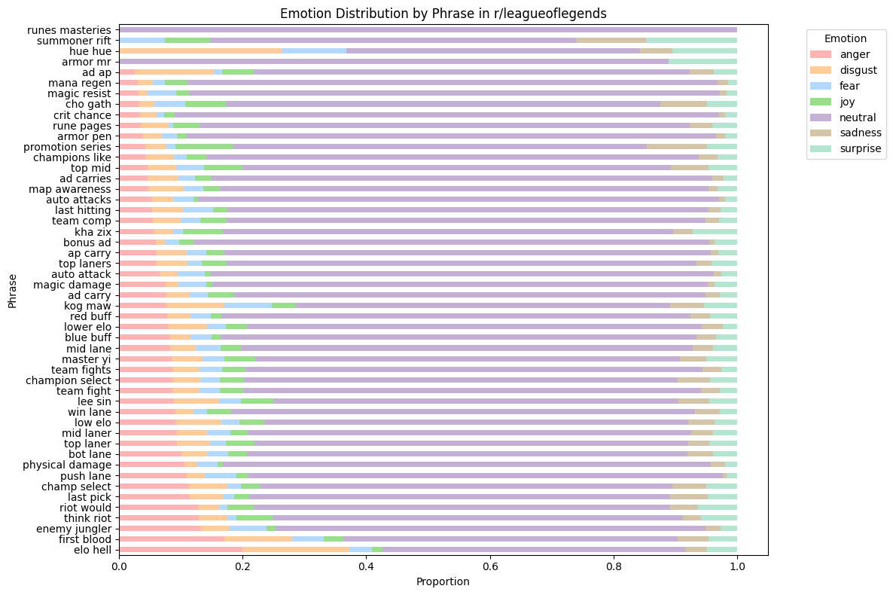
    


    <Figure size 1200x800 with 0 Axes>


    
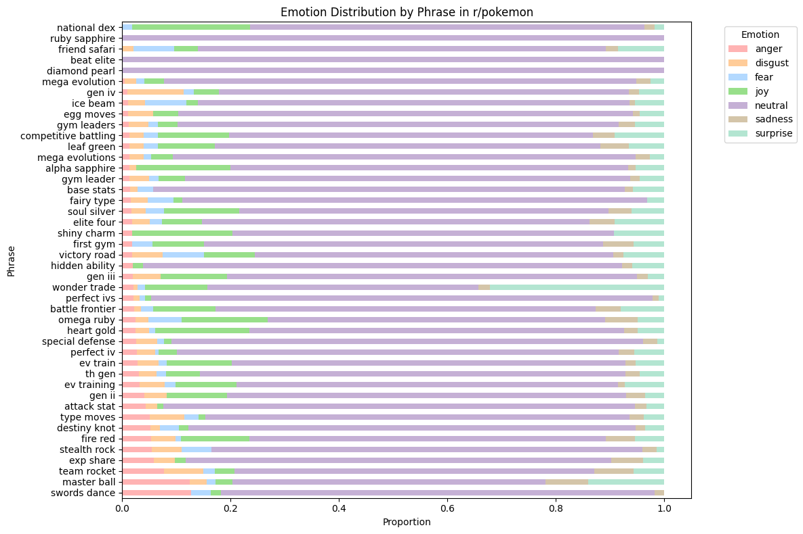
    


    <Figure size 1200x800 with 0 Axes>


    
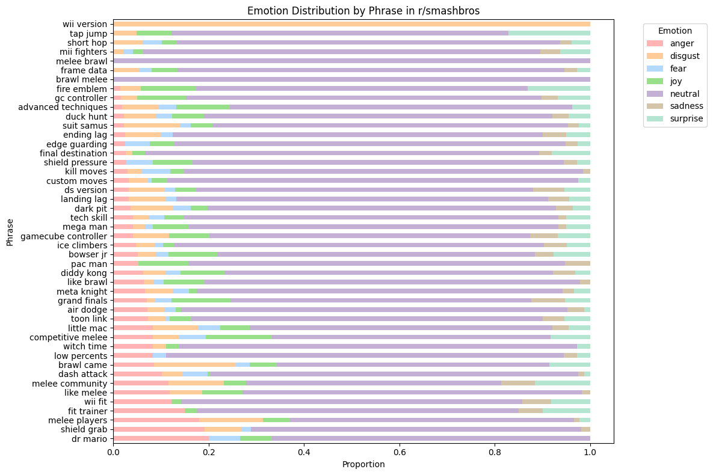
    


    <Figure size 1200x800 with 0 Axes>


    
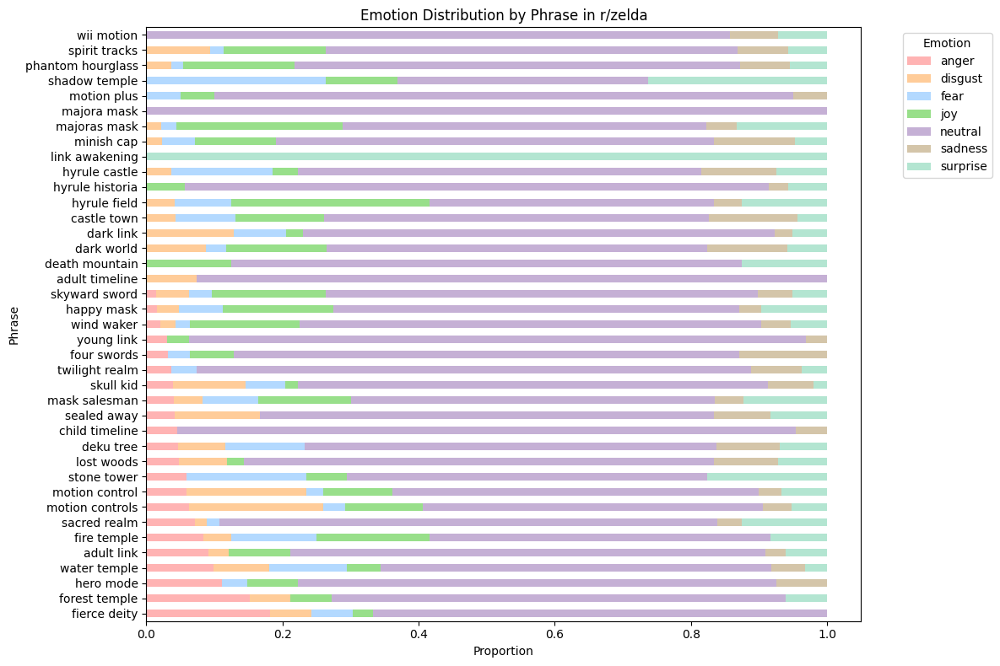
    


```python
# Pivot for dominant emotion per phrase
emotion_pivot_df = emotion_summary.pivot_table(
    index=['subreddit', 'phrase'],
    columns='emo_label',
    values='proportion',
    fill_value=0
).reset_index()

# Find dominant emotion excluding neutral later
emotion_pivot_df['dominant_emotion'] = emotion_pivot_df.loc[:, 
    [col for col in emotion_pivot_df.columns if col not in ['subreddit', 'phrase']]
].idxmax(axis=1)

# Exclude neutral dominant phrases
non_neutral_emotion_phrases = emotion_pivot_df[emotion_pivot_df['dominant_emotion'] != 'neutral']

print(non_neutral_emotion_phrases[['subreddit', 'phrase', 'dominant_emotion']].head(20))
```

    emo_label    subreddit          phrase dominant_emotion
    16           Overwatch  love overwatch              joy
    31           Overwatch        team one            anger
    35           Overwatch    tracer genji            anger
    36           Overwatch   tracer reaper         surprise
    78         hearthstone   minions board              joy
    229          smashbros     wii version          disgust
    248              zelda  link awakening         surprise
    

Here, again, most phrases had neutral sentiments, with only a few exceptions. Since these non-neutral phrases are limited in number. We also examined the second most dominant emotions to gain a better understanding.


```python
emotion_cols = ['anger', 'joy', 'sadness', 'fear', 'surprise', 'disgust', 'neutral']

def get_second_dominant(row):
    # Select only emotion columns (should be all floats)
    emotions = row[emotion_cols]

    # Sort descending
    sorted_emotions = emotions.sort_values(ascending=False)

    # Filter out zero or very small values (avoid meaningless seconds)
    filtered = sorted_emotions[sorted_emotions > 0]

    if len(filtered) < 2:
        return None  # no valid second dominant

    return filtered.index[1]  # second highest emotion label
```


```python
emotion_pivot_df['second_dominant_emotion'] = emotion_pivot_df.apply(get_second_dominant, axis=1)
```


```python
# Define your emotions and their corresponding colormaps
emotion_colormaps = {
    'anger': 'Reds',
    'disgust': 'Purples',
    'fear': 'Blues',
    'joy': 'Greens',
    'sadness': 'Greys',
    'surprise': 'Oranges',
    # 'neutral' intentionally excluded if you want to skip it
}

# Filter emotion columns (exclude meta columns)
emotion_cols = [col for col in emotion_pivot_df.columns if col not in ['subreddit', 'phrase', 'dominant_emotion', 'second_dominant_emotion']]

# Keep only emotions in your colormap dict and second dominant emotion
emotions_to_plot = [e for e in emotion_cols if e in emotion_colormaps]

# Set up the grid size for subplots dynamically (e.g., 2 cols)
cols = 2
rows = (len(emotions_to_plot) + cols - 1) // cols

fig, axes = plt.subplots(rows, cols, figsize=(15, 7*rows))
axes = axes.flatten()

for i, emotion in enumerate(emotions_to_plot):
    # Get phrases where second dominant emotion is this emotion
    filtered_phrases = emotion_pivot_df[emotion_pivot_df['second_dominant_emotion'] == emotion]
    
    if filtered_phrases.empty:
        axes[i].axis('off')
        axes[i].set_title(f'No data for {emotion}')
        continue
    
    freq_dict = dict(zip(filtered_phrases['phrase'], filtered_phrases[emotion]))
    
    wordcloud = WordCloud(
        width=800, height=600,
        background_color='white',
        colormap=emotion_colormaps[emotion]
    ).generate_from_frequencies(freq_dict)
    
    axes[i].imshow(wordcloud, interpolation='bilinear')
    axes[i].set_title(f'Second Dominant Emotion: {emotion.capitalize()}', fontsize=18)
    axes[i].axis('off')

# Turn off any unused axes if total emotions < rows*cols
for j in range(i+1, rows*cols):
    axes[j].axis('off')

plt.tight_layout()
plt.show()

```


    
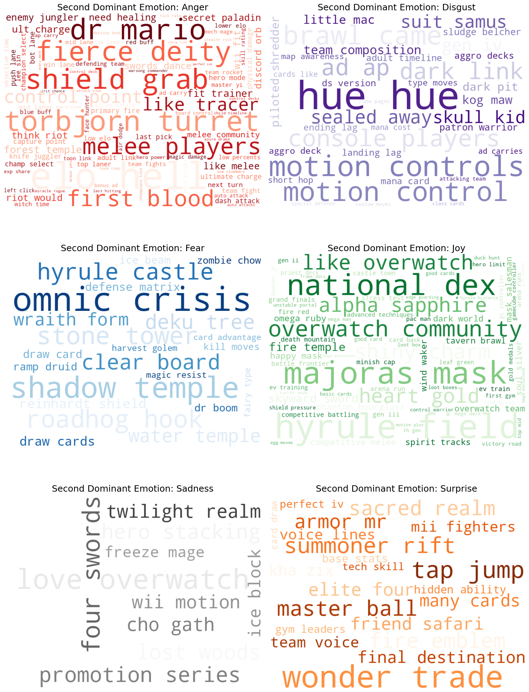
    


## 3. Conclusion and Discussion

The TF-IDF analysis helped identify the most distinctive phrases across different gaming communities, highlighting key terms related to gameplay, competition, and player interactions. The Word2Vec embeddings revealed meaningful semantic relationships between phrases, uncovering clusters of related terms that reflect shared themes or characteristics within each gaming community.

Our sentiment analysis of the TF-IDF phrases showed that most gaming discussions tend to be emotionally neutral rather than strongly positive or negative. While we observed some negatively charged terms, such as “people team” and “console players,” mostly from competitive multiplayer games, the limited number of phrases with clear positive or negative sentiment means we cannot draw definitive conclusions. Nonetheless, these initial findings highlight interesting emotional dynamics around game mechanics and competitiveness that motivate us to investigate these dynamics further.

Limitations: There was an imbalance in our dataset, with the majority of comments coming from League of Legends, followed by Hearthstone, while other games had significantly fewer comments. This imbalance may have affected both the sentiment analysis and the overall results. Also the fact that we looked at the sentiment of sentences that TF-IDF phrases appeared in, means we only get approximation of how phrases tend to be used or discussed but not their standalone sentiment.
